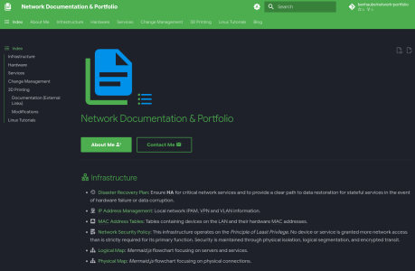

 

# Network Documentation & Portfolio 
*Built with Material for MkDocs*

This is my personal, self-hosted professional portfolio and network documentation website built with [Material for MkDocs](https://squidfunk.github.io/mkdocs-material/). This repository only contains the source markdown and development files. The built website in the `/site` directory is not tracked in the repo, but get's uploaded to my Nginx Web server. The website is hosted on my own server and exposed to the internet with a Cloudflare Tunnel. 

## Clone the Repo

#### HTTPS:

```bash
git clone https://github.com/benhaube/network-portfolio.git

cd network-portfolio/
```

#### SSH:

```bash
git clone git@github.com:benhaube/network-portfolio.git

cd network-portfolio/
```

## Build the Custom Image

> [!note] 
> This project uses plugins for MkDocs that are not included with the standard Docker image. Therefore it is a requirement to pull the standard image and build a new, custom image with those plugins added. The `Dockerfile` contains the 'instructions' for **Docker / Podman** to build the custom image. The two `compose-*.yml` files already have the `localhost/mkdocs-custom` image defined. 

> [!warning]
> The `roamlinks` and `callouts` plugins are very important for this project to ensure all of the internal links and admonitions function properly. The Markdown files originated from my Obsidian vault. While they have been heavily modified, there are still some links and admonitions in the Obsidian format.

#### Pull Material for MkDocs:

```bash
podman pull docker.io/squidfunk/mkdocs-material:latest
```

#### Build Image w/ Extra Plugins:

```bash
podman build -t mkdocs-custom .
```

## Building / Serving the Site

> [!note]
> There are two compose files included in the repo. The `compose-serve.yml` file will spin up the `mkdocs-custom` container and serve the site to `http://localhost:8000`. It is not recommended to serve the production site in this way. It is for testing only. When you are ready to publish your changes you build the site and host it on a separate Web server. I recommend using [Nginx](https://github.com/nginx/nginx).

#### Serve Site for Testing:

```bash
podman compose -f compose-serve.yml up -d  # You can optionally remove the detach flag `-d` if you want to see the log output for debugging. 
```

#### Build Site for Deployment:

```bash
podman compose -f compose-build.yml up -d
```

> [!tip]
> The container will create a new directory in the root of the repository named 'site' and build the site in that directory. Move the resulting `site/*` directory and its contents onto the Web server of your choice. Do **NOT** move any other source files or directories to the Web server. 

#### Alternative `podman run` commands:

Podman / Docker compose is the preferred method for starting and stopping the MkDocs container, but you can also use the following `podman run` commands. 

```bash
podman run --rm -it -p 8000:8000 -v ${PWD}:/docs:Z mkdocs-custom serve -a 0.0.0.0:8000
```

```bash
podman run --rm -it -v ${PWD}:/docs:Z mkdocs-custom build
```

> [!note]
> The `:Z` or `:z` in the volume definition *(also in the compose.yml files)* is critical for **Fedora / Podman** based workstations that use SE-Linux. The container will not run properly without it. It allows the container to set the appropriate SE-Linux context on each file in the repo directory. 

## 🙏 Special Thanks

I would like to give special thanks to the following projects whose work was used extensively in this project:

+ **[Google](https://fonts.google.com/):**
    + For their `Google Sans Flex` and `Google Sans Code` fonts
    + For their icons in the `Material Symbols Font` and `Material Design Icons` collections.
+ **[Material for MkDocs](https://squidfunk.github.io/mkdocs-material/):**
    + For their incredible static website generator.
+ **[Simple Icons](https://simpleicons.org/):**
    + For their amazing brand icons.
+ **[Selfh.st](https://selfh.st/icons/):**
    + For their awesome, colorful brand icons. 
+ **[Mermaid.js](https://mermaid.js.org/):**
    + For building an amazing tool for rendering beautiful flowcharts.
+ **[Vscodium](https://vscodium.com/):**
    + For their excellent open-source IDE that is used extensively in the development of this website, and in all of my projects.