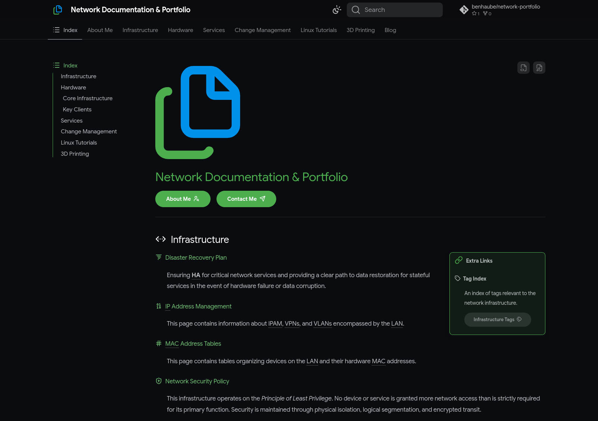
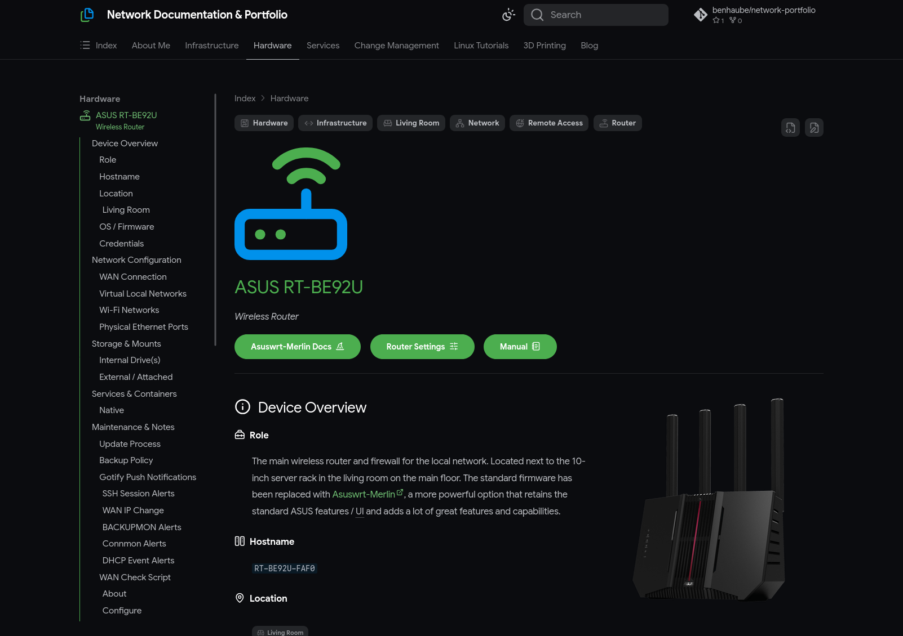
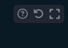
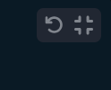
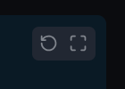
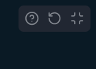

<p align="center">
    <a href="https://portfolio.rac3r4life.online">
        
    </a>
</p>
<h1 align="center" color="#4CAE4F">
    Network Documentation & Portfolio
</h1>
</p>
<p align="center">
    <a href="https://github.com/benhaube/network-portfolio/blob/main/LICENSE">
        
    </a>
    <a href="https://github.com/squidfunk/mkdocs-material">
        
    </a>
    <a href="https://github.com/lucide-icons/lucide">
        
    </a>
    <a href="https://fonts.google.com/icons">
        
    </a>
</p>
<p align="center">
    <a href="#clone-the-repo">Clone the Repository</a>
    ·
    <a href="#using-python-the-preferred-method">Build Using Python</a>
    ·
    <a href="#using-docker">Build Using Docker</a>
    ·
    <a href="#zensical-testing">Zensical Testing</a>
</p>

## About

This is my personal, self-hosted professional portfolio and network documentation website built with [Material for MkDocs](https://squidfunk.github.io/mkdocs-material/). This repository only contains the source markdown and development files. The built website in the `/site` directory is not tracked in the repo, but get's uploaded to my Nginx Web server. The website is hosted on my own server and exposed to the internet with a Cloudflare Tunnel. 





## Clone the Repo

#### HTTPS

```bash
git clone https://github.com/benhaube/network-portfolio.git

cd network-portfolio/
```

#### SSH

```bash
git clone git@github.com:benhaube/network-portfolio.git

cd network-portfolio/
```

## Using Python *(The Preferred Method)*

### Setup Python Virtual Environment

```bash
python -m venv .venv/
source .venv/bin/activate
```

### Install Material for MkDocs

```bash
pip install mkdocs-material
```

#### Install Plugins

| Plugin                                                                                         | Role                                           |
| :--------------------------------------------------------------------------------------------- | :--------------------------------------------- |
| [<code>mkdocs-awesome-nav</code>](https://github.com/lukasgeiter/mkdocs-awesome-nav)           | Customize the navigation structure.            |
| [<code>mkdocs-glightbox</code>](https://github.com/blueswen/mkdocs-glightbox)                  | Create an image gallery.                       |
| [<code>mkdocs-open-in-new-tab</code>](https://github.com/JakubAndrysek/mkdocs-open-in-new-tab) | Open external links in a new tab.              |
| [<code>mkdocs-panzoom-plugin</code>](https://github.com/PLAYG0N/mkdocs-panzoom)                | Enable pan & zoom on large Mermaid flowcharts. |

```bash
pip install mkdocs-awesome-nav mkdocs-glightbox mkdocs-panzoom-plugin mkdocs-open-in-new-tab
```

#### Install Dependencies for Optimize Plugin

The built-in [Optimize](https://squidfunk.github.io/mkdocs-material/plugins/optimize/) plugin for Material for MkDocs is utilized in this project. It optimizes `.jpg` and `.png` images on the site, reducing bandwidth and server storage requirements. However, the Optimize plugin does require additional dependencies to function using the Python package.

##### Python

```bash
pip install "mkdocs-material[imaging]"
```

> [!note]
> This will install compatible versions of the following python packages:
> 
> + [Pillow](https://pillow.readthedocs.io/)
> + [CairoSVG](https://cairosvg.org/)
> 
> The Docker image includes the dependencies required for the Optimize plugin.

##### Cairo Graphics

[Cairo](https://www.cairographics.org/) is a graphics library and dependency of Pillow, which Material for MkDocs makes use of for generating social cards and performing image optimization.

```bash
# Fedora / RHEL
sudo dnf install cairo-devel freetype-devel libffi-devel libjpeg-devel libpng-devel zlib-devel

# OpenSUSE
sudo zypper install cairo-devel freetype-devel libffi-devel libjpeg-devel libpng-devel zlib-devel

# Debian / Ubuntu
sudo apt-get install libcairo2-dev libfreetype6-dev libffi-dev libjpeg-dev libpng-dev libz-dev
```

##### pngquant

[pngquant](https://pngquant.org/) is an excellent library for lossy PNG compression, and a direct dependency of the built-in optimize plugin.

```bash
# Fedora / RHEL
sudo dnf install pngquant

# OpenSUSE
sudo zypper install pngquant

# Debian / Ubuntu
sudo apt-get install pngquant
```

### How to Upgrade

Run the following commands to upgrade Material for MkDocs and the required plugins to the latest version.

```bash
# Material for MkDocs
pip install --upgrade --force-reinstall mkdocs-material "mkdocs-material[imaging]"

# MkDocs Plugins
pip install --upgrade --force-reinstall mkdocs-awesome-nav mkdocs-glightbox mkdocs-panzoom-plugin mkdocs-open-in-new-tab
```

#### Check Current Version

Run the following command to check the currently installed version of Material for MkDocs.

```bash
pip show mkdocs-material
```

### Building / Serving the Site

#### Serve Site for Testing

```bash
# Serve on the default port -- localhost:8000
mkdocs serve

# Serve on a specified port 
mkdocs serve -a localhost:<port>
```

#### Build Site for Deployment

```bash
mkdocs build
```

> [!tip]
> **Material for MkDocs** will create a new directory in the root of the repository named 'site' and build the site in that directory. Move the resulting `site/*` directory and its contents onto the Web server of your choice. Do **NOT** move any other source files or directories to the Web server. 

## Using Docker

### Build the Custom Image

> [!note] 
> This project uses plugins for MkDocs that are not included with the standard Docker image. Therefore it is a requirement to pull the standard image and build a new, custom image with those plugins added. The `Dockerfile` contains the 'instructions' for **Docker / Podman** to build the custom image. The two `compose-*.yml` files already have the `localhost/mkdocs-custom` image defined. 

#### Pull Material for MkDocs

```bash
podman pull docker.io/squidfunk/mkdocs-material:latest
```

#### Build Image w/ Extra Plugins

```bash
podman build -t mkdocs-custom .
```

### Building / Serving the Site

> [!note]
> There are two compose files included in the repo. The `compose-serve.yml` file will spin up the `mkdocs-custom` container and serve the site to `http://localhost:8000`. It is not recommended to serve the production site in this way. It is for testing only. When you are ready to publish your changes you build the site and host it on a separate Web server. I recommend using [Nginx](https://github.com/nginx/nginx).

#### Serve Site for Testing

```bash
podman compose -f compose-serve.yml up -d  # You can optionally remove the detach flag `-d` if you want to see the log output for debugging. 
```

#### Build Site for Deployment

```bash
podman compose -f compose-build.yml up -d
```

> [!tip]
> **Material for MkDocs** will create a new directory in the root of the repository named 'site' and build the site in that directory. Move the resulting `site/*` directory and its contents onto the Web server of your choice. Do **NOT** move any other source files or directories to the Web server. 

#### Alternative `podman run` Commands *(Not Recommended)*

Podman / Docker compose is the preferred method for starting and stopping the MkDocs container, but you can also use the following `podman run` commands. 

```bash
podman run --rm -it -p 8000:8000 -v ${PWD}:/docs:Z mkdocs-custom serve -a 0.0.0.0:8000 --livereload
```

```bash
podman run --rm -it -v ${PWD}:/docs:Z mkdocs-custom build
```

> [!note]
> The `:Z` or `:z` in the volume definition *(also in the compose.yml files)* is critical for **Fedora / Podman** based workstations that use SE-Linux. The container will not run properly without it. It allows the container to set the appropriate SE-Linux context on each file in the repo directory. 

## Zensical Testing

The `zensical-testing` branch exists to experiment with the new [Zensical](https://zensical.org/) static website generator. Eventually, this project will need to migrate to Zensical because Material for MkDocs has entered a maintenance-only development stage, and will eventually be deprecated. This is due to breaking changes made by the MkDocs team with MkDocs 2.0... Once Material for MkDocs is deprecated it will continue to function, but it will not recieve updates for security vulnerabilities. Fortunately, Zenzical is the successor to Material for MkDocs developed from scratch by the same team. Unfortunately, Zensical is still pretty early in its development roadmap, and it is lacking features and extensions I rely on for this project. Once Zenzical develops enough to meet the requirements for this project I will migrate. Until then, this branch exists to build the `zensical.toml` configuration file, and to test the site as Zensical develops.

### Getting Started

#### Install with pip

Open up a terminal window and install Zensical by first setting up a virtual environment and then using `pip` to install the Zensical package into it:

```bash
python3 -m venv .venv
source .venv/bin/activate
pip install zensical
```
 
#### Install with UV

To install Zensical with `uv` and add it to your development dependencies in your `pyproject.toml`, use:

```bash
uv init
uv add --dev zensical
uv run zensical
```

### Building / Serving the Site

#### Serve Site for Testing

```bash
zensical serve
```

#### Build Site for Deployment

```bash
zensical build
```

## Custom Icons for Panzoom Plugin

I have replaced the button icons used by the [Panzooom](https://github.com/PLAYG0N/mkdocs-panzoom) plugin with [Lucide](https://lucide.dev/) icons to match the rest of the site. The icons cannot be applied using CSS due to the way the Panzoom plugin is written. To use the custom icons you need to copy the XML text into the `panzoom_box.py` file located in your virtual environement directory. 

#### Apply Customization

1. Locate the `panzoom_box.py` file: 

    ```
    .venv/lib/python3.14/site-packages/mkdocs_panzoom_plugin/panzoom_box.py
    ```

2. Open the file and replace the SVG icon XML with the new, custom icons:

    ```python
    info_button = """<button class="panzoom-info panzoom-button">
        <svg class="panzoom-icon" version="1.1" viewBox="0 0 24 24" xmlns="http://www.w3.org/2000/svg">
            <path d="m12 1c-6.0633 0-11 4.9367-11 11 0 6.0633 4.9367 11 11 11 6.0633 0 11-4.9367 11-11 0-6.0633-4.9367-11-11-11zm0 2c4.9824 0 9 4.0176 9 9 0 4.9824-4.0176 9-9 9-4.9824 0-9-4.0176-9-9 0-4.9824 4.0176-9 9-9zm-.0625 2.9961c-1.551-.0023421-3.1655.89385-3.791 2.6719a1 1 0 00.61133 1.2754 1 1 0 001.2754-.61133c.40595-1.154 1.3156-1.4645 2.2246-1.3086s1.6639.7513 1.6621 1.9746a1.0001 1.0001 0 000 .0019531c0 .5-.4327 1.0033-1.0547 1.418-.62199.41466-1.2617.63281-1.2617.63281a1 1 0 00-.63281 1.2656 1 1 0 001.2656.63281s.86027-.28185 1.7383-.86719c.8776-.58507 1.9443-1.5812 1.9453-3.0801v-.001953c.002189-2.153-1.5977-3.6511-3.3242-3.9473-.21588-.037029-.43664-.056306-.6582-.056641zm.0625 10.004a1 1 0 00-1 1 1 1 0 001 1h.009766a1 1 0 001-1 1 1 0 00-1-1h-.009766z"/>
        </svg>
    </button>"""

    reset_button = """<button class="panzoom-reset panzoom-button">
        <svg class="panzoom-icon" viewBox="0 0 24 24" xmlns="http://www.w3.org/2000/svg">
            <path d="m3 2a1 1 0 00-1 1v5a1.0001 1.0001 0 00.0078125.13086 1.0001 1.0001 0 00.068359.25195 1.0001 1.0001 0 00.54102.54102 1.0001 1.0001 0 00.25195.068359 1.0001 1.0001 0 00.13086.0078125h5a1 1 0 001-1 1 1 0 00-1-1h-2.5859l.54102-.54102c1.6227-1.5687 3.788-2.4495 6.0449-2.459 3.6064 0 6.2327 2.1417 7.3906 4.9375 1.1579 2.7958.81536 6.169-1.7344 8.7188s-5.923 2.8923-8.7188 1.7344c-2.7958-1.1579-4.9375-3.7843-4.9375-7.3906a1 1 0 00-1-1 1 1 0 00-1 1c0 4.4123 2.7051 7.8017 6.1738 9.2383 3.4687 1.4366 7.7768.95169 10.896-2.168 3.1197-3.1197 3.6046-7.4278 2.168-10.896-1.4366-3.4687-4.8259-6.1738-9.2383-6.1738a1.0001 1.0001 0 00-.003906 0c-2.7738.010435-5.4374 1.0936-7.4316 3.0215a1.0001 1.0001 0 00-.011719.011719l-.55273.55273v-2.5859a1 1 0 00-1-1z"/>
        </svg>
    </button>"""

    max_button = """<button class="panzoom-max panzoom-button">
        <svg class="panzoom-icon" viewBox="0 0 24 24" xmlns="http://www.w3.org/2000/svg">
            <path d="m5 2c-1.645 0-3 1.355-3 3v3a1 1 0 001 1 1 1 0 001-1v-3c0-.56413.43587-1 1-1h3a1 1 0 001-1 1 1 0 00-1-1h-3zm11 0a1 1 0 00-1 1 1 1 0 001 1h3c.56413 0 1 .43587 1 1v3a1 1 0 001 1 1 1 0 001-1v-3c0-1.645-1.355-3-3-3h-3zm-13 13a1 1 0 00-1 1v3c0 1.645 1.355 3 3 3h3a1 1 0 001-1 1 1 0 00-1-1h-3c-.56413 0-1-.43587-1-1v-3a1 1 0 00-1-1zm18 0a1 1 0 00-1 1v3c0 .56413-.43587 1-1 1h-3a1 1 0 00-1 1 1 1 0 001 1h3c1.645 0 3-1.355 3-3v-3a1 1 0 00-1-1z"/>
        </svg>
    </button>"""

    min_button = """<button class="panzoom-min panzoom-button panzoom-hidden">
        <svg class="panzoom-icon" viewBox="0 0 24 24" xmlns="http://www.w3.org/2000/svg">
            <path d="m8 2a1 1 0 00-1 1v3c0 .56413-.43587 1-1 1h-3a1 1 0 00-1 1 1 1 0 001 1h3c1.645 0 3-1.355 3-3v-3a1 1 0 00-1-1zm8 0a1 1 0 00-1 1v3c0 1.645 1.355 3 3 3h3a1 1 0 001-1 1 1 0 00-1-1h-3c-.56413 0-1-.43587-1-1v-3a1 1 0 00-1-1zm-13 13a1 1 0 00-1 1 1 1 0 001 1h3c.56413 0 1 .43587 1 1v3a1 1 0 001 1 1 1 0 001-1v-3c0-1.645-1.355-3-3-3h-3zm15 0c-1.645 0-3 1.355-3 3v3a1 1 0 001 1 1 1 0 001-1v-3c0-.56413.43587-1 1-1h3a1 1 0 001-1 1 1 0 00-1-1h-3z"/>
        </svg>
    </button>"""
    ```

3. After saving and closing the file you can now use the `mkdocs serve` and `mkdocs build` commands as usual, and the new navigation button icons shown on Mermaid diagrams using the Panzoom plugin will have the new, matching Lucide icons. 

    **Before:**

    &emsp;

    **After:**

    &emsp;

> [!note]
> The code above contains the custom SVG icon XML, but the files are also located in this repo in the `custom_panzoom_icons/` directory. To make the [Lucide](https://lucide.dev/) icons compatible with the Panzoom plugin I have converted the stroke to paths with standard fill, I removed all fill instructions, and replaced the Lucide class definitions with `class="panzoom-icon"`. 
> 
> After ugrading the `mkdocs-panzoom-plugin` package you may need to re-apply this modification to the `panzoom_box.py` file. Depending on the changes made by the upgrade, the file may be overwritten.

## 🙏🏻 Special Thanks

**[Google](https://fonts.google.com/)** &mdash; For their `Google Sans` and `Google Sans Code` fonts.

+ The fonts are used with the [SIL Open Font License](https://openfontlicense.org/open-font-license-official-text/).

**[Material for MkDocs](https://squidfunk.github.io/mkdocs-material/)** &mdash; For their incredible open-source static website generator.

+ Some of the Material for MkDocs source code has been modified and redistributed in this repository with the [MIT](https://github.com/squidfunk/mkdocs-material/blob/master/LICENSE) license.

**[Lucide](https://lucide.dev/)** &mdash; For their beautiful and modern icon library.

+ Some Lucide icons are used, modified and redistributed in this repository with the [ISC and MIT](https://github.com/lucide-icons/lucide/blob/main/LICENSE) licenses.

**[Selfh.st](https://selfh.st/icons/)** &mdash; For their awesome, colorful brand icons. 

+ Some Selfh.st icons are used, modified and redistributed in this repository with the [Creative Commons Attribution 4.0](https://github.com/selfhst/icons/blob/main/LICENSE?ref=selfh.st) license.

**[Simple Icons](https://simpleicons.org/)** &mdash; For their monochrome brand icons.

+ Some Simple Icons are used, modified and redistributed in this repository with the [CC0 1.0 Universal](https://github.com/simple-icons/simple-icons/blob/develop/LICENSE.md) license.

**[Mermaid.js](https://mermaid.js.org/)** &mdash; For building an amazing tool for rendering beautiful flowcharts.

+ The Mermaid javascript is used with the [MIT](https://github.com/mermaid-js/mermaid/blob/develop/LICENSE) license.

**[VSCodium](https://vscodium.com/)** &mdash; For their excellent open-source, MIT-Licensed IDE that lacks Microsoft's spyware / telemetry. I have used it extensively in the development of this website, and daily in all of my projects and network configuration management.

**[Inkscape](https://inkscape.org/)** &mdash; For building an incredible piece of software for the FOSS community to create and edit SVG icons.