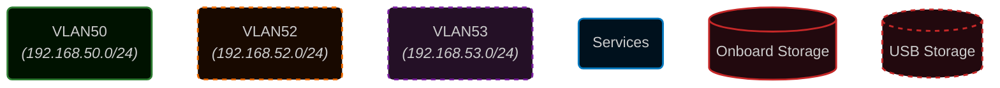
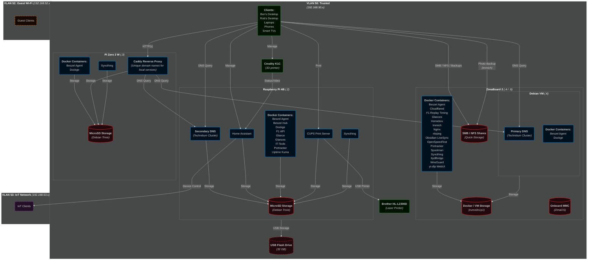

---
hide:
  - toc
---
![[sitemap.svg|100]]
# [[Logical_Map|Logical Network Map]]
---

```mermaid
%%{init: {'theme': 'dark'}}%%
graph
	%% --- Class definitions for Obsidian ---
    %% classDef vlan50 fill:#e8f5e9,stroke:#2e7d32,stroke-width:2px;
    %% classDef vlan52 fill:#fff3e0,stroke:#ef6c00,stroke-width:2px,stroke-dasharray: 5 5;
    %% classDef vlan53 fill:#f3e5f5,stroke:#7b1fa2,stroke-width:2px,stroke-dasharray: 5 5;
    %% classDef service fill:#e1f5fe,stroke:#0277bd,stroke-width:2px;
    %% classDef storage fill:#ffebee,stroke:#c62828,stroke-width:2px;
    %% classDef usb-storage fill:#ffebee,stroke:#c62828,stroke-width:2px,stroke-dasharray: 5 5;
    %% classDef vm fill:#fff3e0,stroke:#ef6c00,stroke-width:2px,stroke-dasharray: 5 5;
    
    %% --- Class definitions for MkDocs ---
    classDef vlan50 fill:#001200,stroke:#2e7d32,stroke-width:2px;
    classDef vlan52 fill:#180900,stroke:#ef6c00,stroke-width:2px,stroke-dasharray: 5 5;
    classDef vlan53 fill:#241026,stroke:#7b1fa2,stroke-width:2px,stroke-dasharray: 5 5;
    classDef service fill:#00111D,stroke:#0277bd,stroke-width:2px;
    classDef storage fill:#22090E,stroke:#c62828,stroke-width:2px;
    classDef usb-storage fill:#22090E,stroke:#c62828,stroke-width:2px,stroke-dasharray: 5 5;
    
    %% --- Ledgend ---
    VLAN50("VLAN50<br><i>(192.168.50.0/24)</i>"):::vlan50
    VLAN52("VLAN52<br><i>(192.168.52.0/24)</i>"):::vlan52
    VLAN53("VLAN53<br><i>(192.168.53.0/24)</i>"):::vlan53
    Service("Services"):::service
    OnboardStorage[("Onboard Storage")]:::storage
    USB-Storage[("USB Storage")]:::usb-storage
```

```mermaid
%%{init: {'theme': 'dark'}}%%
graph TD
	%% --- Class definitions for Obsidian ---
    %% classDef vlan50 fill:#e8f5e9,stroke:#2e7d32,stroke-width:2px;
    %% classDef vlan52 fill:#fff3e0,stroke:#ef6c00,stroke-width:2px,stroke-dasharray: 5 5;
    %% classDef vlan53 fill:#f3e5f5,stroke:#7b1fa2,stroke-width:2px,stroke-dasharray: 5 5;
    %% classDef service fill:#e1f5fe,stroke:#0277bd,stroke-width:2px;
    %% classDef storage fill:#ffebee,stroke:#c62828,stroke-width:2px;
    %% classDef usb-storage fill:#ffebee,stroke:#c62828,stroke-width:2px,stroke-dasharray: 5 5;
    %% classDef vm fill:#fff3e0,stroke:#ef6c00,stroke-width:2px,stroke-dasharray: 5 5;
    
    %% --- Class definitions for MkDocs ---
    classDef vlan50 fill:#001200,stroke:#2e7d32,stroke-width:2px;
    classDef vlan52 fill:#180900,stroke:#ef6c00,stroke-width:2px,stroke-dasharray: 5 5;
    classDef vlan53 fill:#241026,stroke:#7b1fa2,stroke-width:2px,stroke-dasharray: 5 5;
    classDef service fill:#00111D,stroke:#0277bd,stroke-width:2px;
    classDef storage fill:#22090E,stroke:#c62828,stroke-width:2px;
    classDef usb-storage fill:#22090E,stroke:#c62828,stroke-width:2px,stroke-dasharray: 5 5;
    
    %% --- Trusted VLAN ---
    subgraph Trusted_VLAN50 ["<b>VLAN 50: Trusted</b><br><i>(192.168.50.x)</i>"]
        direction TB
        
        Clients("<b>Clients:</b><br>Ben's Desktop<br>Rob's Desktop<br>Laptops<br>Phones<br>Smart TVs"):::vlan50
        
        subgraph Server_Zima ["<b>ZimaBoard 2</b> <i>(.4 / .5)</i>"]
            Storage_SMB[("<b>SMB / NFS Shares</b><br><i>(Quick-Storage)</i>")]:::storage
            Storage_NVMe[("<b>Docker / VM Storage</b><br><i>(nvme0n1p1)</i>")]:::storage
            Storage_MMC[("<b>Onboard MMC</b><br><i>(ZimaOS)</i>")]:::storage
            Service_Docker("<b>Docker Containers:</b><br>Beszel Agent<br>Cloudflared<br>F1 Replay Timing<br>Glances<br>Homebox<br>Immich<br>Nginx<br>ntopng<br>Obsidian LiveSync<br>OpenSpeedTest<br>Portracker<br>Spoolman<br>Syncthing<br>ttydBridge<br>WireGuard<br>yt-dlp WebUI"):::service
            %% VM_Debian("<b>Debian VM <i>(.6)</i>:</b><br><i>Primary DNS</i><br><i>(Technitium Cluster)</i>"):::vm
            subgraph VM_Debian ["<b>Debian VM</b> <i>(.6)</i>"]
                DNS_Primary("<b>Primary DNS</b><br><i>(Technitium Cluster)</i>"):::service
                Service_Docker_VM("<b>Docker Containers:</b><br>Beszel Agent<br>Dockge"):::service
            end
        end
        
        %% --- ZimaBoard 2 storage connections ---
        VM_Debian -- "Storage" --> Storage_NVMe
        Service_Docker -- "Storage" --> Storage_NVMe

        subgraph Server_Pi4 ["<b>Raspberry Pi 4B</b> <i>(.2)</i>"]
            MicroSD_Pi4[("<b>MicroSD Storage</b><br><i>(Debian Trixie)</i>")]:::storage
            DNS_Secondary("<b>Secondary DNS</b><br><i>(Technitium Cluster)</i>"):::service
            HA("Home Assistant"):::service
            Print("CUPS Print Server"):::service
            Syncthing_Pi4("Syncthing"):::service
            Service_Docker_Pi4("<b>Docker Containers:</b><br>Beszel Agent<br>Beszel Hub<br>Dockge<br>F1 API<br>Glance<br>Glances<br>IT-Tools<br>Portracker<br>Uptime Kuma"):::service
        end
        
        %% --- Pi 4B storage connections ---
        Server_Pi4 -- "USB Storage" --> USB_Ext
        DNS_Secondary -- "Storage" --> MicroSD_Pi4
        HA -- "Storage" --> MicroSD_Pi4
        Service_Docker_Pi4 -- "Storage" --> MicroSD_Pi4
        Print -- "Storage" --> MicroSD_Pi4
        Syncthing_Pi4 -- "Storage" --> MicroSD_Pi4

        subgraph Server_PiZero ["<b>Pi Zero 2 W</b> <i>(.3)</i>"]
            MicroSD_PiZero[("<b>MicroSD Storage</b><br><i>(Debian Trixie)</i>")]:::storage
            Service_Docker_PiZero("<b>Docker Containers:</b><br>Beszel Agent<br>Dockge"):::service
            Syncthing_PiZero("Syncthing"):::service
            Caddy("<b>Caddy Reverse Proxy</b><br><i>(Unique domain names for local services)</i>"):::service
        end
        
        %% --- Pi Zero storage connections ---
        Service_Docker_PiZero -- "Storage" --> MicroSD_PiZero
        Caddy -- "Storage" --> MicroSD_PiZero
        Syncthing_PiZero -- "Storage" --> MicroSD_PiZero
        
        Printer("<b>Creality K1C</b><br><i>(3D-printer)</i>"):::vlan50
        Brother("<b>Brother HL-L2300D</b><br><i>(Laser Printer)</i>"):::vlan50
        USB_Ext[("<b>USB Flash Drive</b><br><i>(32 GB)</i>")]:::usb-storage
    end
    
    %% --- Invisible link to fix cut-off title for Trusted_VLAN50 ---
    Trusted_VLAN50 ~~~ Clients

    %% --- Segregated VLANs ---
    subgraph IoT_VLAN53 ["<b>VLAN 53: IoT Network</b> <i>(192.168.53.x)</i>"]
        direction TB
        IoTClients("IoT Clients"):::vlan53  
    end
    
    %% Invisible link to fix cut-off title for IoT_VLAN53
    IoT_VLAN53 ~~~ IoTClients

    subgraph Guest_VLAN52 ["<b>VLAN 52: Guest Wi-Fi</b> <i>(192.168.52.x)</i>"]
        direction TB
        GuestClients("Guest Clients"):::vlan52
    end
    
    %% Invisible link to fix cut-off title for Guest_VLAN52
    Guest_VLAN52 ~~~ GuestClients
    
    %% --- Connections ---
    
    Clients -- "DNS Query" --> DNS_Primary
    Clients -- "DNS Query" --> DNS_Secondary
    Clients -- "HTTP<i>(s)</i>" --> Caddy
    Caddy -- "DNS Query" --> DNS_Primary
    Caddy -- "DNS Query" --> DNS_Secondary
    
    HA -- "Device Control" --> IoTClients

    Clients -- "SMB / NFS / Backups" --> Storage_SMB
    Clients -- "Photo Backup<br><i>(Immich)</i>" --> Storage_SMB

    Clients -- "Manage" --> HA
    Clients -- "Manage" --> Printer
    Clients -- "Print" --> Print
    
    Printer -- "Status/Video" --> HA
    
    Print -- "USB Printer" --> Brother
```
