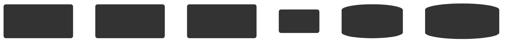
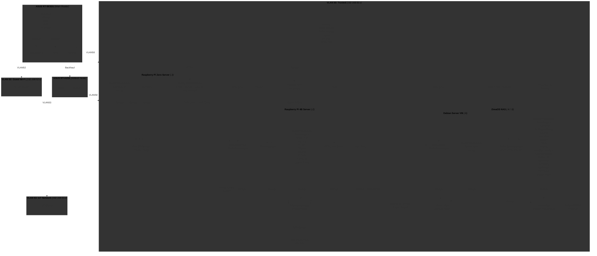

{ width=100 }

# Logical Network Map

---

```mermaid { .pz-ignore }
%%{
  init: {
    "themeCSS": ".node.vlan50 rect, .node.vlan50 polygon, .node.vlan50 circle, .node.vlan50 path { fill: var(--vlan50-bg) !important; stroke: var(--vlan50-border) !important; stroke-width: 2px !important; } .node.vlan52 rect, .node.vlan52 polygon, .node.vlan52 circle, .node.vlan52 path { fill: var(--vlan52-bg) !important; stroke: var(--vlan52-border) !important; stroke-width: 2px !important; stroke-dasharray: 5 5 !important; } .node.vlan53 rect, .node.vlan53 polygon, .node.vlan53 circle, .node.vlan53 path { fill: var(--vlan53-bg) !important; stroke: var(--vlan53-border) !important; stroke-width: 2px !important; stroke-dasharray: 5 5 !important; } .node.service rect, .node.service polygon, .node.service circle, .node.service path { fill: var(--service-bg) !important; stroke: var(--service-border) !important; stroke-width: 2px !important; } .node.storage rect, .node.storage polygon, .node.storage circle, .node.storage path { fill: var(--storage-bg) !important; stroke: var(--storage-border) !important; stroke-width: 2px !important; } .node.usb-storage rect, .node.usb-storage polygon, .node.usb-storage circle, .node.usb-storage path { fill: var(--storage-bg) !important; stroke: var(--storage-border) !important; stroke-width: 2px !important; stroke-dasharray: 5 5 !important; } .nodeLabel { color: var(--node-text) !important; } .node text { fill: var(--node-text) !important; } .cluster rect { fill: var(--subgraph-bg) !important; stroke: var(--subgraph-border) !important; stroke-width: 1px !important; } .cluster-label text, .cluster text { fill: var(--node-text) !important; } .cluster-label span, .cluster span { color: var(--node-text) !important; } .edgeLabel, .edgeLabel span, .edgeLabel p, .labelBkg, .htmlLabel { background-color: var(--edge-bg) !important; color: var(--edge-text) !important; } .edgeLabel rect { fill: var(--edge-bg) !important; } .edgeLabel text { fill: var(--edge-text) !important; } .edgePath path, .flowchart-link { stroke: var(--edge-line) !important; } .marker path, .arrowheadPath { fill: var(--edge-line) !important; stroke: var(--edge-line) !important; }"
  }
}%%

graph
    %% --- Dummy Class Definitions (To register the classes on the SVGs) --- %%
    classDef vlan50 fill: stroke:;
    classDef vlan52 fill: stroke:;
    classDef vlan53 fill: stroke:;
    classDef service fill: stroke:;
    classDef storage fill: stroke:;
    classDef usb-storage fill: stroke:;

    %% --- Ledgend --- %%
    VLAN50("VLAN50<br><i>(192.168.50.0/24)</i>"):::vlan50
    VLAN52("VLAN52<br><i>(192.168.52.0/24)</i>"):::vlan52
    VLAN53("VLAN53<br><i>(192.168.53.0/24)</i>"):::vlan53
    Service("Services"):::service
    OnboardStorage[("Onboard Storage")]:::storage
    USB-Storage[("USB / Virtual Storage")]:::usb-storage
```

```mermaid
%%{
  init: {
    "themeCSS": ".node.vlan50 rect, .node.vlan50 polygon, .node.vlan50 circle, .node.vlan50 path { fill: var(--vlan50-bg) !important; stroke: var(--vlan50-border) !important; stroke-width: 2px !important; } .node.vlan52 rect, .node.vlan52 polygon, .node.vlan52 circle, .node.vlan52 path { fill: var(--vlan52-bg) !important; stroke: var(--vlan52-border) !important; stroke-width: 2px !important; stroke-dasharray: 5 5 !important; } .node.vlan53 rect, .node.vlan53 polygon, .node.vlan53 circle, .node.vlan53 path { fill: var(--vlan53-bg) !important; stroke: var(--vlan53-border) !important; stroke-width: 2px !important; stroke-dasharray: 5 5 !important; } .node.service rect, .node.service polygon, .node.service circle, .node.service path { fill: var(--service-bg) !important; stroke: var(--service-border) !important; stroke-width: 2px !important; } .node.storage rect, .node.storage polygon, .node.storage circle, .node.storage path { fill: var(--storage-bg) !important; stroke: var(--storage-border) !important; stroke-width: 2px !important; } .node.usb-storage rect, .node.usb-storage polygon, .node.usb-storage circle, .node.usb-storage path { fill: var(--storage-bg) !important; stroke: var(--storage-border) !important; stroke-width: 2px !important; stroke-dasharray: 5 5 !important; } .nodeLabel { color: var(--node-text) !important; } .node text { fill: var(--node-text) !important; } .cluster rect { fill: var(--subgraph-bg) !important; stroke: var(--subgraph-border) !important; stroke-width: 1px !important; } .cluster-label text, .cluster text { fill: var(--node-text) !important; } .cluster-label span, .cluster span { color: var(--node-text) !important; } .edgeLabel, .edgeLabel span, .edgeLabel p, .labelBkg, .htmlLabel { background-color: var(--edge-bg) !important; color: var(--edge-text) !important; } .edgeLabel rect { fill: var(--edge-bg) !important; } .edgeLabel text { fill: var(--edge-text) !important; } .edgePath path, .flowchart-link { stroke: var(--edge-line) !important; } .marker path, .arrowheadPath { fill: var(--edge-line) !important; stroke: var(--edge-line) !important; }"
  }
}%%

graph TD
    %% --- Dummy Class Definitions (To register the classes on the SVGs) --- %%
    classDef vlan50 fill: stroke:;
    classDef vlan52 fill: stroke:;
    classDef vlan53 fill: stroke:;
    classDef service fill: stroke:;
    classDef storage fill: stroke:;
    classDef usb-storage fill: stroke:;

    %% --- Router --- %%
    subgraph Router ["<b>ASUS RT-BE92U</b> <i>(Main Router)</i>"]
        direction TB
        Services["<b>Services:</b><br>Chrony<br>SMB<br>SSH<br>WireGuard"]:::service
        Router_USB[("USB Storage")]:::usb-storage
        Router_JFFS[("JFFS")]:::storage
        RouterNVRAM[("NVRAM")]:::storage
    end

    %% --- Router storage connections --- %%
    Services -- "Storage" --> Router_USB
    Services -- "Storage" --> Router_JFFS

    %% --- AiMesh Node --- %%
    subgraph AiMesh_Node["<b>ASUS RT-AX55</b> <i>(AiMesh Node)</i>"]
        direction TB
        AiMesh_JFFS[("JFFS")]:::storage
        AiMesh_NVRAM[("NVRAM")]:::storage
    end

    %% --- Router ==> AiMesh_Node backhaul --- %%
    Router == "Backhaul" ==> AiMesh_Node

    %% --- Trusted VLAN --- %%
    subgraph Trusted_VLAN50 ["<b>VLAN 50: Trusted</b> <i>(192.168.50.x)</i>"]
        direction TB
        
        Clients("<b>Clients:</b><br>Ben's Desktop<br>Rob's Desktop<br>Laptops<br>Phones<br>Smart TVs"):::vlan50
        Printer("<b>Creality K1C</b><br><i>(3D-printer)</i>"):::vlan50
        Brother("<b>Brother HL-L2300D</b><br><i>(Laser Printer)</i>"):::vlan50
        USB_Ext[("<b>USB Flash Drive</b><br><i>(32 GB)</i>")]:::usb-storage

        %% --- ZimaOS NAS --- %%
        subgraph Server_Zima ["<b>ZimaOS NAS</b> <i>(.4 / .5)</i>"]
            Storage_SMB[("<b>RAID: Quick-Storage</b><br><i>(SMB / NFS Shares)</i>")]:::storage
            Storage_NVMe[("<b>nvme0n1p1</b><br><i>(Docker / VM Storage)</i>")]:::storage
            Storage_MMC[("<b>Onboard MMC</b><br><i>(ZimaOS)</i>")]:::storage
            Service_Docker("<b>Docker Containers:</b><br>Beszel Agent<br>Cloudflared<br>F1 Replay Timing<br>Glances<br>Homebox<br>Immich<br>Nginx<br>ntopng<br>Obsidian LiveSync<br>OpenSpeedTest<br>Portracker<br>Spoolman<br>Syncthing<br>ttydBridge<br>WireGuard<br>yt-dlp WebUI"):::service
            
            %% --- Debain VM Server --- %%
            subgraph VM_Debian ["<b>Debian Server VM</b> <i>(.6)</i>"]
                DNS_Primary("<b>Primary DNS</b><br><i>(Technitium Cluster)</i>"):::service
                Service_Docker_VM("<b>Docker Containers:</b><br>Beszel Agent<br>Dockge"):::service
                Virtual_Disk[("<b>Virtual Disk</b><br><i>(Debian Trixie)</i>")]:::usb-storage
            end
        end
        
        %% --- Debian VM storage connections --- %%
        DNS_Primary -- "Storage" --> Virtual_Disk
        Service_Docker_VM -- "Storage" --> Virtual_Disk

        %% --- ZimaOS NAS storage connections --- %%
        VM_Debian -- "Storage" --> Storage_NVMe
        Service_Docker -- "Storage" --> Storage_NVMe

        %% --- Raspberry Pi 4B Server --- %%
        subgraph Server_Pi4 ["<b>Raspberry Pi 4B Server</b> <i>(.2)</i>"]
            MicroSD_Pi4[("<b>MicroSD Storage</b><br><i>(Debian Trixie)</i>")]:::storage
            DNS_Secondary("<b>Secondary DNS</b><br><i>(Technitium Cluster)</i>"):::service
            HA("Home Assistant"):::service
            Print("CUPS Print Server"):::service
            Syncthing_Pi4("Syncthing"):::service
            Service_Docker_Pi4("<b>Docker Containers:</b><br>Beszel Agent<br>Beszel Hub<br>Dockge<br>F1 API<br>Glance<br>Glances<br>IT-Tools<br>Portracker<br>Uptime Kuma"):::service
        end
        
        %% --- Pi 4B storage connections --- %%
        DNS_Secondary -- "Storage" --> MicroSD_Pi4
        HA -- "Storage" --> MicroSD_Pi4
        Service_Docker_Pi4 -- "Storage" --> MicroSD_Pi4
        Print -- "Storage" --> MicroSD_Pi4
        Syncthing_Pi4 -- "Storage" --> MicroSD_Pi4
        Server_Pi4 -. "USB Storage" .- USB_Ext

        %% --- Raspberry Pi Zero Server --- %%
        subgraph Server_PiZero ["<b>Raspberry Pi Zero Server</b> <i>(.3)</i>"]
            MicroSD_PiZero[("<b>MicroSD Storage</b><br><i>(Debian Trixie)</i>")]:::storage
            Service_Docker_PiZero("<b>Docker Containers:</b><br>Beszel Agent<br>Dockge"):::service
            Syncthing_PiZero("Syncthing"):::service
            Caddy("<b>Caddy Reverse Proxy</b><br><i>(Unique domain names for local services)</i>"):::service
        end
        
        %% --- Pi Zero storage connections --- %%
        Service_Docker_PiZero -- "Storage" --> MicroSD_PiZero
        Caddy -- "Storage" --> MicroSD_PiZero
        Syncthing_PiZero -- "Storage" --> MicroSD_PiZero

    end

    %% --- Segregated VLANs --- %%
    subgraph IoT_VLAN53 ["<b>VLAN 53: IoT Network</b> <i>(192.168.53.x)</i>"]
        direction TB
        IoTClients("IoT Clients"):::vlan53  
    end

    subgraph Guest_VLAN52 ["<b>VLAN 52: Guest Wi-Fi</b> <i>(192.168.52.x)</i>"]
        direction TB
        GuestClients("Guest Clients"):::vlan52
    end
    
    %% --- Trusted VLAN Connections --- %%
    Clients -- "DNS Query" --> DNS_Primary
    Clients -- "DNS Query" --> DNS_Secondary
    Clients -- "HTTPS" --> Caddy
    Caddy -- "DNS Query" --> DNS_Primary
    Caddy -- "DNS Query" --> DNS_Secondary
    HA -. "Device Control<br><i>(wlan0)</i>" .- IoT_VLAN53
    Clients -- "SMB / NFS / Backups" --> Storage_SMB
    Clients -- "Photo Backup<br><i>(Immich)</i>" --> Storage_SMB
    Clients -- "Manage" --> HA
    Clients -- "Manage" --> Printer
    Clients -- "Print" --> Print
    Printer -- "Status / Video" --> HA
    Print -. "USB Printer" .- Brother
 
    %% --- Router --> VLAN Connections --- %%
    Router -- "VLAN50" --> Trusted_VLAN50
    Router -- "VLAN52" --> Guest_VLAN52
    Router -- "VLAN53" --> IoT_VLAN53
    AiMesh_Node -- "VLAN50" --> Trusted_VLAN50
```
