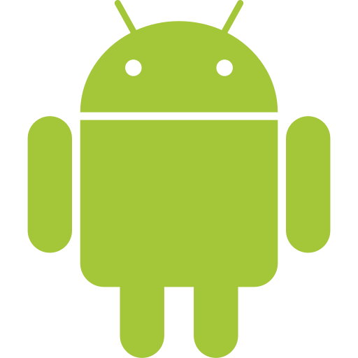

{ width=200 }{ width=75 }

# Ben's Smartphone
*Google Pixel 9 Pro*

[Android Help :brands-android-robot:](https://support.google.com/android/?hl=en#topic=7313011){ .md-button .md-button--primary }&emsp;[Pixel Care+ :symbols-shield-heart:](https://store.google.com/us/my-devices?hl=en-US){ .md-button .md-button--primary }

---
## :material-information-outline: Overview

#### :material-toolbox: Role: 
+ Ben's main mobile device. A Google Pixel 9 Pro connected to the Trusted Wi-Fi network (SSID: `Home`).

#### :symbols-host: Hostname(s): 
+ `bens-phone`

#### :material-map-marker-outline: Location: 
+ Mobile

#### :material-memory: OS / Firmware:
+ [:brands-android-robot:&nbsp;Android 16](https://www.android.com/)

#### :material-key-chain: Credentials:
+ [:services-bitwarden:&nbsp;Bitwarden](https://vault.bitwarden.com): 
    + Email&ensp;:material-arrow-right-thin:&ensp;"Google"

#### :material-security: Device Security:
+ Titan M2 security chip *(FIDO2 / WebAuthn)*
+ Full-disk encryption
+ 8-digit PIN
+ Biometric:
    + :material-fingerprint:&nbsp;Fingerprint
    + :material-face-recognition:&nbsp;Facial Recognition

## :symbols-monitor-heart: Core Specs

| CPU                                                        | Cores / Threads      | CPU Freq.                                                  | RAM           | GPU                                   | GPU Freq. | VRAM   |
| :--------------------------------------------------------- | :------------------- | :--------------------------------------------------------- | :------------ | :------------------------------------ | :-------- | :----- |
| :brands-google-tensor:&nbsp;Google Tensor G4 *(arm64-v8a)* | 8C / 8T / 3-Clusters | Cluster-1 1950 MHz, Cluster-2 2600 MHz, Cluster-3 3105 MHz | 16 GB LPDDR5X | :brands-google-tensor:&nbsp;Mali-G715 | -         | Shared |

## :material-lan: Network Configuration

| Interface | IP Address | MAC Address         | Connected To                         |
| :-------: | :--------- | :------------------ | :----------------------------------- |
|   Wi-Fi   | `DHCP`     | `08:8B:C8:4E:19:7B` | :material-wifi:&nbsp;Home *(VLAN50)* |

| Interface | VLAN                            | FQDN | DNS Servers                   | Gateway        |
| :-------: | :------------------------------ | :--- | :---------------------------- | :------------- |
|   Wi-Fi   | :material-security:&nbsp;VLAN50 | `-`  | `192.168.50.6` `192.168.50.2` | `192.168.50.1` |

## :symbols-storage: Storage & Mounts

#### :material-harddisk: Internal Drive(s):

| Mount Point | Drive Type | Drive Capacity | Device Path | File System | Encryption             |
| :---------- | :--------- | :------------- | :---------- | :---------- | :--------------------- |
| `N/A`       | UFS 3.1    | 128 GB         | `N/A`       | `N/A`       | Full Device Encryption |

#### :material-usb: External/Attached:

| Mount Point | Drive Type | Drive Capacity | Device Path | File System | Encryption |
| :---------- | :--------- | :------------- | :---------- | :---------- | :--------- |
| `-`         | -          | -              | `-`         | `-`         | -          |

## :material-web: Services / Docker Containers

#### :material-network-pos: Virtualization:

|  Status  | OS                                                       | Virtual NIC             | Virtual Disk Image | Role / Notes                       |
| :------: | :------------------------------------------------------- | :---------------------- | :----------------- | :--------------------------------- |
| *Active* | :material-debian:&nbsp;[Debian](https://www.debian.org/) | Virtual Network *(NAT)* | `-`                | Android Virtualization Environment |

#### :brands-android-robot: Native Android:

|  Status  | Service                                                          |        Port(s)         | Role / Notes                             |
| :------: | :--------------------------------------------------------------- | :--------------------: | :--------------------------------------- |
| *Active* | :simple-syncthing:&nbsp;[Syncthing](../03_Services/Syncthing.md) | `8384` `22000` `21027` | Open decentralized file synchronization. |

---
## :material-tools: Maintenance & Notes

> [!config inline end] Critical Configurations
> :material-vpn:&nbsp;**VPN:**
>
> + The [WireGuard](../03_Services/Wireguard_Server.md) VPN is used for remote access to the LAN.
> + [ASUS RT-BE92U](./ASUS_RT-BE92U.md) is the primary server, and [ZimaOS NAS](./ZimaBoard_2_NAS.md) is the secondary / backup server.
> + The VPN is configured through the WireGuard application, and has both profiles loaded. The default profile connects to the ASUS router
>
> :services-gotify-notification:&nbsp;**Gotify:**
>
> + The [Gotify](../03_Services/Gotify.md) application is installed for instant push notifications regarding the essential network infrastructure.
> + Log into the app with the "admin" user. 
>
> :material-email:&nbsp;**Email Client:**
>
> + The standard Gmail app has been disabled and replaced with [Thunderbird](https://www.thunderbird.net/en-US/mobile/) *(formerly K9-Mail)* on this mobile device. 
> + Account and app settings are backed up to the [ZimaOS NAS](./ZimaBoard_2_NAS.md) with [Syncthing](../03_Services/Syncthing.md)
>
> :material-calendar:&nbsp;**Calendar & Tasks:**
> 
> + The standard Google Calendar and Tasks applications are disabled and replaced with [Fossify Calendar](https://github.com/FossifyOrg/Calendar) and [Tasks.org](https://tasks.org/) *(Installed via F-Droid)*. 
> + Calendar and tasks synchronization is handled with the [DAVx5](https://www.davx5.com/) application.
> + The calendar and tasks serivce is hosted by [Fastmail](https://fastmail.com). 

#### :material-update: Update Process:

##### Android OS

+ Android updates are automatic, but can also be performed manually through the system settings or via ADB.
+ Google releases monthly security updates, quarterly feature updates, and yearly major version updates.

##### Applications

+ Most applications are installed / updated via the [Google Play Store](https://play.google.com/store/apps).
+ Other FOSS applications are installed / updated via the [F-Droid](https://f-droid.org/) app store and the [Obtainium](https://obtainium.imranr.dev/) application.

#### :material-cloud-upload-outline: Backup Policy:

##### Google Cloud Backup

+ Google's cloud backup service is used to back up **device settings** and **apps & app data** for applications installed via the Google Play Store. 
+ Other backup services provided by Google, like photos, call history, and SMS / MMS & RCS messages are disabled to maintain privacy and control of sensitive data.

##### Photos & Videos

+ Photos and videos are backed up to the [ZimaOS NAS](./ZimaBoard_2_NAS.md).
+ The [Immich](../03_Services/Immich.md) application handles backup for photos and videos. The Google Photos application is disabled.

##### SMS / MMS & RCS

+ The [SMS Backup & Restore Pro](https://www.synctech.com.au/sms-backup-restore/) application is responsible for backing up messages daily.
+ The application creates a compressed archive of the messages in the directory, `/backups/SMS_Backup`, and [Syncthing](../03_Services/Syncthing.md) transfers them to the **ZimaOS NAS**.

##### Other Apps

+ Other applications that allow exporting settings / data are backed up to the **ZimaOS NAS** via **Syncthing**.
+ Local directory: `/backups`
+ NAS directory: `/media/Quick-Storage/Backup/Pixel-9-Pro` 