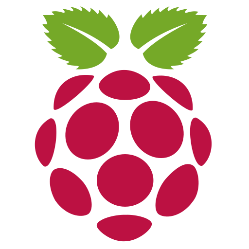

{ width=200 }&ensp;
{ width=50 }
&nbsp;{ width=50 }

# Raspberry Pi Zero Server
*Reverse-Proxy Server*

[Raspberry Pi Docs&ensp;:brands-raspberry-pi:](https://www.raspberrypi.com/documentation){ .md-button .md-button--primary }&emsp;[Debian Docs&ensp;:simple-debian:](https://www.debian.org/doc/){ .md-button .md-button--primary }

---
## :symbols-info:&ensp;Device Overview

#### :symbols-toolbox-outline:&ensp;Role 

:    A tiny, low-power server acting as a dedicated as Caddy reverse-proxy, giving unique `.internal` FQDNs to services hosted on the local network. Located on the stationary printer cart in the office upstairs, and connected to the local network via 2.4 GHz Wi-Fi (SSID: `Home`).

#### :symbols-host-outline:&ensp;Hostname

+ `pi-zero`

#### :symbols-location-outline:&ensp;Location

+ Office
+ Printer-Cart

#### :symbols-memory:&ensp;OS / Firmware

+ [:symbols-debian:&nbsp;Debian Linux 13](https://www.debian.org/) *(Trixie)*

#### :symbols-key:&ensp;Credentials

+ [:services-bitwarden:&nbsp;Bitwarden](https://vault.bitwarden.com) 
    + SSH Keys&ensp;:symbols-arrow-right-thin:&ensp;"pi-zero (admin)"

## :symbols-monitor-heart-outline:&ensp;Core Specs

| CPU                                  | Cores / Threads        | CPU Freq. | RAM          | GPU          | GPU Freq. | VRAM     |
| :----------------------------------- | :--------------------- | :-------- | :----------- | :----------- | :-------- | :------- |
| :simple-arm:&nbsp;BCM2837 *(Armv-8)* | 4C / 4T *(Cortex-A53)* | 1.2 GHz   | 512 MB SDRAM | VideoCore IV | 400 MHz   | *Shared* |

## :symbols-lan:&ensp;Network Configuration

| Interface | IP Address     | MAC Address         | Connected To                                                                          |
| :-------: | :------------- | :------------------ | :------------------------------------------------------------------------------------ |
|  `wlan0`  | `192.168.50.3` | `2c:cf:67:db:f5:e2` | [:symbols-android-wifi-lock:&nbsp;Home](./ASUS_RT-BE92U.md#wi-fi-networks) *(VLAN50)* |

| Interface |              VLAN              | FQDN               | DNS Servers                   | Gateway        |
| :-------: | :----------------------------: | :----------------- | :---------------------------- | :------------- |
|  `wlan0`  | :symbols-security:&nbsp;VLAN50 | `pi-zero.internal` | `192.168.50.6` `192.168.50.2` | `192.168.50.1` |

## :symbols-folder-open-outline:&ensp;Storage & Mounts

#### :symbols-hard-drive-outline:&ensp;Internal Drive(s)

| Mount Point      | Drive Type | Drive Capacity | Device Path      | File System | Encryption |
| :--------------- | :--------- | :------------- | :--------------- | :---------- | :--------- |
| `/`              | MicroSD    | 29 GB          | `/dev/mmcblk0p2` | `ext4`      | -          |
| `/boot/firmware` | MicroSD    | 512 MB         | `/dev/mmcblk0p1` | `vfat`      | -          |
| `/var/log`       | RAM        | 80 MB          | `log2ram`        | `tmpfs`     | -          |

## :symbols-web:&ensp;Services / Docker Containers

#### :symbols-linux:&ensp;Native Linux

|  Status  | Service                                                          |        Port(s)         | Role / Notes                                                                                                                          |
| :------: | :--------------------------------------------------------------- | :--------------------: | :------------------------------------------------------------------------------------------------------------------------------------ |
| *Active* | [:services-caddy:&nbsp;Caddy](../03_Services/Caddy.md)           |       `80` `443`       | Lightweight, open-source Web server written in Go. Used as a *reverse-proxy* for creating unique domains for locally hosted services. |
| *Active* | [:symbols-terminal:&nbsp;SSH](../03_Services/SSH.md)             |          `22`          | Provides secure encrypted communications between two untrusted hosts over an insecure network.                                        |
| *Active* | [:simple-syncthing:&nbsp;Syncthing](../03_Services/Syncthing.md) | `8384` `22000` `21027` | Open decentralized file synchronization.                                                                                              |

#### :services-docker:&ensp;Docker

|   Status   | Service                                                            | Port(s) | Role / Notes                                                                                           |
| :--------: | :----------------------------------------------------------------- | :-----: | :----------------------------------------------------------------------------------------------------- |
|  *Active*  | [:services-beszel:&nbsp;Beszel](../03_Services/Beszel_Hub.md)      | `45876` | Agent for Beszel Hub *(hosted on [Raspberry Pi 4B Server](../02_Hardware/Raspberry_Pi_4B_Server.md))*. |
|  *Active*  | [:services-dockge:&nbsp;Dockge](../03_Services/Dockge.md)          | `5001`  | A fancy, easy-to-use and reactive self-hosted Docker `compose.yaml` stack-oriented manager.            |
| *Inactive* | [:services-portainer:&nbsp;Portainer](../03_Services/Portainer.md) | `9001`  | A lightweight service delivery platform for containerized applications.                                |

---
## :symbols-note-stack:&ensp;Maintenance & Notes

--8<-- "maintenance-raspi.md"
