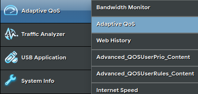
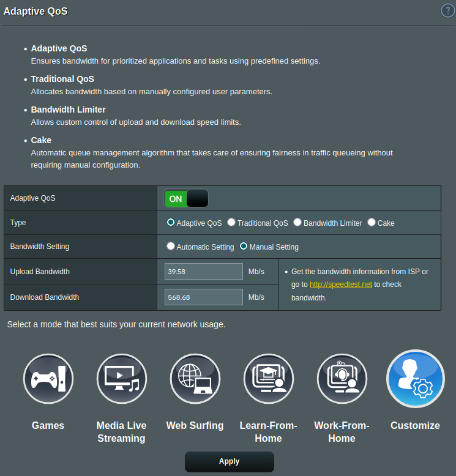
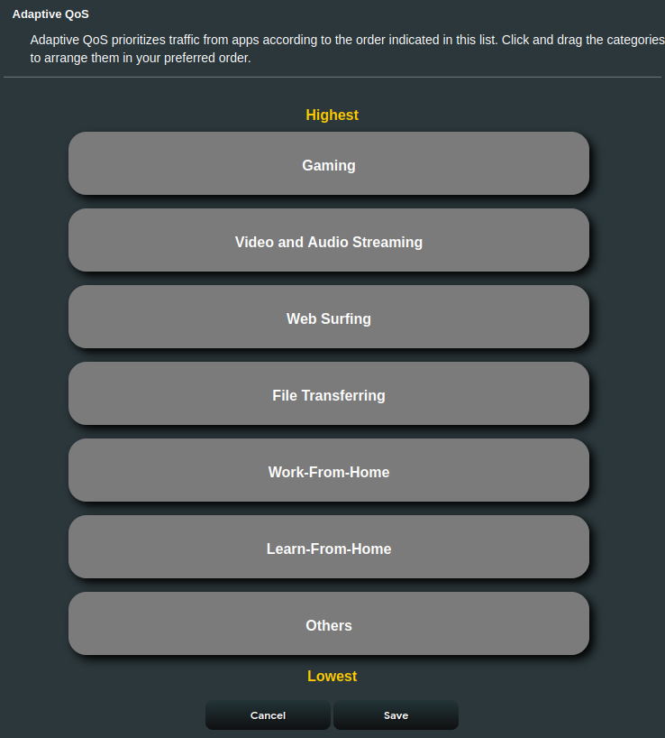
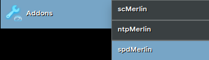
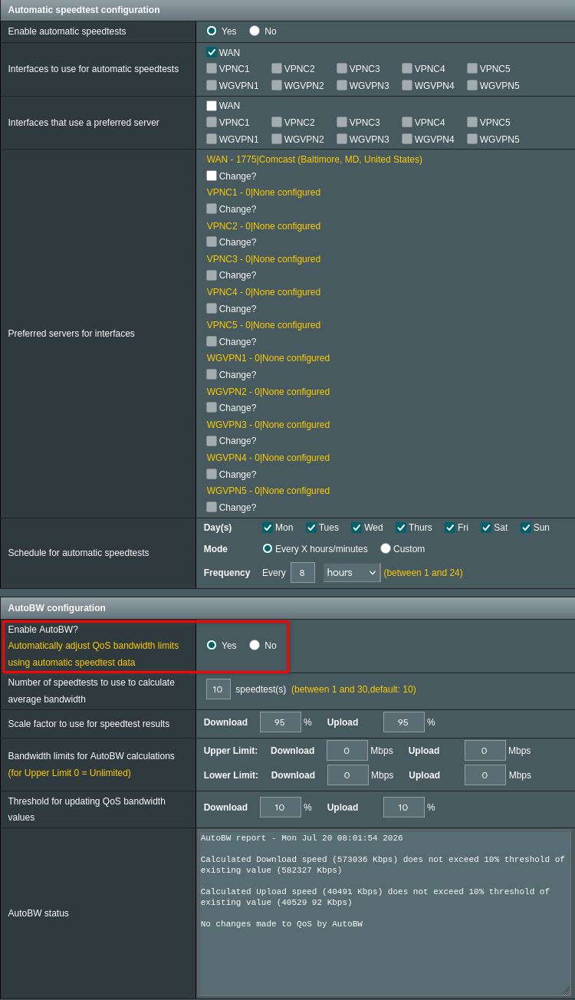

{ width=200 }

# ASUS RT-BE92U
*Wireless Router*

[Asuswrt-Merlin Docs&ensp;:symbols-wizard-hat:](https://github.com/RMerl/asuswrt-merlin.ng/wiki){ .md-button .md-button--primary }&emsp;[Router Settings&ensp;:symbols-settings:](https://asusrouter.internal:8443/Main_Login.asp){ .md-button .md-button--primary }&emsp;[Manual&ensp;:symbols-notebook-text:](../assets/manuals/RT-BE92U_Manual.pdf){ .md-button .md-button--primary }

---
## :symbols-info:&ensp;Device Overview

#### :symbols-toolbox:&ensp;Role

:    The main wireless router and firewall for the local network. Located next to the 10-inch server rack in the living room on the main floor. The standard firmware has been replaced with [Asuswrt-Merlin](https://www.asuswrt-merlin.net/){ external-link }, a more powerful option that retains the standard ASUS features / UI and adds a lot of great features and capabilities.

#### :symbols-host:&ensp;Hostname

:    `RT-BE92U-FAF0`

#### :symbols-map-pin:&ensp;Location 

:    Living-Room

#### :symbols-cpu:&ensp;OS / Firmware

:    [:symbols-wizard-hat:&ensp;Asuswrt-Merlin](https://www.asuswrt-merlin.net/){ external-link } *(3006.102.7_2)*

#### :symbols-user-key:&ensp;Credentials

:    [:services-bitwarden:&ensp;Bitwarden](https://vault.bitwarden.com){ external-link }: 
    
      + Local Network&ensp;:symbols-move-right:&ensp;"Asus Router"
      + SSH Keys&ensp;:symbols-move-right:&ensp;"ASUS RT-BE91U (Admin)"

## :symbols-network:&ensp;Network Configuration

#### :symbols-globe:&ensp;WAN Connection

??? info "Dual-WAN Capable"

    The **ASUS RT-BE92U** tri-band 802.11be *(Wi-Fi 7)* router supports two simultaneous WAN connections that can be configured to act synchronously or in fail-over mode. Additionally, the first two physical Ethernet ports on the router can be configured as either a WAN or LAN port. Physical port 0 is a 2.5 GbE port, and physical port 1 is a 10 GbE port. 
    
    On this network we utilize a single WAN connection on physical port `WAN / LAN 0` while physical port `WAN / LAN 1`, *the 10 GbE port*, is used as the uplink to the main switch via Cat6A Ethernet cable connected to an SFP+ to Ethernet transceiver in the switch. In the router's firmware the two WAN interfaces are labeled `wan0` and `wan1`, and they correspond to the physical ports, `WAN / LAN 0` and `WAN / LAN 1`, respectively.

| Interface {data-sort-method='number'} | IP Address | MAC Address         | Connected To {data-sort-method='none'}                                                     |
| :-----------------------------------: | :--------- | :------------------ | :----------------------------------------------------------------------------------------- |
|                `wan0`                 | `DHCP`     | `60:CF:84:51:FA:F0` | [:symbols-globe:&nbsp;Hitron Modem](hitron_modem.md#network-configuration){ data-preview } |
|                `wan1`                 | `Disabled` | `xx:xx:xx:xx:xx:xx` | -                                                                                          |

#### :symbols-hub:&ensp;Virtual Local Networks

|                VLAN                | Domain   | DNS Server(s) {data-sort-method='none'} | CIDR {data-sort-method='dotsep'} | Gateway {data-sort-method='dotsep'} | Broadcast {data-sort-method='dotsep'} | DHCP Range {data-sort-method='none'} |
| :--------------------------------: | :------- | :-------------------------------------- | :------------------------------- | :---------------------------------- | :------------------------------------ | :----------------------------------- |
|   :symbols-shield:&nbsp;VLAN50     | internal | `192.168.50.6` `192.168.50.2`           | `192.168.50.0/24`                | `192.168.50.1`                      | `192.168.50.255`                      | `.22` to `.254`                      |
| :symbols-user-shield:&nbsp;VLAN52  | -        | `9.9.9.9` `149.112.112.112`             | `192.168.52.0/24`                | `192.168.52.1`                      | `192.168.52.255`                      | `.2` to `.254`                       |
| :symbols-house-shield:&nbsp;VLAN53 | -        | `9.9.9.9` `149.112.112.112`             | `192.168.53.0/24`                | `192.168.53.1`                      | `192.168.53.255`                      | `.3` to `.254`                       |

#### :symbols-wifi-lock:&ensp;Wi-Fi Networks

|     SSID     |  VLAN  |   WAN Access    | CIDR {data-sort-method='dotsep'} | Frequency {data-sort-method='none'}   | Notes                                 |
| :----------: | :----: | :-------------: | :------------------------------- | :------------------------------------ | :------------------------------------ |
|    *Home*    | VLAN50 | :symbols-check: | `192.168.50.0/24`                | 2.4 GHz / 5 GHz / 6 GHz               | :symbols-shield:&nbsp;Trusted VLAN    |
| *Home_Guest* | VLAN52 | :symbols-check: | `192.168.52.0/24`                | 2.4 GHz / 5 GHz                       | :symbols-user-shield:&nbsp;Guest VLAN |
|   *2G_IoT*   | VLAN53 |   :symbols-x:   | `192.168.53.0/24`                | 2.4 GHz                               | :symbols-house-shield:&nbsp;IoT VLAN  |

#### :symbols-ethernet-port:&ensp;Physical Ethernet Ports

| Port {data-sort-method='number'} | Max Speed {data-sort-method='number'} | Connected Device                                                                                            | Color / Type {data-sort-method='none'} | Notes {data-sort-method='none'} |
| :------------------------------: | :------------------------------------ | :---------------------------------------------------------------------------------------------------------- | :------------------------------------- | :------------------------------ |
|           WAN / LAN 0            | 2.5 Gb/s                              | [:symbols-globe:&nbsp;Hitron Modem](hitron_modem.md#network-configuration){ data-preview }                  | Black / Cat6a                          | Active WAN connection           |
|           WAN / LAN 1            | 10 Gb/s                               | [:symbols-ethernet-port:&nbsp;Ugreen Switch](ugreen_switch.md#port-map){ data-preview }                     | Black / Cat6a                          | 10 Gb/s uplink                  |
|              LAN 2               | 2.5 Gb/s                              | <a href="./tags.html#tag:server-rack">:symbols-server-rack:&nbsp;Server Rack</a>                            | Black / Cat6a                          | Spare keystone jack             |
|              LAN 3               | 2.5 Gb/s                              | [:symbols-ethernet-port:&nbsp;TP-Link LiteWave Switch](tp-link_litewave_switch.md#port-map){ data-preview } | White / Cat6                           | 1 Gb/s uplink                   |
|              LAN 4               | 2.5 Gb/s                              | :symbols-ethernet-port:&nbsp;*Empty*                                                                        |                                        |                                 |
|              LAN 5               | 2.5 Gb/s                              | :symbols-ethernet-port:&nbsp;*Empty*                                                                        |                                        |                                 |

## :symbols-folder-tree:&ensp;Storage & Mounts

#### :symbols-hard-drive:&ensp;Internal Drive(s)

| Mount Point | Drive Type | Drive Capacity {data-sort-method='filesize'} | Device Path | File System | Encryption |
| :---------- | :--------- | :------------------------------------------- | :---------- | :---------- | :--------- |
| `/`         | eMMC       | 49.1 MB                                      | `/dev/root` | `squashfs`  | -          |
| `/jffs`     | -          | 44.5 MB                                      | `ubi:jffs2` | `ubifs`     | -          |
| `/data`     | -          | 16.8 MB                                      | `bui:data`  | `ubifs`     | -          |

#### :symbols-usb:&ensp;External / Attached

| Mount Point           | Drive Type      | Drive Capacity {data-sort-method='filesize'} | Device Path | File System | Encryption |
| :-------------------- | :-------------- | :------------------------------------------- | :---------- | :---------- | :--------- |
| `/tmp/mnt/router-usb` | USB Flash Drive | 28.3 GB                                      | `/dev/sda1` | `ext4`      | -          |

## :symbols-monitor-cloud:&ensp;Services & Containers

#### :symbols-tux:&ensp;Native

|  Status  | Service                                                                   | Port(s) {data-sort-method='number'} | Role / Notes {data-sort-method='none'}                                                                                                                                                                                               |
| :------: | :------------------------------------------------------------------------ | :---------------------------------: | :----------------------------------------------------------------------------------------------------------------------------------------------------------------------------------------------------------------------------------- |
| *Active* | [:symbols-clock-refresh-cw:&nbsp;Chrony](../03_services/chrony.md)        |                 `123`               | Advanced, lightweight NTP client and server.                                                                                                                                                                                         |
| *Active* | [:symbols-cloud-sync:&nbsp;DDNS](../03_services/ddns.md)                  |                 `N/A`               | A networking service that automatically maps a static domain name *(hostname)* to a dynamic public IP address. On this local network, the DDNS service is provided by [addr.tools](https://addr.tools){ external-link }.             |
| *Active* | [:symbols-cloud-sync:&nbsp;SMB](../03_services/smb.md)                    |                 `445`               | Remote file system access.                                                                                                                                                                                                           |
| *Active* | [:symbols-terminal-alt:&nbsp;SSH](../03_services/ssh.md)                  |                  `22`               | Provides secure encrypted communications between two untrusted hosts over an insecure network.                                                                                                                                       |
| *Active* | [:services-wireguard:&nbsp;WireGuard](../03_services/wireguard_server.md) |                `41820`              | An extremely simple yet fast and modern VPN that utilizes state-of-the-art cryptography.                                                                                                                                             |

---
## :symbols-sticky-notes:&ensp;Maintenance & Notes

!!! config inline end "Critical Configurations"

    :symbols-refresh-ccw-dot:&ensp;**Backup Restore:**
    :    Do not restore regular ASUS settings backup. Use `backupmon` over SSH instead. This backup / restore utility does a much more comprehensive backup than the ASUS tool. It backs up the NVRAM, JFFS partition, and the external USB drive. The backups are stored on the [ZimaOS NAS](zimaos_nas.md) and the [Pi 4B Server](pi_4b_server.md). 

    :symbols-clock-refresh-cw:&ensp;**NTP Server:**
    :    The router acts as the NTP server for the entire network. The "NTP-Director" feature is used to capture all NTP packets and redirect them to its own **Chrony** server, so devices that do not have their own NTP settings are still using the router to update their time. 

    :symbols-gauge:&ensp;**Adaptive QoS:**
    :    The router manages the available WAN connection bandwidth with an "Adaptive QoS" algorithm and prioritizes allocation based on the application type.

#### :symbols-update:&ensp;Update Process

+ Automatic **Asuswrt-Merlin** firmware updates with the [MerlinAU](https://github.com/ExtremeFiretop/MerlinAutoUpdate-Router){ external-link } tool.
+ Email notifications enabled for [AMTM](https://github.com/RMerl/asuswrt-merlin.ng/wiki/AMTM){ external-link } and script updates.
    + Notification emails are sent to: [admin@haube-pereira.com](mailto:admin@haube-pereira.com){ mailto-link } 
+ For Entware packages use the command, `opkg update`, or update with **AMTM** script.

#### :symbols-cloud-upload:&ensp;Backup Policy

+ The NVRAM, JFFS, and external USB drive are backed up automatically once a week on Sundays *(at 3:00 UTC-5)* to [ZimaOS NAS](zimaos_nas.md#data){ data-preview } and [Pi 4B Server](pi_4b_server.md#external-attached){ data-preview } using the [BACKUPMON](https://github.com/ViktorJp/BACKUPMON){ external-link } script.
+ **Backup Directory:**
    + ZimaOS NAS: `/media/Quick-Storage/Backup/router`
    + Pi 4B Server: `/mnt/usb-drive/smb-share/router`
+ Backups of the router settings stored on the **ZimaOS NAS** are then backed up to the cloud storage provider, [Backblaze B2](https://www.backblaze.com/cloud-storage){ external-link }, to maintain the [3-2-1 Backup Strategy](../01_infrastructure/disaster_recovery_plan.md#backup-strategy).

#### :services-gotify-notification:&ensp;Gotify Push Notifications

:    While most automated notifications from the router are sent via email, there are a few services that utilize the [Gotify](../03_services/gotify.md#notifications){ data-preview } server to send instant push notifications for events that may require an urgent response.

##### SSH Session Alerts

+ A custom script is used to send a push notification through the Gotify server whenever a new SSH session is successfully established with the router. The notification reports the user, hostname, and client IP address.
+ To see the script and detailed configuration information, see the ["SSH Session Alerts"](../03_services/gotify.md#ssh-alerts) section on the Gotify service documentation page.

##### WAN IP Change

+ Whenever the WAN IP address changes or the WAN connection drops then reconnects; a push notification is sent through the Gotify server. 
+ To see the script and detailed configuration information, see the ["WAN IP Change"](../03_services/gotify.md#wan-ip-change) section of the Gotify service documentation page.  

##### BACKUPMON Alerts

+ Every time the BACKUPMON utility completes a backup of the router's NVRAM, JFFS partition, and external USB drive an alert is sent to the Gotify server. The push notification details the success or failure of the backup.
+ To see the script and detailed configuration information, see the ["BACKUPMON Alerts"](../03_services/gotify.md#backupmon-alerts) section of the Gotify service documentation page.

##### Connmon Alerts

+ The Connmon utility monitors the router's WAN connection by measuring the ping, jitter, and line quality. Whenever the tests fail *(lost connection)* or the measured values are greater than the set threshold an alert is sent to the Gotify server.
+ To see the script and detailed configuration information, see the ["Connmon Alerts"](../03_services/gotify.md#connmon-alerts) section of the Gotify service documentation page.

##### DHCP Event Alerts

+ The router's DHCP server assigns IP addresses to all devices that connect to the local network using the `dnsmasq` service. This service has a native `dhcp-script` configuration flag that triggers exactly when a lease is created, renewed, or deleted. The catch is that Asuswrt-Merlin already uses this flag to run its own internal script *(`/sbin/dhcpc_lease`)*, which populates the router's UI Network Map. If you simply overwrite the flag with a standard custom config, you'll break Asuswrt's internal tracking.
+ The logical workaround is to use the `dnsmasq.postconf` script to seamlessly hijack the configuration and point it to a custom wrapper script, `dhcp-event.sh`. This wrapper will execute the router's default script first, and then fire off your Gotify `curl` command.
+ To see these scripts and detailed configuration information, see the ["DHCP Event Alerts"](../03_services/gotify.md#dhcp-event-alerts) section of the Gotify service documentation page.

#### :symbols-globe-check:&ensp;WAN Check Script

##### About

The `ChkWAN.sh` script can monitor the connection status of the WAN interface, and if the status is found to be unacceptable, can perform one of the following:

+ Report the status of the WAN connection.
+ Attempt to restart the WAN interface.
+ Reboot the router.

On this router the `ChkWAN.sh` script is configured to PING the following IP addresses and restart the WAN interface if no ICMP echo reply is received from ANY of the addresses. 

+ `9.9.9.9` *(Quad9)*
+ `149.112.112.112` *(Quad9)*
+ `8.8.8.8` *(Google)*
+ `1.1.1.1` *(Cloudflare)*

##### Configure

1. Download the `ChkWAN.sh` script to the router and give it permission to execute:

    ```sh linenums="1"
    curl --retry 3 "https://raw.githubusercontent.com/MartineauUK/Chk-WAN/master/ChkWAN.sh" -o "/jffs/scripts/ChkWAN.sh" && chmod 755 "/jffs/scripts/ChkWAN.sh"
    ```

2. Manually test the script with the default PING method, and the script will passively report the status, rather than proactively restart the WAN or reboot the router:

    ```sh linenums="1"
    ./ChkWAN.sh noaction once nowait
    ```

3. Add the following code to the `wan-event` script contained in the `/jffs/scripts` directory: 

    ```sh {title="/jffs/scripts/wan-event" linenums="1" .mono-title}
    if [ "$2" == "connected" ]; then
      #  (1)!
      cru a WAN_Check "*/5 * * * * /jffs/scripts/ChkWAN.sh wan ping=9.9.9.9,149.112.112.112,8.8.8.8,1.1.1.1"
    fi
    ```

    1. Manually create the cron job to preserve custom arguments.

    !!! note

        This code adds an entry to the crontab that runs the `ChkWAN.sh` script every five minutes. It will PING the five listed IP addresses, and if none of the PING requests get a reply the script restarts the WAN interface. The reason for adding this code to the `wan-event` script is to ensure the schedule is added to the crontab every time the router reboots or the WAN re-connects.

4. Trigger the `wan-event` script to add the crontab entry:

    ```sh linenums="1"
    sh /jffs/scripts/wan-event wan0 connected
    ```

5. Check the crontab for the `ChkWAN.sh` entry:

    ```sh linenums="1"
    cru l
    ```

    You should see the following line in the crontab:

    ```text linenums="1"
    */5 * * * * /jffs/scripts/ChkWAN.sh wan ping=9.9.9.9,149.112.112.112,8.8.8.8,1.1.1.1 #WAN_Check#
    ```

#### :symbols-gauge:&ensp;Adaptive QoS & spdMerlin

:    The router manages the available WAN connection bandwidth with an **"Adaptive QoS"** algorithm and prioritizes allocation based on the application type. The `spdMerlin` script runs a bandwidth test *every 8 hours* to update the QoS algorithm with the available bandwidth by averaging the last 10 test results. The upload / download bandwidth for Adaptive QoS will be automatically set to 95% of the average from the last ten test results. 

##### App Categories

:    Below is a list of QoS application categories in descending order from **highest** to **lowest** priority:

      + :symbols-gamepad-2:&ensp;Gaming
      + :symbols-film:&ensp;Video Streaming
      + :symbols-audio-lines:&ensp;Audio Streaming
      + :symbols-app-window-mac:&ensp;Web Surfing
      + :symbols-file-input:&ensp;File Transferring
      + :symbols-briefcase:&ensp;Work-From-Home
      + :symbols-graduation-cap:&ensp;Learn-From-Home
      + :symbols-circle-ellipsis:&ensp;Others

##### Adaptive QoS Settings

1. To access the **Adaptive QoS** settings, log into the [ASUS Router's Web UI](https://asusrouter.internal:8443){ external-link } and navigate to the QoS settings using the side bar. 

    <figure markdown="span">
        { width=400 }
    </figure>

2. On the **Adaptive QoS** settings page you can enable / disable the QoS feature, select the QoS method, set the upload and download bandwidth, and adjust the application priority. 

    !!! tip

        :symbols-gauge:&ensp;**Bandwidth Setting:**

        :    It is necessary to leave **"Bandwidth Setting"** set to **"Manual Setting"** for the `spdMerlin` script to automatically set the bandwidth based on the scheduled bandwidth test results. Though it may sound counter-intuitive, this is required for the feature to work. 
    
    <figure markdown="span">
        { width=600 }
    </figure>

    <figure markdown="span">
        { width=600 }
    </figure>

##### Configure spdMerlin

1. Log into the ASUS Router via [SSH](../03_services/ssh.md#url-access){ data-preview }, run the `amtm` script, and ensure the `spdMerlin` script is installed. 

    <figure markdown="span">
        { width=400 }
        { width=400 }
    </figure>

2. After confirming the `spdMerlin` script is installed, log into the [ASUS Router's Web UI](https://asusrouter.internal:8443){ external-link } and navigate to the `spdMerlin` page via the **"Addons"** entry on the side bar.

    <figure markdown="span">
        { width=400 }
    </figure>

3. On the `spdMerlin` addon page you can enable / disable automatic bandwidth tests, set the schedule for bandwidth tests, and enable the **"AutoBW"** feature to automatically set the QoS bandwidth based on the test results.

    <figure markdown="span">
        { width=600 }
    </figure>