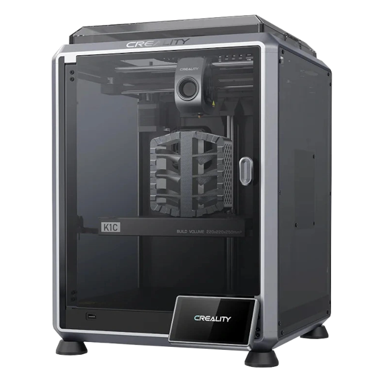

{ width=200 }

# Kacey 3D-Printer

_Modified Creality K1C_

[Creality Docs&ensp;:brands-creality-v2:](https://wiki.creality.com/en/k1-flagship-series){ .md-button .md-button--primary }&emsp;[Helper Script&ensp;:symbols-file-terminal:](https://guilouz.github.io/Creality-Helper-Script-Wiki/){ .md-button .md-button--primary }&emsp;[OrcaSlicer&ensp;:services-orca-slicer:](https://www.orcaslicer.com/){ .md-button .md-button--primary }

---

{ width=400 align=right .no-shadow }

## :symbols-info:&ensp;Device Overview

#### :symbols-toolbox:&ensp;Role

:    The Creality K1C 3D-printer located in the office upstairs, and connected to the local network through 2.4 GHz Wi-Fi _(SSID: `Home`)_. Affectionately, named 'Kacey' as a play on the model name, K1C.

:    See more detailed information about the Creality K1C hardware...

    [More Kacey Info&ensp;:brands-creality-v2:](kacey_info.md){ .md-button }

#### :symbols-host:&ensp;Hostname

:    `k1c-a71e`

#### :symbols-map-pin:&ensp;Location

- <!-- material/tags { include: [Office] } -->
{ .no-bullets }

#### :symbols-cpu:&ensp;OS / Firmware

- [:brands-creality-v2:&ensp;Creality FW Version: 1.3.3.46](https://www.creality.com/download/k1c-carbon-3d-printer){ external-link }
{ .no-bullets }
- [:symbols-tux:&ensp;Buildroot 2020.02.1](https://buildroot.org/){ external-link }
{ .no-bullets }
- [:services-klipper:&ensp;Klipper 0.13.0](https://www.klipper3d.org/Releases.html#klipper-0130){ external-link }
{ .no-bullets }

#### :symbols-user-key:&ensp;Credentials

:    [:services-bitwarden:&ensp;Bitwarden](https://vault.bitwarden.com "Bitwarden Web Vault"){ external-link }

    - Local Network&ensp;:symbols-move-right:&ensp;"Fluidd (Creality K1C)"
    - SSH Keys&ensp;:symbols-move-right:&ensp;"Kacey (root)"

## :symbols-network:&ensp;Network Configuration

| Interface | IP Address { data-sort-method="dotsep" } | MAC Address         | Connected To                                                                                |
| :-------: | :--------------------------------------- | :------------------ | :------------------------------------------------------------------------------------------ |
|  `wlan0`  | `192.168.50.15`                          | `FC:EE:28:09:A7:1E` | [:symbols-wifi-lock:&nbsp;Home](asus_rt-be92u.md#wi-fi-networks){ data-preview } _(VLAN50)_ |

| Interface |             VLAN             | FQDN             | DNS Servers { data-sort-method="dotsep" } | Gateway { data-sort-method="dotsep" } |
| :-------: | :--------------------------: | :--------------- | :---------------------------------------- | :------------------------------------ |
|  `wlan0`  | :symbols-shield:&nbsp;VLAN50 | `kacey.internal` | `192.168.50.6` `192.168.50.2`             | `192.168.50.1`                        |

## :symbols-folder-tree:&ensp;Storage & Mounts

#### :symbols-hard-drive:&ensp;Internal Drive

| Mount Point | Drive Type | Drive Capacity { data-sort-method="filesize" } | Device Path       | File System | Encryption |
| :---------- | :--------- | :--------------------------------------------- | :---------------- | :---------- | :--------- |
| `/usr/data` | eMMC       | 6.5 GB                                         | `/dev/mmcblk0p10` | `ext4`      | -          |
| `/overlay`  | eMMC       | 96.8 MB                                        | `/dev/mmcblk0p9`  | `ext4`      | -          |
| `/rom`      | ROM        | 126.8 MB                                       | `/dev/root`       | `squashfs`  | -          |

#### :symbols-usb:&ensp;External / Attached

| Mount Point       | Drive Type      | Drive Capacity { data-sort-method="filesize" } | Device Path | File System | Encryption |
| :---------------- | :-------------- | :--------------------------------------------- | :---------- | :---------- | :--------- |
| `/tmp/udisk/sda1` | USB Flash Drive | 14.5 GB                                        | `/dev/sda1` | `vfat`      | -          |

## :symbols-cloud:&ensp;Services & Containers

#### :symbols-tux:&ensp;Native Linux

|  Status  | Service                                                     | Port(s) { data-sort-method="number" } | Role / Notes { data-sort-method="none" }                                                       |
| :------: | :---------------------------------------------------------- | :-----------------------------------: | :--------------------------------------------------------------------------------------------- |
| _Active_ | [:services-fluidd:&nbsp;Fluidd](../03_services/fluidd.md)   |            `80` `4408`             | A free and open-source Klipper web interface for managing your 3D-printer.                     |
| _Active_ | [:symbols-api:&nbsp;Moonraker](../03_services/moonraker.md) |                `7125`                 | Web API server for [Klipper](https://www.klipper3d.org/){ external-link }.                     |
| _Active_ | [:symbols-square-terminal:&nbsp;SSH](../03_services/ssh.md) |                 `22`                  | Provides secure encrypted communications between two untrusted hosts over an insecure network. |

---

## :symbols-sticky-notes:&ensp;Maintenance & Notes

???+ config "Modifications"

    :symbols-cpu:&ensp;**Firmware**

    :    The standard firmware from Creality is heavily modified with the [Creality Helper Script](https://guilouz.github.io/Creality-Helper-Script-Wiki/){ external-link }.  See documentation for configuration issues.

    :symbols-package:&ensp;**Software**

    :   Fluidd

        - For information regarding the [Fluidd](../03_services/fluidd.md) Web UI see the [documentation](https://docs.fluidd.xyz/ "Fluidd Docs"){ external-link }.  

    :   Klipper / Moonraker

        - For information regarding Klipper configuration see the [documentation](https://www.klipper3d.org/ "Klipper Docs"){ external-link }.
        - Moonraker is an API that allows Fluidd to communicate with Klipper. See Moonraker [documentation](https://moonraker.readthedocs.io/en/latest/ "Moonraker Docs"){ external-link }.

    :   HelixScreen

        - HelixScreen is a replacement UI for the printer's LCD touchscreen that can control many more functions of the 3D-printer. It integrates with the Moonraker API for its functions. 
        - For more information about HelixScreen and help with configuration see the [documentation](https://helixscreen.org/installation/ "HelixScreen Docs"){ external-link }.

    :symbols-printer-3d-nozzle:&ensp;**Hardware**

    :   [Bed Leveling Knobs](../3d_printing/k1_bed_level_knobs.md)

        - Changes from a fixed bed to an adjustable bed with aluminum knobs.

    :   [PROWIPER^&copy;^ Mod](../3d_printing/prowiper_mod.md)

        - Replaces the standard nozzle wiping brush at the back of the build plate.

    :symbols-file-code-corner:&ensp;**Custom G-Code Macros**

    :   [Manual Nozzle Cleaning Macro](../3d_printing/manual_nozzle_cleaning_macro.md)

        - This custom macro set *(`CLEAN_NOZZLE`, `DONE_CLEANING`, and `DONE_CLEANING_COOL`)* creates an interactive, semi-automated workflow for manual nozzle maintenance.

#### :symbols-rotate-cw-clock:&ensp;Update Process

:    Update most software through the [Fluidd Web UI](http://kacey.internal){ external-link }. Update Entware packages in terminal via [SSH](../03_services/ssh.md)

#### :symbols-cloud-upload:&ensp;Backup Policy

:    Configuration files are backed up automatically to a private [GitHub](https://github.com/benhaube/creality-K1C-klipper-backup){ external-link } repository.