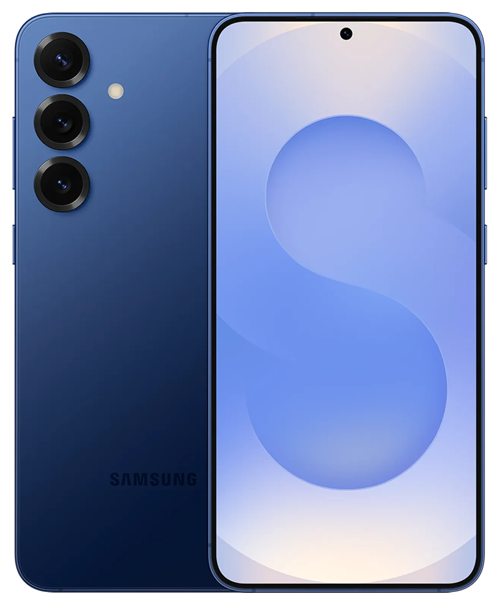

{ width=200 }

# Rob's Smartphone

_Samsung Galaxy S25+_

[Android Help&ensp;:brands-android-2:](https://support.google.com/android){ .md-button .md-button--primary }&emsp;[Device Support&ensp;:symbols-life-buoy:](https://store.google.com/us/my-devices?hl=en-US){ .md-button .md-button--primary }

---

{ width=300 align=right .no-shadow }

## :symbols-info:&ensp;Device Overview

#### :symbols-toolbox:&ensp;Role

:    Rob's main mobile device. A Samsung Galaxy S25+ connected to the Trusted Wi-Fi network _(SSID: `Home`)_.

#### :symbols-host:&ensp;Hostname

:    `robert-s-s25`

#### :symbols-map-pin:&ensp;Location

- <!-- material/tags { include: [Mobile] } -->
{ .no-bullets } 

#### :symbols-cpu:&ensp;OS / Firmware

:    [:brands-android-2:&ensp;Android 17](https://www.android.com/){ external-link }

#### :symbols-user-key:&ensp;Credentials

:    [:services-bitwarden:&ensp;Bitwarden](https://vault.bitwarden.com "Bitwarden Web Vault"){ external-link }

    - Email&ensp;:symbols-move-right:&ensp;"Google"

#### :symbols-brick-wall-shield:&ensp;Device Security

##### Software

- :symbols-shield-keyhole:&nbsp;Full-disk encryption
{ .no-bullets }
- :symbols-rectangle-ellipsis:&nbsp;8-digit PIN
{ .no-bullets }

##### Biometric

- :symbols-fingerprint-pattern:&nbsp;Fingerprint Scan
{ .no-bullets }
- :symbols-scan-face:&nbsp;Face Scan
{ .no-bullets }

## :symbols-circuit-board:&ensp;Core Specs

| CPU                                                       | Cores / Threads       | CPU Freq.                  | RAM           | GPU                               | GPU Freq. | VRAM   |
| :-------------------------------------------------------- | :-------------------- | :------------------------- | :------------ | :-------------------------------- | :-------- | :----- |
| :brands-snapdragon:&nbsp;Snapdragon 8 Elite _(arm64-v8a)_ | 8C / 8T 2-Clusters | 2x 4.47 GHz 6x 3.53 GHz | 12 GB LPDDR5X | :brands-qualcomm:&nbsp;Adreno 830 | 1200 MHz  | Shared |

## :symbols-network:&ensp;Network Configuration

| Interface | IP Address { data-sort-method="dotsep" } | MAC Address         | Connected To                                                                                |
| :-------: | :--------------------------------------- | :------------------ | :------------------------------------------------------------------------------------------ |
|   Wi-Fi   | `DHCP`                                   | `1A:5C:54:48:81:37` | [:symbols-wifi-lock:&nbsp;Home](asus_rt-be92u.md#wi-fi-networks){ data-preview } _(VLAN50)_ |

| Interface | VLAN                         | FQDN                    | DNS Servers { data-sort-method="none" } | Gateway { data-sort-method="dotsep" } |
| :-------: | :--------------------------- | :---------------------- | :-------------------------------------- | :------------------------------------ |
|   Wi-Fi   | :symbols-shield:&nbsp;VLAN50 | `robert-s-s25.internal` | `192.168.50.6` `192.168.50.2`           | `192.168.50.1`                        |

## :symbols-folders:&ensp;Storage & Mounts

#### :symbols-hard-drive:&ensp;Internal Drive(s)

| Mount Point | Drive Type | Drive Capacity { data-sort-method="filesize" } | Device Path | File System | Encryption                                         |
| :---------- | :--------- | :--------------------------------------------- | :---------- | :---------- | :------------------------------------------------- |
| `N/A`       | UFS 4.0    | 256 GB                                         | `N/A`       | `N/A`       | :symbols-shield-keyhole:&nbsp;Full-disk Encryption |

#### :symbols-usb:&ensp;External/Attached

| Mount Point | Drive Type | Drive Capacity { data-sort-method="filesize" } | Device Path | File System | Encryption |
| :---------- | :--------- | :--------------------------------------------- | :---------- | :---------- | :--------- |
| `-`         | -          | -                                              | `-`         | `-`         | -          |

---

## :symbols-sticky-notes:&ensp;Maintenance & Notes

!!! config inline end "Critical Configurations"

    :symbols-waypoints:&ensp;**VPN**

    :   The [WireGuard](../03_services/wireguard_server.md) VPN is used for remote access to the LAN. The [ASUS RT-BE92U](asus_rt-be92u.md) wireless router is the primary server, and [ZimaOS NAS](zimaos_nas.md) is the backup server.

    :   The VPN is configured through the WireGuard application, and has both profiles loaded. The default profile connects to the ASUS router.

#### :symbols-rotate-cw-clock:&ensp;Update Process

##### Android OS

:   Android updates are automatic, but can also be performed manually through the system settings or via ADB. Samsung releases monthly security updates, quarterly feature updates, and yearly major version updates.

##### Applications

:   Most applications are installed / updated via the [Google Play Store](https://play.google.com/store/apps){ external-link }. Other FOSS applications are installed / updated via the [F-Droid](https://f-droid.org/){ external-link } app store and the [Obtainium](https://obtainium.imranr.dev/){ external-link } application.

#### :symbols-cloud-upload:&ensp;Backup Policy

##### Cloud Backup

:   Google's cloud backup service is used to back up **device settings** and **apps & app data** for applications installed via the Google Play Store. Other backup services provided by Google, like photos, call history, and SMS / MMS & RCS messages are disabled to maintain privacy and control of sensitive data.

:   Backups of the user files stored on the **ZimaOS NAS** are then backed up to the cloud storage provider, [Backblaze B2](https://www.backblaze.com/cloud-storage){ external-link }, to maintain the [3-2-1 Backup Strategy](../01_infrastructure/disaster_recovery_plan.md#backup-strategy).

##### Photos & Videos

:   Photos and videos are backed up to the [ZimaOS NAS](zimaos_nas.md). The [Immich](../03_services/immich.md) application handles backup for photos and videos. The Google Photos application is disabled.

##### SMS / MMS & RCS

:   The [SMS Backup & Restore Pro](https://www.synctech.com.au/sms-backup-restore/){ external-link } application is responsible for backing up messages daily. The application creates a compressed archive of the messages in the directory, `/backups/SMS_Backup`, and [Syncthing](../03_services/syncthing.md) transfers them to the **ZimaOS NAS**.

##### Other Apps

:   Other applications that allow exporting settings / data are backed up to the **ZimaOS NAS** via **Syncthing**.

    - Local directory:&ensp;`/backups`
    - NAS directory:&ensp;`/media/Quick-Storage/Backup/Galaxy-S25`