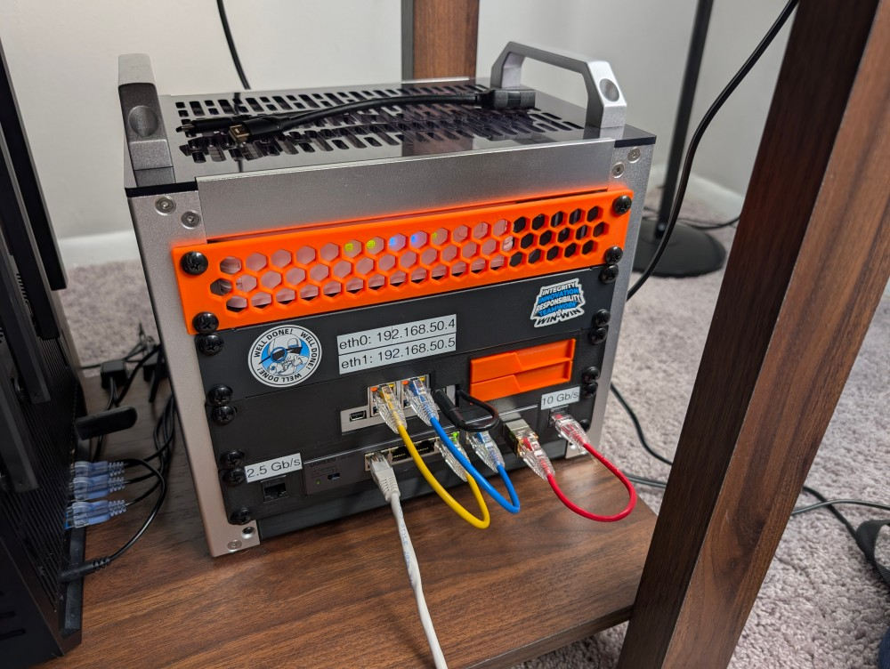

{ width=200 }

# Ugreen Switch

_Model UM106X_

[Manual&ensp;:symbols-notebook-text:](../assets/manuals/Ugreen_CM106X_Manual.pdf){ .md-button .md-button--primary }&emsp;[Datasheet&ensp;:symbols-file-chart-column:](../assets/manuals/Ugreen_CM106X_Datasheet.pdf){ .md-button .md-button--primary }

---

{ width=400 align=right .on-glb }

## :symbols-info:&ensp;Physical Overview

#### :symbols-toolbox:&ensp;Role

: A rack-mounted 2.5 gigabit switch in the living room with a 10 Gb/s SFP+ uplink to the router, distributing Ethernet connections to the devices in the 10-inch server rack with extra ports available for future network expansion.

#### :symbols-map-pin:&ensp;Location

- <!-- material/tags { include: [Living Room, Server Rack] } -->
{ .no-bullets } 

#### :symbols-plug:&ensp;Power Source

:    Wall wart _(12.0V / 1.0A)_

#### :symbols-circuit-board:&ensp;Specs

##### Throughput

- Five 2.5 Gb/s Ports
{ .no-bullets }
- One SFP+ 10 Gb/s Uplink *(from [ASUS RT-BE92U](asus_rt-be92u.md#physical-ethernet-ports){ data-preview } router)*
{ .no-bullets }
- 45 Gb/s Total Switching Capacity
{ .no-bullets }

##### Jumbo Frames

- Supported _(12 KB)_
{ .no-bullets }

##### Managed

- No &mdash; Unmanaged
{ .no-bullets }

## :symbols-ethernet-port:&ensp;Port Map

| Port # { data-sort-method="number" } | Connected Device                                                                                   | Color / Type { data-sort-method="none" } | Notes { data-sort-method="none" }                          |
| :----------------------------------: | :------------------------------------------------------------------------------------------------- | :--------------------------------------- | :--------------------------------------------------------- |
|                  1                   | [:symbols-laptop-minimal:&nbsp;Rob's Laptop](robs_laptop.md#network-configuration){ data-preview } | White / Cat5e                            | 2.5 Gb/s &mdash; Temporary Connection `E8:9C:25:90:8B:11`  |
|                  2                   | :symbols-ethernet-port:&nbsp;_Empty_                                                               | -                                        | -                                                          |
|                  3                   | :symbols-ethernet-port:&nbsp;_Empty_                                                               | -                                        | -                                                          |
|                  4                   | [:symbols-server-nas:&nbsp;ZimaOS NAS](zimaos_nas.md#network-configuration){ data-preview }        | Blue / Cat6A                             | 2.5 Gb/s &mdash; `eth1` `192.168.50.5` `00:E0:4C:5B:9A:95` |
|                  5                   | [:symbols-server-nas:&nbsp;ZimaOS NAS](zimaos_nas.md#network-configuration){ data-preview }        | Yellow / Cat6A                           | 2.5 Gb/s &mdash; `eth0` `192.168.50.4` `00:E0:4C:5B:9A:96` |
|                  6                   | [:symbols-router:&nbsp;ASUS RT-BE92U](asus_rt-be92u.md#physical-ethernet-ports){ data-preview }    | Red / Cat6A                              | 10 Gb/s &mdash; SFP+ Ethernet Transceiver                  |

---

## :symbols-sticky-notes:&ensp;Maintenance Notes

!!! visual inline "Visual Indicators"

    **Ethernet Ports**

    - :symbols-led:&ensp;**Green:** 2500 Mb/s 
    { .no-bullets }
    - :symbols-led:&ensp;**Amber:** 10/100/1000 Mb/s
    { .no-bullets }
    - :symbols-led-on:&ensp;**Flashing:** Network Activity
    { .no-bullets }

    **SFP+ Port**

    - :symbols-led:&ensp;**Green:** 10 Gb/s 
    { .no-bullets }
    - :symbols-led:&ensp;**Amber:** 1000 / 2500 Mb/s
    { .no-bullets }
    - :symbols-led-on:&ensp;**Flashing:** Network Activity
    { .no-bullets }

!!! warning inline "Troubleshooting"

    Hard reboot required if traffic stalls _(unplug power for 60s)_.
