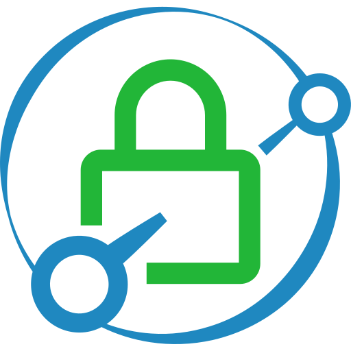

{ width=200 }

# Caddy *(Reverse-Proxy Server)*
[GitHub :material-github:](https://github.com/caddyserver/caddy){ .md-button .md-button--primary }&emsp;[Documentation :material-file-document-multiple:](https://caddyserver.com/docs/){ .md-button }

---
## :material-information-outline: Overview

#### Purpose: 
+ Lightweight, open-source Web server written in Go. Used as a *reverse-proxy* for creating unique domains for locally hosted services.

#### Port(s):
+ `80`
+ `443`

#### URL / Access: 
+ <https://pi-zero.internal>

#### Credentials:
+ N/A

## :material-package-down: Deployment Details

| Host Device | Method | Container Name | Image |
| :---------- | :----- | :------------- | :---- |
| :material-raspberry-pi:&nbsp;[Raspberry Pi Zero Server](../02_Hardware/Raspberry_Pi_Zero_2_W.md) | :material-linux:&nbsp;Native Linux *(Systemd)* | `N/A` | `N/A` |

### :material-cog: Configuration 

#### Install:

1. Add the official Caddy repository. 

    ```bash linenums="1"
    sudo apt install -y debian-keyring debian-archive-keyring apt-transport-https curl
    
    curl -1sLf 'https://dl.cloudsmith.io/public/caddy/stable/gpg.key' | sudo gpg --dearmor -o /usr/share/keyrings/caddy-stable-archive-keyring.gpg
    
    curl -1sLf 'https://dl.cloudsmith.io/public/caddy/stable/debian.deb.txt' | sudo tee /etc/apt/sources.list.d/caddy-stable.list
    ```

2. Install the package.

    ```bash linenums="1"
    sudo apt update
    sudo apt install caddy
    ```

3. Edit the configuration.

    ```bash linenums="1"
    sudo nano /etc/caddy/Caddyfile
    ```

4. Apply configuration changes by reloading the Systemd service.

    ```bash linenums="1"
    sudo systemctl reload caddy
    ```

#### The 'Caddyfile' *(configuration file)*:

```nginx title="/etc/caddy/caddyfile" linenums="1"
# The Caddyfile is an easy way to configure your Caddy web server.  
#  
# Unless the file starts with a global options block, the first  
# uncommented line is always the address of your site.  
#  
# To use your own domain name (with automatic HTTPS), first make  
# sure your domain's A/AAAA DNS records are properly pointed to  
# this machine's public IP, then replace ":80" below with your  
# domain name.  
  
:80 {  
       # Set this path to your site's directory.  
       root * /usr/share/caddy  
  
       # Enable the static file server.  
       file_server  
  
       # Another common task is to set up a reverse proxy:  
       # reverse_proxy localhost:8080  
  
       # Or serve a PHP site through php-fpm:  
       # php_fastcgi localhost:9000  
}  
  
# Refer to the Caddy docs for more information:  
# https://caddyserver.com/docs/caddyfile  
  
beszel.internal  
   reverse_proxy 192.168.50.2:8090  
}  
  
glance.internal {  
   reverse_proxy 192.168.50.2:8580  
}  
  
home-assistant.internal {  
   reverse_proxy 192.168.50.2:8123  
}  
  
immich.internal {  
   reverse_proxy 192.168.50.4:2283  
}  
  
it-tools.internal {  
   reverse_proxy 192.168.50.2:8080  
}  
  
openspeedtest.internal {  
   reverse_proxy 192.168.50.4:3004  
}  
  
portainer.internal {  
   reverse_proxy 192.168.50.2:9443  
}  
  
spoolman.internal {  
   reverse_proxy 192.168.50.4:7912  
}  
  
technitium.internal {  
   reverse_proxy 192.168.50.6:5380  
}  
  
uptime.internal {  
   reverse_proxy 192.168.50.2:3001  
}  
  
yt-dlp.internal {  
   reverse_proxy 192.168.50.4:3033  
}
```
