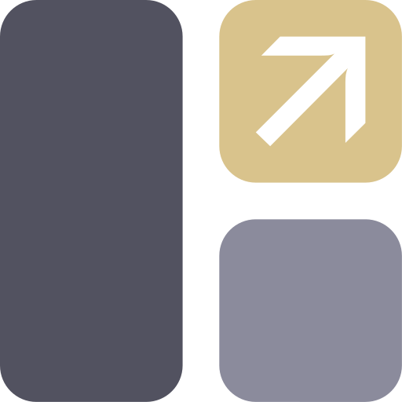

{ width=200 }

# Glance
[GitHub :material-github:](https://github.com/glanceapp/glance){ .md-button .md-button--primary }&emsp;[Documentation :material-file-document-multiple:](https://github.com/glanceapp/glance/tree/main/docs){ .md-button }

---
## :material-information-outline: Overview

#### :symbols-description: Description: 
+ A server dashboard Web UI. 

#### :symbols-settings-ethernet: Port(s):
+ `8580`

#### :material-link-variant: URL / Access:  
+ <https://glance.internal>
+ <http://pi-server.internal:8580/>

#### :material-key-chain: Credentials: 
+ [:services-bitwarden:&nbsp;Bitwarden](https://vault.bitwarden.com): 
    + "Glance Admin"
    + "Glance User (bhaube)"
    + "Glance User (rpereira)"

## :symbols-deployed-code-update: Deployment Details

> [!change]- Image
> :material-calendar:&nbsp;**Date:** Monday, April 27 2026 <br>
> :material-swap-horizontal:&nbsp;**Change:** Using a forked Docker image <br>
> :material-help-circle-outline:&nbsp;**Reason:** Active development, additional features
>
> ---
>
> :material-cog:&nbsp;**Configuration:**
> 
> :   Changed the image to `panonim/dynacat:latest`, a fork of Glance with some added features. The standard Glance configuraiton is compatible, but the main configuration file needs to have a different name, `dynacat.yml`. I have left the old `glance.yml` configuration file in the directory to maintain compatibility with the official Glance image. 
> 
> :material-arrow-down-thin:&nbsp;**[See the new config file below](#glance-config)**&nbsp;:material-arrow-down-thin:

| Host Device | Method | Container Name | Image |
| :---------- | :----- | :------------- | :---- |
| :material-raspberry-pi:&nbsp;[Raspberry Pi 4B Server](../02_Hardware/Raspberry_Pi_4B_Server.md) | :material-docker:&nbsp;Docker Compose | `glance` | `panonim/dynacat:latest` |
|  |  | `f1_api` | `skyallinott/f1_api:latest` |

### :material-cog: Configuration

> [!change]- User Authentication
> :material-calendar:&nbsp;**Date:** Monday, April 20 2026 <br>
> :material-swap-horizontal:&nbsp;**Change:** Enabled user authentication <br>
> :material-help-circle-outline:&nbsp;**Reason:** Additional security
>
> ---
>
> :material-account:&nbsp;**Users:**
> 
> + Glance now has authentication enabled, therefore login is required for users to access the service. The user's credentials are stored in the [Bitwarden Vault](https://vault.bitwarden.com) within the folder "Local Network". There are curretly three user accounts: `admin`, `bhaube`, and `rpereira`. 
>
> :material-form-textbox-password:&nbsp;**Passwords:**
>
> > [!tip inline end]
> > Restarting the container with `#!bash docker compose restart` will not allow changes to the `.env` file to take affect. It is required to use `#!bash docker compose down` and `#!bash docker compose up -d`.
>
> + For additional security, the passwords are not stored in clear text within the service's configuration files. Instead, the passwords are hashed, and defined in the `.env` file. 
> + To change a user's password, attach to the container's shell and run the following command: 
>
>     ```bash linenums="1"
>     ./glance password:hash <my-password>
>     ```
> 
> + Copy and paste the hashed string into the corresponding variable in the `.env` file, shut the container down, and start the container again. 
>      
> :material-key-chain:&nbsp;**Server Secret:**
> 
> + The "Server Secret" needs to be set in the `glance.yml` configuration file. 
> + To generate a new server secret, attach to the container's shell and run the following command: 
> 
>     ```bash linenums="1"
>     ./glance secret:make
>     ```
> 
> + Copy and paste the generated string into the `glance.yml` file. 
>
>     + **Example:**
>
>         ```yaml title="glance.yml (snippet)" linenums="1"
>         auth:
>           secret-key: <insert-server-secret>
>           users:
>         ```
>
> + Shut the container down and start it back up using the same method shown above for user passwords. 

> [!change]- Widgets Directory
> :material-calendar:&nbsp;**Date:** Saturday, April 18 2026 <br>
> :material-swap-horizontal:&nbsp;**Change:** Moved pages and widgets into separate directories. <br>
> :material-help-circle-outline:&nbsp;**Reason:** Simplify the `<page>.yml` files for easier configuration management.
>
> ---
>
> > [!tip inline end]
> > Changes to the YAML files in the `config/pages` and `config/widgets` directories are recognized by the container instantly. However, you may need to clear the browser cache when you reload the page. 
> > 
> > **Reload and clear cache:**<br>++ctrl+f5++ 
> 
> :material-cog:&nbsp;**Configuration:**
> 
> + The Glance dashboard widgets have been moved into thier own directory to clean up the page YAML files. The new widgets directory is `/app/config/widgets/`. 
> + Using the `$include` directive, the separate widget YAML files can be added to the pages resulting in a much cleaner and easy to manage file structure. 
>     
>     + **Example:**
>
>         ```yaml title="page.yml (example)" linenums="1"
>         columns:
>           - size: full
>             widgets:         
>               - $include: /app/config/widgets/search.yml
>         ```
>
> :material-widgets:&nbsp;**Widgets:**
> 
> + To avoid putting a code block for every widget on this page, you can instead visit the GitHub repository containing all of the widgets included in the repository. 
> 
>     [Glance Widgets :material-github:](https://github.com/benhaube/glance-pages/tree/main/config/widgets){ .md-button }

#### :material-docker: Docker Compose:

```yaml title="docker-compose.yml" linenums="1"
services:
  glance:
    container_name: glance
    image: panonim/dynacat:latest  # (7)!
    restart: unless-stopped
    volumes:
      - ./config:/app/config
      - ./assets:/app/assets
      - /etc/localtime:/etc/localtime:ro
      - /var/run/docker.sock:/var/run/docker.sock:ro  # (1)!
    ports:
      - 8580:8580
    env_file: .env  # (2)!
    labels:
      glance.name: Glance
      glance.icon: si:glance
      glance.url: http://pi-server.internal:8580
      glance.description: Server Dashboard
      glance.id: glance
    dns:   # (3)!
      - 192.168.50.2
      - 192.168.50.6
  f1_api:
    container_name: f1_api
    image: skyallinott/f1_api:latest
    environment:
      - TIMEZONE=America/New_York  # (4)!
      - TRACK_COLOUR=#B0B0B0  # (5)!
      - EVENT_DETAIL=main  # (6)!
    ports:
      - 4463:4463
    restart: unless-stopped
    dns:
      - 192.168.50.2
      - 192.168.50.6
networks: {}
```

1. Optionally, also mount docker socket if you want to use the docker containers widget
2. Use `.env` to store tokens / secrets and URLs for Widgets. Do **NOT** put API tokens directly into the Glance pages.
3. It is required to define DNS server IP addresses for the container to resolve `.internal` domain names. 
4. Specify your timezone.
5. Specify desired track map color
6. Optional. main tracks qualis and races (inc. sprints), race tracks races. 
7. Changed image to a fork of Glance with added features.

#### :material-file-cog-outline: Glance Config:

```yaml title="dynacat.yml" linenums="1"
server:
  port: 8580
  assets-path: /app/assets  # (1)!

branding:
  app-name: Dashboard
  # logo-text: G
  logo-url: /assets/glance.png
  app-icon-url: /assets/glance.png
  favicon-url: /assets/glance.svg
  # hide-footer: true

theme:
  presets:
    Neon-Pink:
      background-color: 240 27 11  # (5)!
      contrast-multiplier: 1.5  # (6)!
      primary-color: 321 100 71
      positive-color: 165 78 51
      negative-color: 360 100 71
    Formula-One:
      background-color: 0 0 5
      contrast-multiplier: 1.5
      primary-color: 2 100 44
      positive-color: 112 82 46
      negative-color: 2 100 44
    Material-Purple-Enhanced:
      background-color: 227 46 16
      contrast-multiplier: 1.3
      primary-color: 233 76 85
      positive-color: 115 54 76
      negative-color: 347 70 65
    Material-Dark-Forest:
      background-color: 187 100 8
      contrast-multiplier: 1.3
      primary-color: 188 54 83
      positive-color: 115 54 76
      negative-color: 347 70 65

  custom-css-file: /assets/user.css  # (2)!

auth:
  secret-key: <insert-server-secret>  # (3)!
  users:
    admin:
      password-hash: ${ADMIN_PW_HASH}  # (4)!
    bhaube:
      password-hash: ${BHAUBE_PW_HASH}
    rpereira:
      password-hash: ${RPEREIRA_PW_HASH}

pages:
  - $include: pages/home.yml
  - $include: pages/network.yml
  - $include: pages/formula1.yml
```

1. The `/app/assets` directory contains all of the custom icons and CSS used in the Glance pages.
2. Assets are cached by the browser, changes to the CSS file will not be reflected until the browser cache is cleared... Refresh & clear cache: ++ctrl+f5++
3. The Glance Dashboard's server secret is stored in the Bitwarden Vault. (Local Network :material-arrow-right-thin: "Glance Server Secret" )
4. The `app/.env` file contains the hashed passwords. To change a user's password and generate the hash, enter the container's shell and use the command: `#!bash ./glance password:hash <my-password>`. Then paste the hashed string into the corresponding variable in the `.env` file.
5. Values for the colors are in **HSL** format. You can use a color picker like [this one](https://colorpicker.dev/#121212) to convert colors from other formats.  
6. Used to increase or decrease the contrast of the text. A value of `1.5` means that the text will be 50% *lighter / darker* depending on the scheme. Use this if you think that some of the text on the page is too dark and hard to read

```yaml title="glance.yml" linenums="1"
server:
  port: 8580
  assets-path: /app/assets # (1)!

# branding:
  # app-icon-url: /assets/icons/glance.png
  # hide-footer: true

theme:
  presets:
    Neon-Pink:
      background-color: 240 27 11  # (5)!
      contrast-multiplier: 1.5  # (6)!
      primary-color: 321 100 71
      positive-color: 165 78 51
      negative-color: 360 100 71
    Formula-One:
      background-color: 0 0 5
      contrast-multiplier: 1.5
      primary-color: 2 100 44
      positive-color: 112 82 46
      negative-color: 2 100 44
    Material-Purple-Enhanced:
      background-color: 227 46 16
      contrast-multiplier: 1.3
      primary-color: 233 76 85
      positive-color: 115 54 76
      negative-color: 347 70 65
    Material-Dark-Forest:
      background-color: 187 100 8
      contrast-multiplier: 1.3
      primary-color: 188 54 83
      positive-color: 115 54 76
      negative-color: 347 70 65

  custom-css-file: /assets/user.css # (2)!

auth:
  secret-key: <insert-server-secret>  # (3)!
  users:
    admin:
      password-hash: ${ADMIN_PW_HASH} # (4)!
    bhaube:
      password-hash: ${BHAUBE_PW_HASH}
    rpereira:
      password-hash: ${RPEREIRA_PW_HASH}

pages:
  - $include: pages/home.yml
  - $include: pages/network.yml
  - $include: pages/formula1.yml
```

1. The `/app/assets` directory contains all of the custom icons and CSS used in the Glance pages.
2. Assets are cached by the browser, changes to the CSS file will not be reflected until the browser cache is cleared... Refresh & clear cache: ++ctrl+f5++
3. The Glance Dashboard's server secret is stored in the Bitwarden Vault. (Local Network :material-arrow-right-thin: "Glance Server Secret" )
4. The `app/.env` file contains the hashed passwords. To change a user's password and generate the hash, enter the container's shell and use the command: `#!bash ./glance password:hash <my-password>`. Then paste the hashed string into the corresponding variable in the `.env` file.
5. Values for the colors are in **HSL** format. You can use a color picker like [this one](https://colorpicker.dev/#121212) to convert colors from other formats.  
6. Used to increase or decrease the contrast of the text. A value of `1.5` means that the text will be 50% *lighter / darker* depending on the scheme. Use this if you think that some of the text on the page is too dark and hard to read

#### :material-view-dashboard: Glance Pages:

```yaml title="home.yml" linenums="1"
- name: Home
  show-mobile-header: true  # (1)!
  # hide-desktop-navigation: true  (2)
  head-widgets:

    - $include: /app/config/widgets/markets.yml

  columns:

    - size: small
      widgets:

        - $include: /app/config/widgets/nasa-apod.yml
        - $include: /app/config/widgets/random-fact.yml
        - $include: /app/config/widgets/bookmarks.yml

    - size: full
      widgets:

        - $include: /app/config/widgets/search.yml
        - $include: /app/config/widgets/hacker-news-lobsters-split.yml
        - $include: /app/config/widgets/rss-home.yml
        - $include: /app/config/widgets/youtube-home.yml
        - $include: /app/config/widgets/reddit-home.yml

    - size: small
      widgets:

        - $include: /app/config/widgets/clock.yml
        - $include: /app/config/widgets/weather.yml
        - $include: /app/config/widgets/weather-aqi.yml 
        - $include: /app/config/widgets/weather-forecast.yml
        - $include: /app/config/widgets/calendar.yml
        - $include: /app/config/widgets/releases.yml
```

1. Show a title header on mobile web browsers.
2. Optionally, if you only have a single page you can hide the desktop navigation for a cleaner look.

```yaml title="network.yml" linenums="1"
- name: Network
  show-mobile-header: true  # (1)!
  # hide-desktop-navigation: true  (2)
  columns:

    - size: small
      widgets:

        - $include: /app/config/widgets/beszel.yml
        - $include: /app/config/widgets/uptime-kuma-ssh.yml
        # - $include: /app/config/widgets/wg-easy.yml  (3)
        - $include: /app/config/widgets/ha-wan.yml
        - $include: /app/config/widgets/ha-bandwidth.yml
        - $include: /app/config/widgets/releases.yml

    - size: full
      widgets:

        - $include: /app/config/widgets/search.yml
        - $include: /app/config/widgets/network-services.yml
        - $include: /app/config/widgets/docker-containers.yml

        - type: split-column
          widgets:

          - $include: /app/config/widgets/technitium.yml
          - $include: /app/config/widgets/immich-stats.yml

    - size: small
      widgets:

        - $include: /app/config/widgets/clock.yml
        - $include: /app/config/widgets/weather.yml
        - $include: /app/config/widgets/weather-aqi.yml
        - $include: /app/config/widgets/weather-forecast.yml
        - $include: /app/config/widgets/calendar.yml
```

1. Show a title header on mobile web browsers.
2. Optionally, if you only have a single page you can hide the desktop navigation for a cleaner look.
3. :material-bug: Disabled WireGuard Easy community widget for now due to bugginess. 

```yaml title="formula1.yml" linenums="1"
- name: Formula 1
  show-mobile-header: true  # (1)!
  # hide-desktop-navigation: true  (2)
  columns:

    - size: small
      widgets:

        - $include: /app/config/widgets/search.yml
        - $include: /app/config/widgets/f1-last-race-results.yml
        - $include: /app/config/widgets/rss-f1.yml

    - size: full
      widgets:

        - type: split-column
          widgets:

            - $include: /app/config/widgets/f1-next-race.yml
            
            - type: group
              widgets:

                - $include: /app/config/widgets/f1-driver-standings.yml
                - $include: /app/config/widgets/f1-constructor-standings.yml

        - $include: /app/config/widgets/reddit-f1.yml

    - size: small
      widgets:

        - $include: /app/config/widgets/clock.yml
        - $include: /app/config/widgets/weather.yml
        - $include: /app/config/widgets/weather-aqi.yml
        - $include: /app/config/widgets/weather-forecast.yml
        - $include: /app/config/widgets/calendar.yml
```

1. Show a title header on mobile web browsers.
2. Optionally, if you only have a single page you can hide the desktop navigation for a cleaner look.
