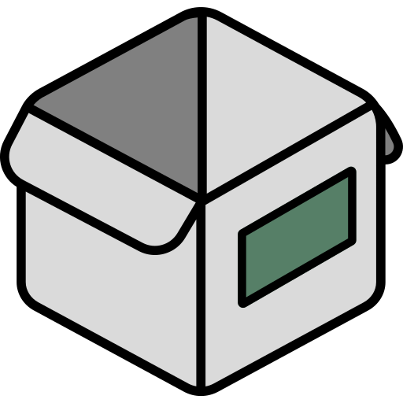

{ width=200 }

# Homebox
[GitHub :material-github:](https://github.com/sysadminsmedia/homebox){ .md-button .md-button--primary }&emsp;[Documentation :material-file-document-multiple:](https://homebox.software/en/quick-start/){ .md-button }

---
## :material-information-outline: Overview

#### :symbols-description: Description: 
+ An inventory and organization system built for the home user.

#### :symbols-settings-ethernet: Port(s): 
+ `3100`

#### :material-link-variant: URL / Access: 
+ <http://storage-server.internal:3100>
+ <http://192.168.50.4:3100>

#### :material-key-chain: Credentials: 
+ [:services-bitwarden:&nbsp;Bitwarden](https://vault.bitwarden.com): 
    + Local Network&ensp;:material-arrow-right-thin:&ensp;"Homebox @ storage-server"

## :symbols-deployed-code-update: Deployment Details

| Host Device                                                         | Method                                | Container Name | Image                                   |
| :------------------------------------------------------------------ | :------------------------------------ | :------------- | :-------------------------------------- |
| :material-nas:&nbsp;[ZimaOS NAS](../02_Hardware/ZimaBoard_2_NAS.md) | :material-docker:&nbsp;Docker Compose | `homebox`      | `ghcr.io/sysadminsmedia/homebox:latest` |

### :material-cog: Configuration

```yaml title="compose.yml" linenums="1"
--8<-- "homebox.yml"
```

1. Please consider allowing analytics to help us improve Homebox *(basic computer information, no personal data)*.