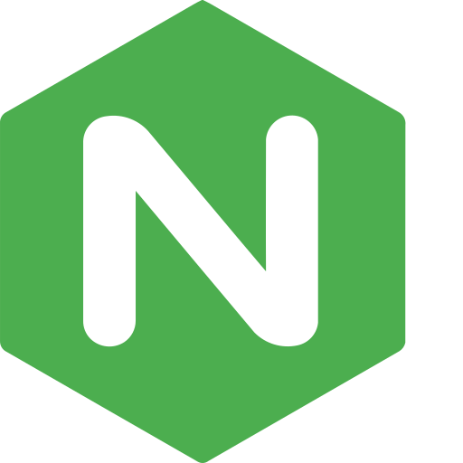

{ width=200 }

# Nginx
*Network Documentation*

[GitHub&ensp;:simple-github:](https://github.com/nginx/nginx){ .md-button .md-button--primary }&emsp;[Documentation&ensp;:symbols-documentation:](https://nginx.org/en/docs/){ .md-button .md-button--primary }

---
## :symbols-info:&ensp;Overview

#### :symbols-description:&ensp;Description 

:    The world's most popular Web Server, high performance Load Balancer, Reverse Proxy, API Gateway and Content Cache.

#### :symbols-settings-ethernet:&ensp;Port(s) 

+ `8080`

#### :symbols-link:&ensp;URL / Access

+ <http://storage-server.internal:8080>
+ <http://storage-server-2.internal:8080>
+ <https://portfolio.rac3r4life.online>

#### :symbols-key:&ensp;Credentials 

+ N/A

## :symbols-deployed-code-update:&ensp;Deployment Details

| Host Device | Method | Container Name | Image |
| :------------------------------------------------------------------ | :------------------------------------ | :---------------------- | :------------- |
| [:material-nas:&nbsp;ZimaOS NAS](../02_Hardware/ZimaBoard_2_NAS.md) | :material-docker:&nbsp;Docker Compose | `network-documentation` | `nginx:alpine` |

### :symbols-settings:&ensp;Configuration

```yaml title="<code>compose.yml</code>" linenums="1"
--8<-- "nginx.yml"
```

1. Maps port `8080` on the VM to port `80` inside the container.
2. Mounts your site folder as read-only (ro) for extra security.