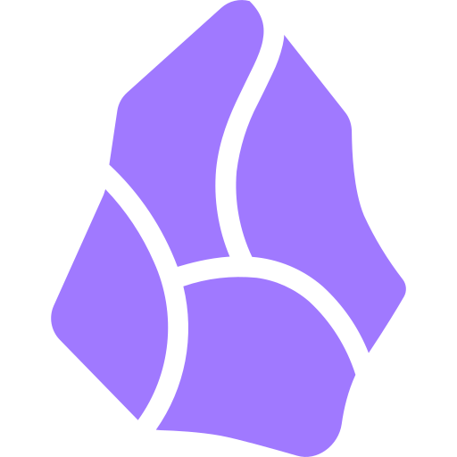

{ width=200 }&nbsp;{ width=75 }

# Obsidian LiveSync *(CouchDB)*
[GitHub :material-github:](https://github.com/apache/couchdb){ .md-button .md-button--primary }&emsp;[Documentation :material-file-document-multiple:](https://docs.couchdb.org/en/stable/){ .md-button }

---
## :material-information-outline: Overview

#### :symbols-description: Description: 
+ CouchDB database for synchronizing Obsidian Vaults 

#### :symbols-settings-ethernet: Port(s):
+ `5984`

#### :material-link-variant: URL / Access:  
+ :material-application-cog-outline: Settings Web UI: 
    + <http://storage-server.internal:5984/_utils>
+ :material-database-outline: Database:
    + <http://storage-server.internal:5984/obsidian-vault>

#### :material-key-chain: Credentials:  
+ :material-docker:&nbsp;Docker Compose: `docker-compose.yml`

## :symbols-deployed-code-update: Deployment Details

| Host Device | Method | Container Name | Image |
| :---------- | :----- | :------------- | :---- |
| :material-nas:&nbsp;[ZimaOS NAS](../02_Hardware/ZimaBoard_2_NAS.md) | :material-docker:&nbsp;Docker Compose | `obsidian-livesync` | `couchdb:3.5.0` |

### :material-cog: Configuration 

#### :material-server-outline: Server:

```yaml title="docker-compose.yml" linenums="1"
name: big-bear-obsidian-livesync
services:
  app:
    cpu_shares: 90
    command: []
    container_name: obsidian-livesync
    deploy:
      resources:
        limits:
          memory: 16508317696
        reservations:
          devices: []
    environment:
      - COUCHDB_PASSWORD=password # (1)!
      - COUCHDB_USER=bhaube
    image: couchdb:3.5.0
    labels:
      icon: https://cdn.jsdelivr.net/gh/selfhst/icons/png/obsidian.png
    ports:
      - mode: ingress
        target: 5984
        published: "5984"
        protocol: tcp
    restart: unless-stopped
    volumes:
      - type: bind
        source: /DATA/AppData/big-bear-obsidian-livesync/data/couchdb
        target: /opt/couchdb/data
        bind:
          create_host_path: true
      - type: bind
        source: /DATA/AppData/big-bear-obsidian-livesync/data/local.ini
        target: /opt/couchdb/etc/local.ini
        bind:
          create_host_path: true
    x-casaos:
      envs:
        - container: COUCHDB_USER
          description:
            en_us: "Container Variable: COUCHDB_USER"
        - container: COUCHDB_PASSWORD
          description:
            en_us: "Container Variable: COUCHDB_PASSWORD"
      ports:
        - container: "5984"
          description:
            en_us: "Container Port: 5984"
      volumes:
        - container: /opt/couchdb/data
          description:
            en_us: "Container Path: /opt/couchdb/data"
        - container: /opt/couchdb/etc/local.ini
          description:
            en_us: "Container Path: /opt/couchdb/etc/local.ini"
    devices: []
    cap_add: []
    networks:
      - default
    privileged: false
networks:
  default:
    name: big-bear-obsidian-livesync_default
x-casaos:
  architectures:
    - amd64
    - arm64
  author: BigBearTechWorld
  category: BigBearCasaOS
  description:
    en_us: Self-hosted database for synchronizing Obsidian vaults.
  developer: couchdb
  hostname: ""
  icon: https://cdn.jsdelivr.net/gh/selfhst/icons/png/obsidian.png
  index: /
  is_uncontrolled: false
  main: app
  port_map: "5984"
  scheme: http
  store_app_id: big-bear-obsidian-livesync
  tagline:
    en_us: Self-hosted database for synchronizing Obsidian vaults.
  thumbnail: ""
  tips:
    before_install:
      en_us: >
        Run this script before installing the big-bear-obsidian-livesync
        application:

        

        bash -c "$(wget -qLO - https://raw.githubusercontent.com/bigbeartechworld/big-bear-scripts/master/generate-obsidian-livesync-local-ini/run.sh)"


        Video Tutorial: https://youtu.be/-n1abMPLmFg


        After running this script, you need to restart the container.
  title:
    custom: ""
    en_us: Obsidian Livesync
```

1. Leave the default password in the Docker compose file, and change the password from the CouchDB Web UI. 

#### :material-devices: Clients:

```json title="<Vault Dir>/.obsidian/plugins/obsidian-livesync/data.json" linenums="1"
{
  "remoteType": "",
  "useCustomRequestHandler": false,
  "couchDB_URI": "",
  "couchDB_USER": "",
  "couchDB_PASSWORD": "",
  "couchDB_DBNAME": "",
  "liveSync": true,
  "syncOnSave": false,
  "syncOnStart": false,
  "savingDelay": 200,
  "lessInformationInLog": false,
  "gcDelay": 0,
  "versionUpFlash": "",
  "minimumChunkSize": 20,
  "longLineThreshold": 250,
  "showVerboseLog": false,
  "suspendFileWatching": false,
  "trashInsteadDelete": true,
  "periodicReplication": false,
  "periodicReplicationInterval": 60,
  "syncOnFileOpen": false,
  "encrypt": false,
  "passphrase": "",
  "usePathObfuscation": false,
  "doNotDeleteFolder": false,
  "resolveConflictsByNewerFile": false,
  "batchSave": false,
  "batchSaveMinimumDelay": 5,
  "batchSaveMaximumDelay": 60,
  "deviceAndVaultName": "",
  "usePluginSettings": false,
  "showOwnPlugins": false,
  "showStatusOnEditor": false,
  "showStatusOnStatusbar": true,
  "showOnlyIconsOnEditor": true,
  "hideFileWarningNotice": false,
  "networkWarningStyle": "",
  "usePluginSync": true,
  "autoSweepPlugins": true,
  "autoSweepPluginsPeriodic": false,
  "notifyPluginOrSettingUpdated": true,
  "checkIntegrityOnSave": false,
  "batch_size": 25,
  "batches_limit": 25,
  "useHistory": true,
  "disableRequestURI": true,
  "skipOlderFilesOnSync": true,
  "checkConflictOnlyOnOpen": false,
  "showMergeDialogOnlyOnActive": false,
  "syncInternalFiles": true,
  "syncInternalFilesBeforeReplication": true,
  "syncInternalFilesIgnorePatterns": "\\/node_modules\\/, \\/\\.git\\/, \\/obsidian-livesync\\/, ^\\.git\\/,\\/workspace$ ,\\/workspace.json$,\\/workspace-mobile.json$",
  "syncInternalFilesTargetPatterns": "",
  "syncInternalFilesInterval": 60,
  "additionalSuffixOfDatabaseName": "86c7f436930a1e67",
  "ignoreVersionCheck": false,
  "lastReadUpdates": 25,
  "deleteMetadataOfDeletedFiles": false,
  "syncIgnoreRegEx": "",
  "syncOnlyRegEx": "",
  "customChunkSize": 0,
  "readChunksOnline": true,
  "watchInternalFileChanges": true,
  "automaticallyDeleteMetadataOfDeletedFiles": 0,
  "disableMarkdownAutoMerge": false,
  "writeDocumentsIfConflicted": false,
  "useDynamicIterationCount": false,
  "syncAfterMerge": false,
  "configPassphraseStore": "",
  "encryptedPassphrase": "",
  "encryptedCouchDBConnection": "%$HpRTF+7P7iaTT40ibseGsZXwqzCfaynr4G1/yD8FYEt+sjj3Sra2CmWXbYGLbAAG0t4teoqW8XGAfgGEFoJLDHoy+kFj9S6K44h+YFvSb4IWZFGsngRjO/0dFmuMl/IzQFBi7s+cR7n2tONYcOsy8sw6YLVz4Luzw8WgErcDDtEDBru/iC4dn6KD47zxPwHPdXsHt2wyU1777l5t9XDQuzvTamCwyoDH3FP7inja9WYAGx5OjR24euEivGpu6gIhrMWcn9nCDNR8f0O1J1BesQu2twsE/QVAR0Iow5Q/QQ9XD6zwEPA5xPUOgaedgbmfLRofsw12iZ3SPskHOSOdKmCSaqy0iPmyqdY79lgYrSxDjQu+NsfHIkwiYOmHAyzT20FxvMCS8ounNBYwcPKR2p1rEi8Gyfv/aHQwt9Pjus/q9lnkK92tt+FqblgWZxofzwduMoad8mQ/UljDbGyvEYFaLLbdIVEFsTbsoQeGYofLglgvGx/rHXj1mTbMCuqrir2KAb8s1b0g6+v45bBfSpCLJMzY59V7hp7CWdd4EU0KAvfVcrEhTv3WyiAHEuh71wukersI+X/G0BM5D/C/dHUKv24JfEPIz4Cm/8A4WleOLYFwl+SdUG8yn3SxCGd7XB1Oh615atoz8AXPMoE+ka9SaCoHCh83PfSeuxRpegMqLEU+rghvgSHAGvqGXBxCTpEwY0BJcHKSC06hAFBiv+0qvg==",
  "permitEmptyPassphrase": false,
  "useIndexedDBAdapter": false,
  "useTimeouts": false,
  "writeLogToTheFile": false,
  "doNotPaceReplication": false,
  "hashCacheMaxCount": 300,
  "hashCacheMaxAmount": 50,
  "concurrencyOfReadChunksOnline": 40,
  "minimumIntervalOfReadChunksOnline": 50,
  "hashAlg": "xxhash64",
  "suspendParseReplicationResult": false,
  "doNotSuspendOnFetching": false,
  "useIgnoreFiles": false,
  "ignoreFiles": ".gitignore",
  "syncOnEditorSave": false,
  "pluginSyncExtendedSetting": {},
  "syncMaxSizeInMB": 50,
  "settingSyncFile": "",
  "writeCredentialsForSettingSync": false,
  "notifyAllSettingSyncFile": true,
  "isConfigured": true,
  "settingVersion": 10,
  "enableCompression": false,
  "accessKey": "",
  "bucket": "",
  "endpoint": "",
  "region": "",
  "secretKey": "",
  "useEden": false,
  "maxChunksInEden": 10,
  "maxTotalLengthInEden": 1024,
  "maxAgeInEden": 10,
  "disableCheckingConfigMismatch": false,
  "displayLanguage": "def",
  "enableChunkSplitterV2": false,
  "disableWorkerForGeneratingChunks": false,
  "processSmallFilesInUIThread": false,
  "notifyThresholdOfRemoteStorageSize": 2000,
  "usePluginSyncV2": true,
  "usePluginEtc": false,
  "doNotUseFixedRevisionForChunks": true,
  "showLongerLogInsideEditor": false,
  "sendChunksBulk": false,
  "sendChunksBulkMaxSize": 1,
  "useSegmenter": false,
  "useAdvancedMode": true,
  "usePowerUserMode": true,
  "useEdgeCaseMode": false,
  "enableDebugTools": false,
  "suppressNotifyHiddenFilesChange": false,
  "syncMinimumInterval": 2000,
  "P2P_Enabled": false,
  "P2P_AutoAccepting": 0,
  "P2P_AppID": "self-hosted-livesync",
  "P2P_roomID": "",
  "P2P_passphrase": "",
  "P2P_relays": "wss://exp-relay.vrtmrz.net/",
  "P2P_AutoBroadcast": false,
  "P2P_AutoStart": false,
  "P2P_AutoSyncPeers": "",
  "P2P_AutoWatchPeers": "",
  "P2P_SyncOnReplication": "",
  "P2P_RebuildFrom": "",
  "P2P_AutoAcceptingPeers": "",
  "P2P_AutoDenyingPeers": "",
  "P2P_IsHeadless": false,
  "P2P_DevicePeerName": "",
  "P2P_turnServers": "",
  "P2P_turnUsername": "",
  "P2P_turnCredential": "",
  "doctorProcessedVersion": "0.25.27",
  "bucketCustomHeaders": "",
  "couchDB_CustomHeaders": "",
  "useJWT": false,
  "jwtAlgorithm": "",
  "jwtKey": "",
  "jwtKid": "",
  "jwtSub": "",
  "jwtExpDuration": 5,
  "useRequestAPI": false,
  "bucketPrefix": "",
  "chunkSplitterVersion": "v3-rabin-karp",
  "E2EEAlgorithm": "v2",
  "processSizeMismatchedFiles": false,
  "forcePathStyle": true,
  "syncInternalFileOverwritePatterns": "",
  "useOnlyLocalChunk": false,
  "maxMTimeForReflectEvents": 0
}
```
