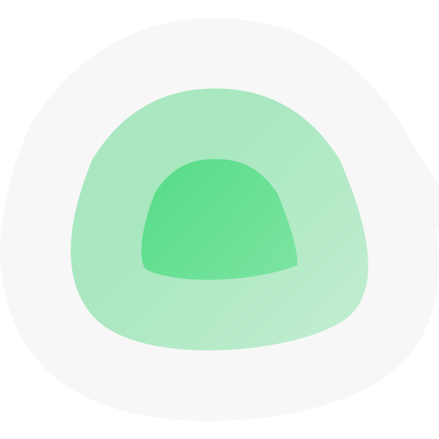

{ width=200 }

# Uptime Kuma
[GitHub :material-github:](https://github.com/louislam/uptime-kuma){ .md-button .md-button--primary }&emsp;[Documentation :material-file-document-multiple:](https://github.com/louislam/uptime-kuma/wiki){ .md-button }

---
## :material-information-outline: Overview

#### :symbols-description: Description: 
+ A fancy self-hosted service monitoring tool.

#### :symbols-settings-ethernet: Port(s): 
+ `3001`

#### :material-link-variant: URL / Access: 
+ :material-lan:&nbsp;LAN Access
    + <https://uptime.internal>
    + <http://pi-server.internal:3001>
+ :material-wan:&nbsp;WAN Access
    + <https://uptime.rac3r4life.online>

#### :material-key-chain: Credentials:  
* [:services-bitwarden:&nbsp;Bitwarden](https://vault.bitwarden.com): "Uptime Kuma @ pi-server"

## :symbols-deployed-code-update: Deployment Details

| Host Device | Method | Container Name | Image |
| :---------- | :----- | :------------- | :---- |
| :material-raspberry-pi:&nbsp;[Raspberry Pi 4B Server](../02_Hardware/Raspberry_Pi_4B_Server.md) | :material-docker:&nbsp;Docker Compose | `uptime-kuma` | `louislam/uptime-kuma:2` |

### :material-cog: Configuration 

```yaml title="docker-compose.yml" linenums="1"
services:
  uptime-kuma:
    image: louislam/uptime-kuma:2
    container_name: uptime-kuma
    restart: unless-stopped
    volumes:
      - ./data:/app/data
      - /var/run/docker.sock:/var/run/docker.sock:ro
    environment:
      - PUID=1000
      - PGID=110
    ports:
      - "3001:3001"
    dns:
      - 192.168.50.6
      - 192.168.50.2
```
