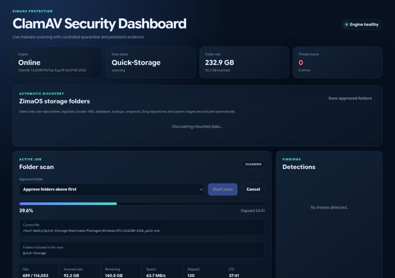

{ width=200 }

# ClamAV Dashboard

_Anti-Virus for ZimaOS_

[GitHub&ensp;:brands-github:](https://github.com/Jacko88888/clamav-dashboard){ .md-button .md-button--primary }&emsp;[Issues&ensp;:symbols-circle-dot-dashed:](https://github.com/Jacko88888/clamav-dashboard/issues){ .md-button .md-button--primary }

---

{ width=400 align=right .on-glb }

## :symbols-info:&ensp;Overview

#### :symbols-file-text:&ensp;Description

: ClamAV security dashboard for ZimaOS with automatic disk discovery, scan progress, history and confirmed quarantine actions.

#### :symbols-hash:&ensp;Port(s)

-   Service:&ensp;`clamav-server`
{ .no-bullets }
    - `3310`
-   Service:&ensp;`clamav-dashboard`
{ .no-bullets }
    - `8099`

#### :symbols-link-2:&ensp;URL / Access

:    <http://storage-server.internal:8099>

#### :symbols-user-key:&ensp;Credentials 

:    N/A

## :symbols-package-search:&ensp;Deployment Details

| Host Device                                                          | Method                                    | Container Name     | Image                                       |
| :------------------------------------------------------------------- | :---------------------------------------- | :----------------- | :------------------------------------------ |
| [:symbols-server-nas:&nbsp;ZimaOS-NAS](../02_hardware/zimaos_nas.md) | :symbols-container:&nbsp;Docker Container | `clamav-server`    | `clamav/clamav:1.5_base`                    |
|                                                                      | :symbols-container:&nbsp;Docker Container | `clamav-dashboard` | `ghcr.io/jacko88888/clamav-dashboard:0.2.4` |

### :symbols-settings:&ensp;Configuration

--8<-- "deploy_with_dockge.md"

``` yaml { .mono-title title="../AppData/dockge/stacks/clam-av/compose.yaml" linenums="1" }
--8<-- "clamav-dashboard.yaml"
```