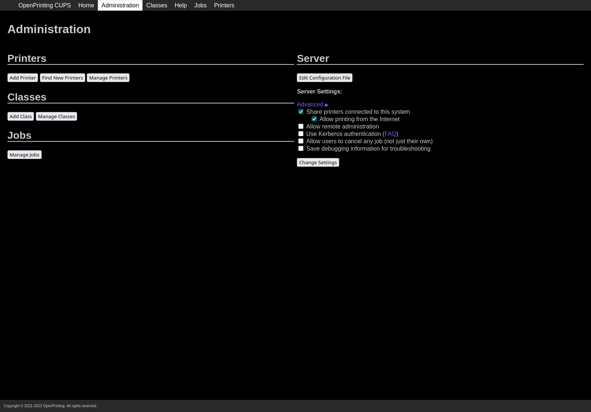

{ width=200 }

# CUPS

_Open Print Server_

[GitHub&ensp;:brands-github:](https://github.com/OpenPrinting/cups){ .md-button .md-button--primary }&emsp;[Documentation&ensp;:symbols-files:](https://openprinting.github.io/cups/#DOCUMENTATION){ .md-button .md-button--primary }

---

{ width=400 align=right }

## :symbols-info:&ensp;Overview

#### :symbols-file-text:&ensp;Description

:    A standards-based, open-source printing system for Linux and other Unix-like operating systems.

#### :symbols-hash:&ensp;Port(s)

:    `631`

#### :symbols-link-2:&ensp;URL / Access 

:    <https://192.168.50.2:631>

#### :symbols-printer-plus:&ensp;Printer URL

- IPP:&ensp;`ipp://192.168.50.2:631/printers/Brother_HL-L2300D_series`
{ .no-bullets }
- mDNS:&ensp;`dnssd://Brother%20Laser%20Printer%20%40%20pi-server._ipp._tcp.local/cups?uuid=06d625d5-f736-30c6-6315-c20eec2f460e`
{ .no-bullets }

#### :symbols-user-key:&ensp;Credentials

:    [:services-bitwarden:&ensp;Bitwarden](https://vault.bitwarden.com "Bitwarden Web Vault"){ external-link }

    - Local Network&ensp;:symbols-move-right:&ensp;"CUPS Admin"&emsp;:symbols-info:{ title="Login needed for Administration, but anyone on the local network can print." }

## :symbols-package-search:&ensp;Deployment Details

| Host Device                                                          | Method                          | Container Name | Image |
| :------------------------------------------------------------------- | :------------------------------ | :------------- | :---- |
| [:symbols-server:&nbsp;Pi 4B Server](../02_hardware/pi_4b_server.md) | :symbols-tux:&nbsp;Native Linux | `N/A`          | `N/A` |

### :symbols-settings:&ensp;Configuration

#### :symbols-monitor-arrow-down-corner: Install CUPS Server

1.  Install the `cups` package and its dependencies:

    ``` bash linenums="1"
    sudo apt update
    sudo apt install cups
    ```

2.  Start / Enable the `cups` Systemd service:

    ``` bash linenums="1"
    sudo systemctl enable cups
    sudo systemctl start cups
    ```

3.  Make a backup of the original configuration file, and replace the working config file with the one on this page.
4.  Restart the `cups` Systemd service:

    ``` bash linenums="1"
    sudo systemctl restart cups
    ```

#### :symbols-file-cog: Config File

``` apacheconf { .mono-title title="/etc/cups/cupsd.conf" linenums="1" }
--8<-- "cupsd.conf"
```
