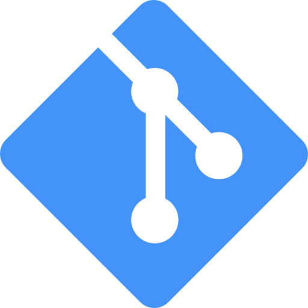

{ width=200 }

# Gitea

_Git with a Cup of Tea_

[GitHub&ensp;:brands-github:](https://github.com/go-gitea/gitea){ .md-button .md-button--primary }&emsp;[Documentation&ensp;:symbols-files:](https://docs.gitea.com/){ .md-button .md-button--primary }

---

{ width=400 align=right .on-glb }
{ width=400 align=right .on-glb }

## :symbols-info:&ensp;Overview

#### :symbols-file-text:&ensp;Description

: Painless, self-hosted, all-in-one software development service. Including Git hosting, code review, team collaboration, package registry and CI/CD.

#### :symbols-hash:&ensp;Port(s)

- `3080`
{ .no-bullets }
- `222`
{ .no-bullets }

#### :symbols-link-2:&ensp;URL / Access

-   Web-UI:
{ .no-bullets }
    - <http://storage-server.internal:3080>
    - <http://storage-server-2.internal:3080>
-   SSH:
{ .no-bullets }
    - `git@storage-server.internal:222`

#### :symbols-user-key:&ensp;Credentials

- [:brands-gitlab:&ensp;GitLab OAuth](https://gitlab.com/-/user_settings/applications){ external-link }
{ .no-bullets }
- [:brands-github:&ensp;GitHub OAuth](https://github.com/settings/developers){ external-link }
{ .no-bullets }
- [:services-bitwarden:&ensp;Bitwarden](https://vault.bitwarden.com "Bitwarden Web Vault"){ external-link }
{ .no-bullets }
    - Local Network&ensp;:symbols-move-right:&ensp;"Gitea (admin)"
    - Local Network&ensp;:symbols-move-right:&ensp;"Gitea (benhaube)"
    - SSH Keys&ensp;:symbols-move-right:&ensp;"Gitea"
- 2FA / MFA
{ .no-bullets }
    - :symbols-key-fido2:&ensp;FIDO2 / WebAuthn
    - :symbols-clock:&ensp;TOTP

## :symbols-package-search:&ensp;Deployment Details

| Host Device                                                          | Method                                    | Container Name | Image                           |
| :------------------------------------------------------------------- | :---------------------------------------- | :------------- | :------------------------------ |
| [:symbols-server-nas:&nbsp;ZimaOS NAS](../02_hardware/zimaos_nas.md) | :symbols-container:&nbsp;Docker Container | `gitea`        | `docker.gitea.com/gitea:latest` |
|                                                                      | :symbols-container:&nbsp;Docker Container | `gitea_runner` | `gitea/act_runner:latest`       |

### :symbols-settings:&ensp;Configuration

#### :symbols-folder-git-2:&ensp;Data Directories

: The data for the `gitea` container is stored in the `dockge/stacks` directory, and is owned by `root:root`.

##### Gitea App Data

- `/media/nvme0n1p1/AppData/dockge/stacks/gitea/data`
{ .no-bullets }

##### Repo Data

- `/media/nvme0n1p1/AppData/dockge/stacks/gitea/data/git/repositories`
{ .no-bullets }

##### SSH Data

- `/media/nvme0n1p1/AppData/dockge/stacks/gitea/data/ssh`
{ .no-bullets }

##### Runner Data

- `/media/nvme0n1p1/AppData/dockge/stacks/gitea/runner-data`
{ .no-bullets }

#### :symbols-file-cog:&ensp;Config File

``` ini { .mono-title title="../data/gitea/conf/app.ini" linenums="1" }
--8<-- "gitea_app.ini"
```

#### :symbols-file-code-corner:&ensp;Docker Compose File

--8<-- "includes/managed_by_dockge.md"

``` yaml { .mono-title title="../AppData/dockge/stacks/gitea/compose.yaml" linenums="1" }
--8<-- "gitea.yml"
```