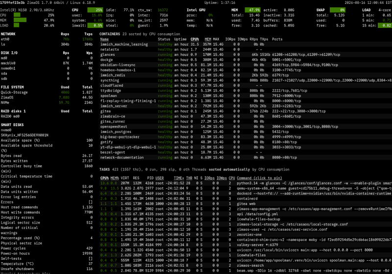

{ width=200 }
{ width=200 }

# Glances

_An Eye on Your System_

[GitHub&ensp;:brands-github:](https://github.com/nicolargo/glances){ .md-button .md-button--primary }&emsp;[Documentation&ensp;:symbols-files:](https://glances.readthedocs.io/en/latest/){ .md-button .md-button--primary }

---

{ width=400 align=right .on-glb }

## :symbols-info:&ensp;Overview

#### :symbols-file-text:&ensp;Description

:    Glances an Eye on your system. A `top` / `htop` alternative for GNU / Linux, BSD, Mac OS and Windows operating systems.  

#### :symbols-hash:&ensp;Port(s) 

:    `61208`

#### :symbols-link-2:&ensp;URL / Access

- <http://pi-server.internal:61208>
{ .no-bullets }
- <http://storage-server.internal:61208>
{ .no-bullets }

#### :symbols-user-key:&ensp;Credentials

: N/A

## :symbols-package-search:&ensp;Deployment Details

| Host Device                                                          | Method                                    | Container Name | Image                           | Port(s) |
| :------------------------------------------------------------------- | :---------------------------------------- | :------------- | :------------------------------ | :------ |
| [:symbols-server:&nbsp;Pi 4B Server](../02_hardware/pi_4b_server.md) | :symbols-container:&nbsp;Docker Container | `glances`      | `nicolargo/glances:latest-full` | `61208` |
| [:symbols-server-nas:&nbsp;ZimaOS NAS](../02_hardware/zimaos_nas.md) | :symbols-container:&nbsp;Docker Container | `glances`      | `nicolargo/glances:latest-full` | `61208` |

### :symbols-settings:&ensp;Configuration

#### :symbols-folder-git-2:&ensp;Data Directories

##### Pi 4B Server

- `/opt/stacks/glances/glances.conf`
{ .no-bullets }
- `/opt/stacks/glances/compose.yaml`
{ .no-bullets }

##### ZimaOS NAS

- `../AppData/glances/glances.conf`
{ .no-bullets }
- `../AppData/dockge/stacks/glances/compose.yaml`
{ .no-bullets }

#### :symbols-file-code-corner:&ensp;Docker Compose File

--8<-- "includes/managed_by_dockge.md"

##### Pi 4B Server

``` yaml { .mono-title title="/opt/stacks/glances/compose.yaml" linenums="1" }
--8<-- "glances-pi-4b.yml"
```

1. See all image tags here:&ensp;[Docker Hub](https://hub.docker.com/r/nicolargo/glances/tags){ external-link }
2. Please set to your local timezone _(or use local `${TZ}` environment variable if set on your host)_.

##### ZimaOS NAS

``` yaml { .mono-title title="../AppData/dockge/stacks/glances/compose.yaml" linenums="1" }
--8<-- "glances-zima.yml"
```
