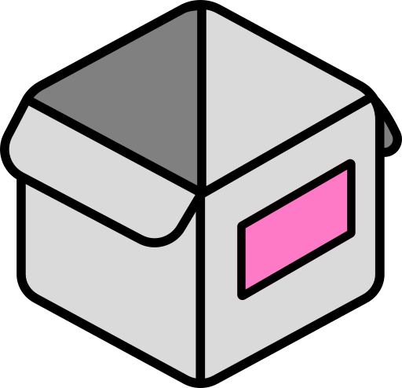

{ width=200 }

# Homebox

_Inventory Management_

[GitHub&ensp;:brands-github:](https://github.com/sysadminsmedia/homebox){ .md-button .md-button--primary }&emsp;[Documentation&ensp;:symbols-file-text:](https://homebox.software/en/quick-start/){ .md-button .md-button--primary }

---

## :symbols-info:&ensp;Overview

#### :symbols-file-text:&ensp;Description

:    An inventory and organization system built for the home user.

#### :symbols-hash:&ensp;Port(s) 

:    `3100`

#### :symbols-link-2:&ensp;URL / Access  

:    <http://storage-server.internal:3100>

:    <http://storage-server-2.internal:3100>

#### :symbols-user-key:&ensp;Credentials 

:    [:services-bitwarden:&ensp;Bitwarden](https://vault.bitwarden.com){ external-link }:

    - Local Network&ensp;:symbols-move-right:&ensp;"Homebox"

## :symbols-package-search:&ensp;Deployment Details

| Host Device                                                          | Method                                    | Container Name | Image                                   |
| :------------------------------------------------------------------- | :---------------------------------------- | :------------- | :-------------------------------------- |
| [:symbols-server-nas:&nbsp;ZimaOS NAS](../02_hardware/zimaos_nas.md) | :symbols-container:&nbsp;Docker Container | `homebox`      | `ghcr.io/sysadminsmedia/homebox:latest` |

### :symbols-settings:&ensp;Configuration

#### :symbols-folder-git-2:&ensp;Data Directories

##### Docker Deploy

:    `../AppData/dockge/stacks/homebox`

##### App Data

:    `../AppData/homebox-data/`

#### :symbols-file-code-corner:&ensp;Docker Compose File

--8<-- "deploy_with_dockge.md"

``` yaml { .mono-title title="../AppData/dockge/stacks/homebox/compose.yaml" linenums="1" }
--8<-- "homebox.yml"
```

1.  Please consider allowing analytics to help us improve Homebox _(basic computer information, no personal data)_.
2.  Use a strong random string for the pepper in production, it will be used to hash API keys and make them more secure.

    To generate a random string use the following command:

    ``` bash linenums="1"
    openssl rand -base64 48
    ```