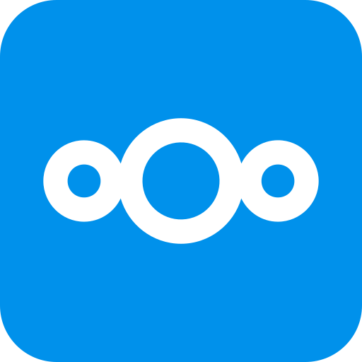

{ width=200 }

# Nextcloud

_Private Cloud_

[GitHub&ensp;:brands-github:](https://github.com/nextcloud){ .md-button .md-button--primary }&emsp;[Documentation&ensp;:symbols-files:](https://docs.nextcloud.com/){ .md-button .md-button--primary }

---

## :symbols-info:&ensp;Overview

#### :symbols-file-text:&ensp;Description

:    Self-hosted cloud storage and collaboration platform.

#### :symbols-hash:&ensp;Port(s)

:    `10081`

#### :symbols-link-2:&ensp;URL / Access  

:    ~~<http://storage-server.internal:10081>~~

:    ~~<http://storage-server-2.internal:10081>~~

#### :symbols-user-key:&ensp;Credentials 

:    [:services-bitwarden:&ensp;Bitwarden](https://vault.bitwarden.com){ external-link }

    - Local Network&ensp;:symbols-move-right:&ensp;"Nextcloud (admin)"
    - Local Network&ensp;:symbols-move-right:&ensp;"Nextcloud (bhaube)"

## :symbols-package-search:&ensp;Deployment Details

| Host Device                                                              | Method                                    | Container Name | Image            |
| :----------------------------------------------------------------------- | :---------------------------------------- | :------------- | :--------------- |
| [:symbols-server-nas:&nbsp;~~ZimaOS NAS~~](../02_hardware/zimaos_nas.md) | :symbols-container:&nbsp;Docker Container | `nextcloud`    | `nextcloud:32.0` |

### :symbols-settings:&ensp;Configuration

``` yaml { .mono-title title="compose.yml" linenums="1" }
--8<-- "nextcloud.yml"
```