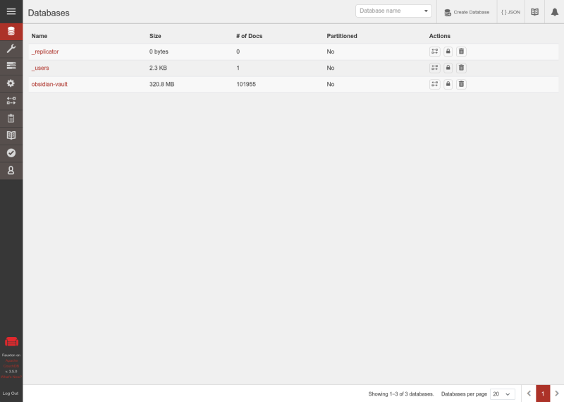

{ width=200 }{ width=75 }

# Obsidian LiveSync

_Sync with CouchDB_

[GitHub&ensp;:brands-github:](https://github.com/apache/couchdb){ .md-button .md-button--primary }&emsp;[Documentation&ensp;:symbols-files:](https://docs.couchdb.org/en/stable/){ .md-button .md-button--primary }

---

{ width=400 align=right .on-glb }

## :symbols-info:&ensp;Overview

#### :symbols-file-text:&ensp;Description

:    Seamless multi-primary syncing database with an intuitive HTTP / JSON API, designed for reliability.

#### :symbols-hash:&ensp;Port(s)

:    `5984`

#### :symbols-link-2:&ensp;URL / Access

-   :symbols-monitor-cog:&ensp;Settings Web UI:
{ .no-bullets }
    - <http://storage-server.internal:5984/_utils>
    - <http://storage-server-2.internal:5984/_utils>
-   :symbols-database:&ensp;Database:
{ .no-bullets }
    - <http://storage-server.internal:5984/obsidian-vault>
    - <http://storage-server-2.internal:5984/obsidian-vault>

#### :symbols-user-key:&ensp;Credentials

:    [:services-bitwarden:&ensp;Bitwarden](https://vault.bitwarden.com "Bitwarden Web Vault"){ external-link }  

    - Local Network&ensp;:symbols-move-right:&ensp;"Obsidian LiveSync"

## :symbols-package-search:&ensp;Deployment Details

| Host Device                                                          | Method                                    | Container Name      | Image           |
| :------------------------------------------------------------------- | :---------------------------------------- | :------------------ | :-------------- |
| [:symbols-server-nas:&nbsp;ZimaOS NAS](../02_hardware/zimaos_nas.md) | :symbols-container:&nbsp;Docker Container | `obsidian-livesync` | `couchdb:3.5.0` |

### :symbols-settings:&ensp;Configuration

#### :symbols-folder-git-2:&ensp;Data Directories

##### Docker Deploy

- `../AppData/dockge/stacks/obsidian-livesync/compose.yaml`
{ .no-bullets }

##### Database

- `../AppData/obsidian-livesync/data/couchdb`
{ .no-bullets }

##### Config File

- `../AppData/obsidian-livesync/data/local.ini`
{ .no-bullets }

#### :symbols-file-code-corner:&ensp;Docker Compose File

--8<-- "includes/managed_by_dockge.md"

``` yaml { .mono-title title="../AppData/dockge/stacks/obsidian-livesync/compose.yaml" linenums="1" }
--8<-- "obsidian-livesync.yml"
```

1. Leave the default password in the Docker compose file, and change the password from the CouchDB Web UI.

#### :symbols-file-cog:&ensp;Config File

``` ini { .mono-title title="../AppData/obsidian-livesync/data/local.ini" linenums="1" }
--8<-- "couchdb-local.ini"
```