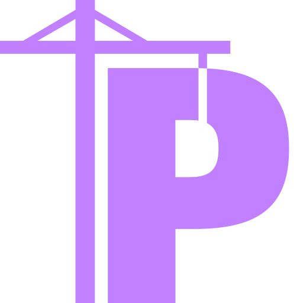

{ width=200 }

# Portainer-EE

_Container Management_

[GitHub&ensp;:brands-github:](https://github.com/portainer/portainer){ .md-button .md-button--primary }&emsp;[Documentation&ensp;:symbols-files:](https://docs.portainer.io/){ .md-button .md-button--primary }

---

## :symbols-info:&ensp;Overview

#### :symbols-file-text:&ensp;Description

:    A lightweight service delivery platform for containerized applications.

#### :symbols-hash:&ensp;Port(s)

- Hub:
{ .no-bullets }
    - `9443`
- Agent:
{ .no-bullets }
    - `9001`

#### :symbols-link-2:&ensp;URL / Access 

- Hub:
{ .no-bullets }
    - ~~<https://portainer.internal>~~
    - ~~<https://pi-server.internal:9443>~~
- Agent:
{ .no-bullets }
    - ~~<http://pi-zero.internal:9001>~~
    - ~~<http://storage-server.internal:9001>~~

#### :symbols-user-key:&ensp;Credentials 

- [:brands-github:&ensp;GitHub OAuth](https://github.com/settings/developers){ external-link }
{ .no-bullets }
- [:services-bitwarden:&ensp;Bitwarden](https://vault.bitwarden.com){ external-link }
{ .no-bullets }
    - Local Network&ensp;:symbols-move-right:&ensp;"Portainer"
- 2FA / MFA
{ .no-bullets }
    - :symbols-key-fido2:&ensp;FIDO2 / WebAuthn
    - :symbols-clock:&ensp;TOTP

## :symbols-package-search:&ensp;Deployment Details

##### Hub

| Host Device                                                              | Method                                    | Container Name | Image                        |
| :----------------------------------------------------------------------- | :---------------------------------------- | :------------- | :--------------------------- |
| [:symbols-server:&nbsp;~~Pi 4B Server~~](../02_hardware/pi_4b_server.md) | :symbols-container:&nbsp;Docker Container | `portainer`    | `portainer/portainer-ee:lts` |

##### Agent

| Host Device                                                                        | Method                                    | Container Name    | Image                 |
| :--------------------------------------------------------------------------------- | :---------------------------------------- | :---------------- | :-------------------- |
| [:symbols-server:&nbsp;~~Pi Zero 2W Server~~](../02_hardware/pi_zero_2w_server.md) | :symbols-container:&nbsp;Docker Container | `portainer_agent` | `portainer/agent:lts` |
| [:symbols-server-nas:&nbsp;~~ZimaOS NAS~~](../02_hardware/zimaos_nas.md)           | :symbols-container:&nbsp;Docker Container | `portainer_agent` | `portainer/agent:lts` |

### :symbols-settings:&ensp;Configuration

##### Hub

``` yaml title="Pi 4B Server" linenums="1"
--8<-- "portainer-pi-4b.yml"
```

##### Agent

``` yaml title="Pi Zero 2W Server" linenums="1"
--8<-- "portainer-pi-zero.yml"
```

``` yaml title="ZimaOS NAS" linenums="1"
--8<-- "portainer-zima.yml"
```