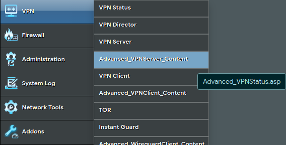
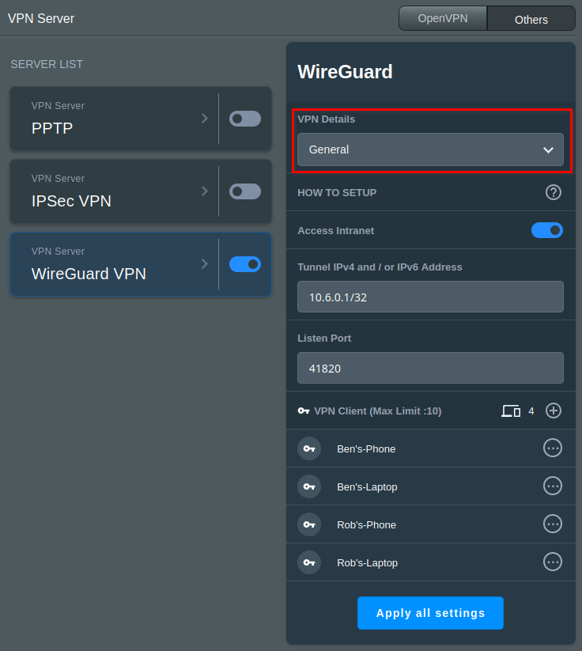
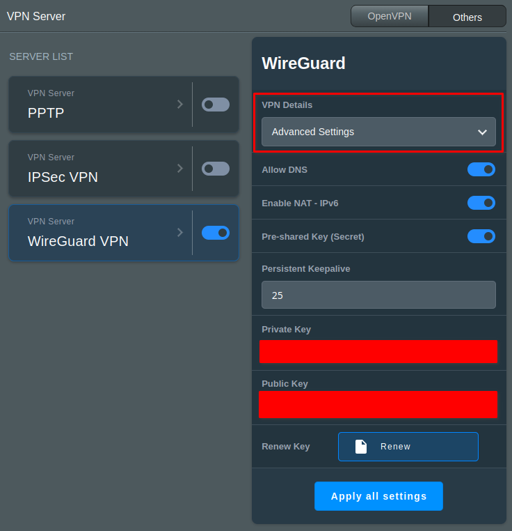

{ width=200 }

# WireGuard
*A Simple, Modern VPN*

[GitHub&ensp;:brands-github:](https://github.com/wg-easy/wg-easy){ .md-button .md-button--primary }&emsp;[Documentation&ensp;:symbols-files:](https://wg-easy.github.io/wg-easy/latest/){ .md-button .md-button--primary }

---
## :symbols-info:&ensp;Overview

#### :symbols-file-text:&ensp;Description 

:    An extremely simple yet fast and modern VPN that utilizes state-of-the-art cryptography.

#### :symbols-settings-ethernet:&ensp;Port(s) 

:    `41820`

#### :symbols-link:&ensp;URL / Access 

:    :symbols-waypoints:&nbsp;Server Endpoint:
    
      + `rac3r4life.myaddr.dev:41820` &mdash; :symbols-router:&nbsp;*ASUS RT-BE92U*

:    :symbols-monitor-cog:&nbsp;Web UI Admin: 
    
      + <https://asusrouter.internal:8443/Advanced_VPNServer_Content.asp>

#### :symbols-user-key:&ensp;Credentials 

:    [:services-bitwarden:&nbsp;Bitwarden](https://vault.bitwarden.com): 
      
      + Local Network&ensp;:symbols-move-right:&ensp;"ASUS Router" &mdash; :symbols-router:&nbsp;*ASUS RT-BE92U*

#### :symbols-monitor-smartphone:&ensp;Client Profiles

:    :symbols-router:&nbsp;ASUS RT-BE92U:
    
      + `Ben's-Phone`
      + `Ben's-Laptop`
      + `Rob's-Phone`
      + `Rob's-Laptop`

## :symbols-package-search:&ensp;Deployment Details

| Host Device                                                            | Method                                    | Container Name | Image |
| :--------------------------------------------------------------------- | :---------------------------------------- | :------------- | :---- |
| [:symbols-router:&nbsp;ASUS RT-BE92U](../02_hardware/asus_rt-be92u.md) | :symbols-penguin:&nbsp;Native Linux       | `N/A`          | `N/A` |

### :symbols-settings:&ensp;Configuration 

1. Log into the [ASUS Router's Web UI:symbols-external-link-small:](https://asusrouter.internal:8443/) and navigate to the **"Advanced VPN Server Content"** page.

      <figure markdown="span">
            { width=600 }
      </figure>

2. Select **"General"** in the drop-down menu to add / remove / edit clients, change the tunnel IP address, change the listening port, or turn on / off intranet access.

      <figure markdown="span">
            { width=600 }
      </figure>

3. Select **"Advanced Settings"** in the drop-down menu to configure DNS, IPv6 NAT, persistent keepalive, and change the server's pre-shared key. 

      <figure markdown="span">
            { width=600 }
      </figure>