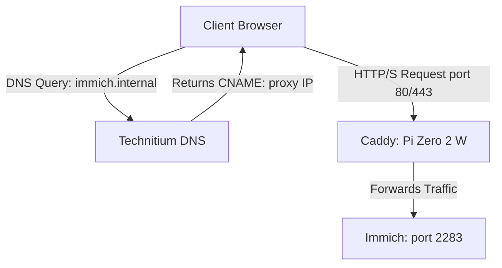

{ width=200 }

# Reverse Proxy & DNS Routing

> [!info] Goal
> Route human-readable domain names *(e.g., `immich.internal`)* to internal services without needing to specify port numbers.

## :material-information-outline: Architecture Overview

#### DNS Servers:

* Technitium Cluster Primary: *[:material-debian:&nbsp;Debian Server VM](../02_Hardware/Debian_Server_VM.md)*
* Technitium Cluster Secondary: *[:material-raspberry-pi:&nbsp;Raspberry Pi 4B Server](../02_Hardware/Raspberry_Pi_4B_Server.md)*

#### Reverse Proxy:

* :simple-caddy: Caddy *[:material-raspberry-pi:Raspberry Pi Zero Server](../02_Hardware/Raspberry_Pi_Zero_2_W.md) - Native `apt` Install)*

#### Application Hosts:

* [:material-nas:&nbsp;ZimaOS NAS](../02_Hardware/ZimaBoard_2_NAS.md)
* [:material-raspberry-pi:&nbsp;Raspberry Pi 4B Server](../02_Hardware/Raspberry_Pi_4B_Server.md)

---

## :material-file-cloud: Technitium DNS Records

> [!note]
> Instead of pointing every service to the proxy's IP address directly, we use a single `A` record for the proxy hardware, and `CNAME` aliases for the services. This makes IP migrations easier in the future.

| Domain / Alias | Record Type | Target / Value | PTR | Description |
| :--- | :--- | :--- | :---: | :--- |
| `pi-zero.internal` | **A** | `192.168.50.3` | :material-check: | The dedicated Caddy reverse proxy host. |
| `immich.internal` | **CNAME** | `pi-zero.internal` | :material-close: | Points the Immich domain to the proxy. |

## :material-cloud-cog: Caddy Configuration

#### File Location: 

+ `/etc/caddy/Caddyfile` 

#### Commands: 

+ `#!bash sudo nano /etc/caddy/Caddyfile` *(Open config file in `nano`)*  
+ `#!bash sudo systemctl reload caddy` *(Apply changes)*

#### Example Caddyfile:

```nginx title="/etc/caddy/Caddyfile" linenums="1"
# Immich Photo Server
immich.internal {
    reverse_proxy [192.168.50.4]:2283
}
```

## :material-traffic-light: Traffic Flow

