```mermaid
graph LR
    %% Phase 1
    subgraph Phase_1 ["<b>Phase 1:</b> Pre-Migration & Documentation"]
        direction TB
        Export("<b>Export Pi-hole Data:</b> Run a 'Teleporter' backup on your current primary and secondary Pi-holes.")
        Document("<b>Document Static Records:</b> Note all local DNS records and DHCP reservations <i>(if Pi-hole is handling DHCP)</i>.")
        Map("<b>Map IP Addresses:</b>")
        Primary("<b>Primary</b> (Raspberry Pi 4B): 192.168.50.2")
        Secondary("<b>Secondary</b> (Debian VM): 192.168.50.6")
        Tertiary("<b>Tertiary/Failover</b> (Raspberry Pi Zero 2W): 192.168.50.3")
    end
    
    %% Connections (Phase_1)
    Export --> Document
    Document --> Map
    Map --> Primary
    Map --> Secondary
    Map --> Tertiary
    Phase_1 ==> Phase_2
    
    %% Phase 2
    subgraph Phase_2 ["<b>Phase 2:</b> Server Provisioning"]
        direction TB
        subgraph Debian_VM ["<b>Debian VM (ZimaOS):</b>"]
            direction TB
            Allocate("<b>Allocate Resources:</b> Assign 2 vCPUs and 2GB RAM to the VM.")
            Install("<b>Install Technitium:</b> Use the installer script or Docker container.")
            Configure("<b>Configure Upstream:</b> Set Quad9 DoT <i>(9.9.9.9:853 and 149.112.112.112:853)</i>.")
            Import("<b>Import Records:</b> Manually add local DNS zones/records from the Pi-hole export.")
        end
        subgraph RasPi_4B ["<b>Raspberry Pi 4B:</b>"]
            direction TB
            Install_Pi("<b>Install Technitium:</b> Match the version running on the Debian VM.")
            Set_Secondary("<b>Set as Secondary:</b> Configure identical upstream servers.")
        end   
    end
    
    %% Connections (Phase_2)
    Allocate --> Install
    Install --> Configure
    Configure --> Import
    
    Install_Pi --> Set_Secondary
    Phase_2 ==> Phase_3
    
    %% Phase 3
    subgraph Phase_3 ["<b>Phase 3:</b> Cluster Synchronization"]
        direction TB
        Enable_Clustering("<b>Enable Clustering:</b>")
        DebianVM_Master("Set the Debian VM as the <b>Master</b>.")
        Pi4B_Slave("Set the Pi 4B as the <b>Slave</b>.")
        Verify_Sync("<b>Verify Sync:</b> Ensure local zones and blocklists are appearing on both instances.")
        Tuning("<b>Blocklist Tuning:</b> Add your preferred lists <i>(e.g., OISD, HaGeZi)</i> and verify they are enabled on both.")
    end
    
    %% Connections (Phase_3)
    Enable_Clustering --> DebianVM_Master
    Enable_Clustering --> Pi4B_Slave
    DebianVM_Master --> Verify_Sync
    Pi4B_Slave --> Verify_Sync
    Verify_Sync --> Tuning
    Phase_3 ==> Phase_4
    
    subgraph Phase_4 ["<b>Phase 4</b>: Network Cutover"]
        direction TB
        DHCP("<b>Update Router DHCP:</b>")
        DHCP_1("Point DNS 1 to the <b>Debian VM</b> IP.")
        DHCP_2("Point DNS 2 to the <b>Pi 4B</b> IP.")
        DHCP_3("<i>(Optional)</i> Point DNS 3 to the <b>Pi Zero</b> IP.")
        
        Clear_Cache("<b>Clear Local Caches:</b> Flush DNS on your main workstation")
        Test_Resolution("<b>Test Resolution:</b> Run 'dig @[Primary-IP] google.com' and verify the [SERVER] field.")
    end
    
    %% Connections (Phase_4)
    DHCP --> DHCP_1
    DHCP --> DHCP_2
    DHCP --> DHCP_3
    DHCP_1 --> Clear_Cache
    DHCP_2 --> Clear_Cache
    Clear_Cache --> Test_Resolution
    Phase_4 ==> Phase_5
    
    subgraph Phase_5 ["<b>Phase 5:</b> Verification & Safety Net"]
        direction TB
        DoT_Status("<b>Check DoT Status:</b> Ensure upstream is encrypted.")
        Fallback("<b>Verify Pi Zero Fallback:</b> Temporarily stop the Technitium service on both the VM and Pi 4B. Confirm the Pi Zero Pi-hole takes over resolution.")
        Audit("<b>Audit</b> Dashboard:</b> Monitor the Technitium dashboard for any unexpected NXDOMAIN responses or high latency.")
    end
    
    %% Connections (Phase_5)
    DoT_Status --> Fallback
    Fallback --> Audit
```

---
hide:
  - toc
---
![[pi-hole.svg|150]]&nbsp;{ width=100 }{ width=100 }&emsp;{ width=150 }{ width=150 }

# [[DNS_Migration|DNS Migration (Pi-hole :material-arrow-right-thin: Technitium)]]

## :material-file-document: Phase 1: Pre-Migration & Documentation
1. **Export Pi-hole Data:** 
    + [ ] Run a "Teleporter" backup on your current primary and secondary Pi-holes.
2. **Document Static Records:** 
    + [ ] Note all local DNS records and DHCP reservations *(if Pi-hole is handling DHCP)*.
3. **Map IP Addresses:**
    + [ ] Primary: :simple-raspberrypi:&nbsp;[[Raspberry_Pi_4B_Server|Raspberry Pi 4B Server]] --> `192.168.50.2` 
    + [ ] Secondary: :simple-debian:&nbsp;[[Debian_Server_VM|Debian Server VM]] --> `192.168.50.6`
    + [ ] Tertiary/Failover: :simple-raspberrypi:&nbsp;[[Raspberry_Pi_Zero_2_W|Raspberry Pi Zero Server]] --> `192.168.50.3`

## :material-dns: Phase 2: Server Provisioning

### :material-debian:&nbsp;Debian VM (ZimaOS):

1. **Allocate Resources:** 
    + [ ] Assign 2 vCPUs and 2 GB RAM to the VM.
2. **Install Technitium:** 
    + [ ] Use the installer script or Docker container.
3. **Configure Upstream:** 
    + [ ] Set Quad9 DoT *(`9.9.9.9:853` and `149.112.112.112:853`)*.
4. **Import Records:** 
    + [ ] Manually add local DNS zones/records from the Pi-hole export.

### :simple-raspberrypi:&nbsp;Raspberry Pi 4B:

1. **Uninstall Pi-hole:**
    + [ ] Use the command `#!bash sudo pihole uninstall` to remove Pi-hole from the server.
2. **Install Technitium:** 
    + [ ] Match the version running on the Debian VM.
3. **Set as Secondary:** 
    + [ ] Configure identical upstream servers.

## :material-cog-sync: Phase 3: Cluster Synchronization

1. **Enable Clustering:** 
    + [ ] Set the Debian VM as the **Master**.
    + [ ] Set the Pi 4B as the **Slave**.
2. **Verify Sync:** 
    + [ ] Ensure local zones and blocklists are appearing on both instances.
3. **Blocklist Tuning:** 
    + [ ] Add your preferred lists *(e.g., OISD, HaGeZi)* and verify they are enabled on both.

## :material-toggle-switch-outline: Phase 4: Network Cutover

1. **Update Router DHCP:** 
    + [ ] Point DNS 1 to the Debian VM IP.
    + [ ] Point DNS 2 to the Pi 4B IP.
    + [ ] *(Optional)* Point DNS 3 to the Pi Zero IP.
2. **Clear Local Caches:** 
    + [ ] Flush DNS on your main workstation *(`#!bash resolvectl flush-caches` or `#!bash ipconfig /flushdns`)*.
3. **Test Resolution:** 
    + [ ] Run `#!bash dig @[Primary-IP] google.com` and verify the `SERVER` field.

## :material-web-check: Phase 5: Verification & Safety Net

1. **Check DoT Status:** 
    + [ ] Run `#!bash dig @[Primary-IP] +short txt proto.on.quad9.net` to ensure the upstream is encrypted.
2. **Verify Pi Zero Fallback:** 
    + [ ] Temporarily stop the Technitium service on both the VM and Pi 4B. Confirm the Pi Zero Pi-hole takes over resolution.
3. **Audit Dashboard:** 
    + [ ] Monitor the Technitium dashboard for any unexpected NXDOMAIN responses or high latency.

---

