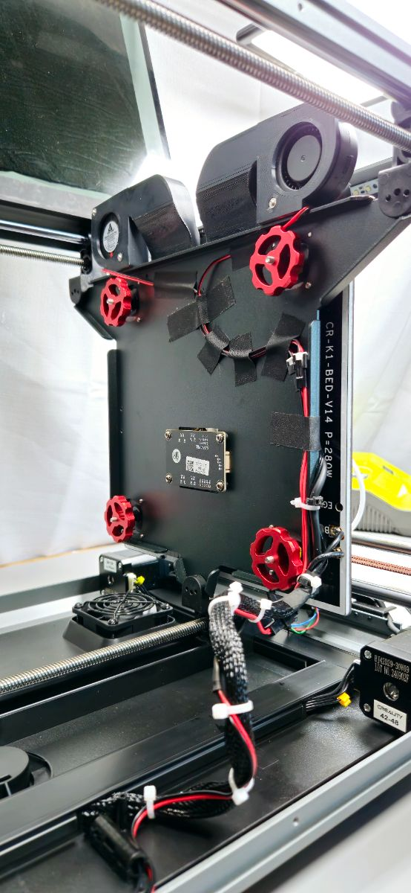
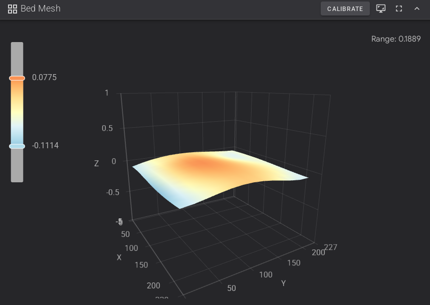

{ width=400 }
{ width=400 }

# Manual Bed Leveling Mod
*Fine Tune Your Bed Level*

[Creality^&copy;^ K1C :devices-creality:](../02_Hardware/Kacey_3D-printer.md){ .md-button .md-button--primary }&emsp;[Fluidd :services-fluidd:](../03_Services/Fluidd.md){ .md-button }&emsp;[3DPHUB.net :brands-3dphub:](https://3dphub.net){ .md-button }

> [!question]
> **Why do this?**
>  
> :     The K1 series does NOT have automatic bed leveling! This upgrade allows you to fine tune your bed level using the `screws_tilt_calculate` command in Fluidd. This method is superior to tooth skipping and the Creality method. It's quick, easy and accurate.

> [!links] Bed Leveling Kit 
> [AliExpress :brands-aliexpress:](https://s.click.aliexpress.com/e/_oopAFjx){ .md-button }&emsp;[Amazon :fontawesome-brands-amazon:](https://amzn.to/4jkJ185){ .md-button }

---
## :material-tools: Hardware Setup

> [!note inline end] Installation Note
> **Graphite Bed & Bed Fans:**
> :     If you plan to install a graphite heated bed upgrade, or if you want to increase your chamber temperature for ABS / ASA using bed fans, it is recommended to do these mods at the same time because they all require the first 8 steps.
>
>       [Graphite Bed Kit :brands-r3men:](https://www.r3men.com/products/graphite-heated-bed-for-creality-k1-k1c-k1se?ref=3dphub){ .md-button }
>
>       [Bed Fans Guide :brands-3dphub:](https://3dphub.net/learn/bed-fans-upgrade-guide){ .md-button }
>
> **Nylon Knobs:**
> :     If you have a graphite bed kit, you can print the knobs out of nylon and use the springs and screws that come with the kit *(using metal knobs is still recommended to avoid heat issues)*.
>
>       [Nylon Knobs :simple-printables:](https://www.printables.com/model/1182770-bed-leveling-knob-for-m4-screw-m4-nut){ .md-button }

1. [ ] Home the printer.
2. [ ] Lower the bed &frac34; of the way down, so that you have enough room to stand the bed up.
3. [ ] Shut down the power and disconnect the power.
4. [ ] You can optionally remove the side panels to make the process easier.
5. [ ] Slowly and gently move the toolhead to the side, so that you have enough room to work.

    > [!danger] Caution!
    > Moving the toolhead quickly generates back EMF that can damage your printer’s electronics.

6. [ ] Remove the build plate.
7. [ ] Remove the 4 screws from the bed.
8. [ ] Stand the bed up.

    > [!danger] Caution!
    > Take care not to put any stress on the wiring.

9. [ ] If you are using printed knobs, remove the black hexagonal spacers and drill them to 4.5 mm if you aren’t using other spacers.
10. [ ] Put the bed springs in place of the spacers.
11. [ ] Optionally add Loctite 222 or 243 to the bottom third of the new screws to combat vibrations.
12. [ ] Working at one corner from above, put a screw back through the build plate and spring.
13. [ ] Put a spacer underneath the bed, with the screw coming through it.
14. [ ] Put a knob under the spacer, with the screw coming through it.

    > [!danger] Stop!
    > Don't tighten yet - just give it a few turns so it doesn't fall off.

15. [ ] Repeat for the other 3 corners, making sure the springs are straight.
16. [ ] Alternating between corners, tighten the knobs little by little to ensure even torque distribution.
17. [ ] When it starts getting tight or bottoms out, back off a little so you have room for adjustment.

    > [!danger] Caution!
    > Do not overtighten if you are still using the factory load cells as it may cause damage or issues.

18. [ ] Place the build plate back on.

<figure markdown="span">
{ width=800 .on-glb data-title="Completed Modification" data-description=".img-desc1" }
<figcaption>This is what the completed bed leveling mod should look like. <b>Note:</b> If you bought your kit from <a href="https://amzn.to/4jkJ185">Amazon</a> the knobs will be blue.</figcaption>
</figure>

<div class="glightbox-desc img-desc1">
<p>This is what the completed bed leveling mod should look like.</p>
<p><b>Note:</b> If you bought your kit from <a href="https://amzn.to/4jkJ185">Amazon</a> the knobs will be blue.</p>
</div>

## :material-chip: Firmware Setup

> [!info inline end] Root Access
> This project requires Root Access to your Creality K1-series 3D-printer via SSH. If you don't know how to gain root access, refer to the Helper Script and Root Access Guide.
>
> [Root Access Guide :brands-3dphub:](https://www.3dphub.net/learn/root-access-quick-start-guide){ .md-button }
>
> [Helper Script :devices-creality:](https://guilouz.github.io/Creality-Helper-Script-Wiki/){ .md-button }
> 
> > [!security] Default Password
> > The default `root` password is `creality_2023` *(at least on my Creality K1C)*. 
> > 
> > It is highly recommended to change this password using the `passwd` command. 

1. [ ] Turn the printer on.
2. [ ] SSH into the printer.
3. [ ] **Option 1:** Run the [Helper Script :devices-creality:](https://guilouz.github.io/Creality-Helper-Script-Wiki/helper-script/helper-script-installation/) and install `13) Screws Tilt Adjust Support`

    **Option 2:** Add this to `printer.cfg`

    ```cfg title="K1 / K1C / K1SE" linenums="1"
    --8<-- "screw-tilt-k1.cfg"
    ```

    ```cfg title="K1 MAX" linenums="1"
    --8<-- "screw-tilt-k1max.cfg"
    ```

4. [ ] Save *(if you edited `printer.cfg`)* and restart the printer to apply the changes.

## :material-tooltip-question-outline: How to Use

> [!note inline end] 
> **Preheating the Bed:**
> :     Factory beds change shape when heated - you need to wait for it to stabilize. You can skip this if you have a Graphite Bed Upgrade. 

1. [ ] Home the printer.
2. [ ] Preheat the bed to your normal bed temperature for 20 minutes *(60&deg;C for PLA)*.
3. [ ] Open up Fluidd or mainsail through Orca Slicer or by typing your printers IP address into your web browser with the appropriate port number appended.

    | Interface                         |  Port  |
    | :-------------------------------- | :----: |
    | :services-fluidd:&nbsp;Fluidd     | `4408` |
    | :services-mainsail:&nbsp;Mainsail | `4409` |

4. [ ] In the Fluidd console, type `SCREWS_TILT_CALCULATE` or click the handy macro.

> [!question inline end] 
> **Minutes?**
> 
> :     15 min = &frac14; turn.

5. [ ] The printer will probe each corner and a message will pop up telling you how high or low the corners are relative to the front left corner. It will instruct you which direction *(looking at it from the top down)* and how far to turn each knob *(in minutes)*.

<figure markdown="span">
    { width=400 .on-glb data-title="Screws Tilt Adjust" data-description=".img-desc2" }
    { width=400 .on-glb data-title="Screws Tilt Adjust" data-description=".img-desc2" }
<figcaption>In the image, the back right corner is 0.0468 mm higher than the front left, and to correct it, you would turn it 4 minutes counter clockwise <i>(looking at it from above)</i>, or roughly 1&frasl;16 of a turn.</figcaption>
</figure>

<div class="glightbox-desc img-desc2">
<p>In the image, the back right corner is 0.0468 mm higher than the front left, and to correct it, you would turn it 4 minutes counter clockwise <i>(looking at it from above)</i>, or roughly <sup>1</sup>/<sub>16</sub> of a turn.</p>
</div>

6. [ ] Click retry or repeat the command to check the new level.

    > [!bug]
    > Sometimes if you do the calibration a few times in a row, you will not get a popup. In this case, the output should be displayed in the console and you can simply restart the printer and fluidd to bring the popup back.

---

## :material-information-outline: Additional Info

> [!note inline end] 
> **Bed Warping:**
> :     If your bed mesh looks warped compared to before you installed the knobs, loosen three screws, heat soak the bed and tighten again.
>
> { .on-glb width=230 }

> [!warning]
> **Factory Loadcell:**
> :     This process is only as accurate as your probe. To get an idea of how accurate your probe is, you can type `PROBE_ACCURACY`. It will run a macro that measures the accuracy of your bed mesh probe by repeatedly probing the same point. Most aftermarket probes are at least 10x more accurate than the factory load cells. It is highly recommended to upgrade before doing this modification in order to get the best results and minimize the chance of issues.

> [!failure] Error
> **Error `key60`:**
> :     If you are doing this modification with the factory load cells *(bed mesh probe)* and get a `key60` error, *(Internal error command: `BEDMESH_CALIBRATE`)*, this may be due to excessive pressure being applied to the load cells. Try slightly loosening the knobs, then run the `SCREWS_TILT_CALCULATE` macro again.

#### :material-link-variant: References and Resources:

[Klipper Docs :services-klipper:](https://www.klipper3d.org){ .md-button }&emsp;[Fluidd Docs :services-fluidd:](https://docs.fluidd.xyz/){ .md-button }&emsp;[Mainsail Docs :services-mainsail:](https://docs.mainsail.xyz/){ .md-button }