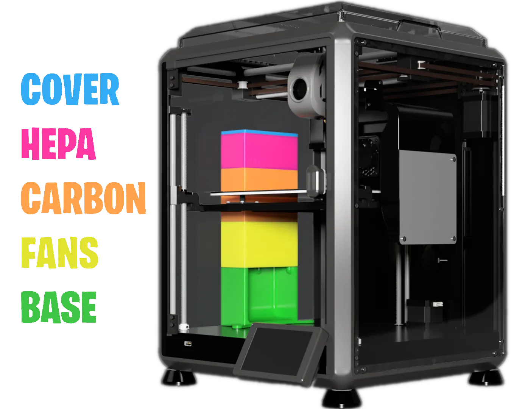

{ width=300 .no-shadow }

# Bento Box v2.1 Mod

_Chamber Air Scrubber_

[Creality K1C&ensp;:symbols-printer-3d-nozzle:](../02_hardware/kacey_3d-printer.md){ .md-button .md-button--primary }&emsp;[3DPHUB.net&ensp;:brands-3dphub:](https://3dphub.net){ .md-button .md-button--primary }&emsp;[Printables&ensp;:brands-printables:](https://www.printables.com/model/1136546-bento-box-21-combination-hepa-and-activated-carbon){ .md-button .md-button--primary }

---

## :symbols-info:&ensp;About

The Bento box is a HEPA & activated carbon based air scrubber for the chamber; reducing harmful PM2.5 particulate matter and VOCs emitted during prints. This results in much healthier air in your home during prints for both humans and pets. The air scrubber uses two 5015 blower fans connected with a splitter to the spare 2-pin, 24V fan header on the printer's motherboard.

### :symbols-receipt-text:&ensp;Bill of Materials

| Item                                                                                | Qty |
| :---------------------------------------------------------------------------------- | :-: |
| [GDSTime 5015 Blower 24V](https://www.amazon.com/dp/B0B1V6JTB8){ external-link }    |  2  |
| [6x3mm Neodymium Magnets](https://www.amazon.com/dp/B0BW91ZTKZ){ external-link }    | 50  |
| [2-Pin JST XH-2.54 Splitter](https://www.amazon.com/dp/B0FHQ5VBPZ){ external-link } |  1  |
| [80x40x15mm HEPA Filters](https://www.amazon.com/dp/B0782T7L6P){ external-link }    |  1  |
| [Acid Free Activated Carbon](https://www.amazon.com/dp/B0CFY14DZZ){ external-link } |  1  |

## :symbols-file-code-corner:&ensp;G-Code Customizations

To enable the new fans we need to modify the following files; `printer.cfg`, `gcode-macro.cfg`, and `fans-control.cfg`. The first two files can be edited in place, but the `fans-control.cfg` file is write protected and controlled by the Helper-Script. You CAN modify it in place if you connect via SSH, but in Fluidd you cannot make changes. Even if you do edit it in place, it will be overwritten by a Helper-Script update. To get around this I recommend copying the file into the main configuration directory, then editing your `printer.cfg` file to use the copied file instead of the one located in the `Helper-Script/` directory. You can use this method to modify any of the Helper-Script configuration files to your needs. I have also done this with my `M600-support.cfg` and `useful-macros.cfg` files to make changes for the [PROWIPER mod](prowiper_mod.md).

#### Replace `fans-control.cfg`

1.  [ ] Copy the file `fans-control.cfg` from the `Helper-Script/` directory and paste the copy into the main configuration directory.
2.  [ ] Open the `printer.cfg` configuration file and comment out the following line with a hash _(`#`)_.

    ``` cfg
    [include Helper-Script/fans-control.cfg]
    ```

3. [ ] Replace the `[include]` directive you commented out with the following line.

    ``` cfg
    [include fans-control.cfg]
    ```

#### Base Printer Configuration

1. [ ] Add the new `output-pin` to `printer.cfg` below `fan2`.

    ``` cfg
    [output_pin fan3]
    pin: PA0
    pwm: True
    cycle_time: 0.0100
    hardware_pwm: false
    value: 0.00
    scale: 255
    shutdown_value: 0.0
    ```

2. [ ] Open the `gcode-macro.cfg` file and change `variable_fans: 3` to `variable_fans: 4`, then add the line, `variable_fan3_min: 0`.

    ``` cfg title="Example"
    [gcode_macro PRINTER_PARAM]
    variable_z_safe_pause: 0.0
    variable_z_safe_g28: 3.0
    variable_max_x_position: 220.0
    variable_max_y_position: 220.0
    variable_max_z_position: 250.0
    variable_fans: 4
    variable_auto_g29: 0
    variable_fan0_min: 25
    variable_fan1_min: 50
    variable_fan2_min: 180
    variable_fan3_min: 0
    variable_fan2_speed: 0
    variable_hotend_temp: 0
    variable_e_min_current: 0.27
    variable_cam_off_temp: 60
    ```

#### Automatic Temperature Control

1. [ ] Open the new `fans-control.cfg` file and add `PA0` to the `duplicate_pin_override` section.

    ``` cfg title="Example"
    [duplicate_pin_override]
    pins: PA0, PC0, PC5, PB2, PC6, ADC_TEMPERATURE
    ```

2. [ ] Add the following code to the `fans-control.cfg` file to enable automatic temperature control for the new fans.

    ``` cfg
    [temperature_fan bento_fan]
    pin: PA0
    cycle_time: 0.0100
    hardware_pwm: false
    max_power: 1    
    shutdown_speed: 0   
    sensor_type: EPCOS 100K B57560G104F
    sensor_pin: PC5
    min_temp: 0
    max_temp: 70
    control: watermark
    max_delta: 2
    target_temp: 35.0
    max_speed: 1.0
    min_speed: 0.5
    ```

#### `M106` Macro Control

For proper `M106` macro control of the fan we need to modify the macro located in the `fans-control.cfg` file.

1. [ ] Remove this block of code from the bottom of the `M106` macro.

    ``` cfg
    
        
    
    ```

2. [ ] Add this code block below the `fan2` block.

    ``` cfg
    
      
      
        SET_GCODE_VARIABLE MACRO=Qmode VARIABLE=fan3_value VALUE={printer["gcode_macro PRINTER_PARAM"].fan3_min + value}
        
          
        
          
        
      
        
      
    
    ```

3. [ ] Replace the initial `P` check at the top of the macro with this logic to restore the fail safe we removed previously. This ensures that if a fan number that does not exist is passed to the `M106` macro it will fall back to fan1 which is the exhaust fan. 

    ``` cfg
    
      
      
        
      
        
      
    
    ```

4. [ ] Example `M106` macro after all customizations are completed.

    ``` cfg title="Example"
    --8<-- "m106.cfg"
    ```