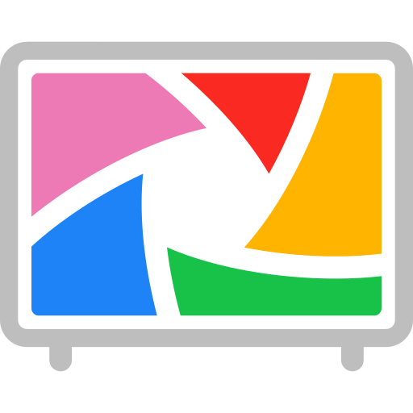

{ width=225 }

# Project Migration: Immich Slideshow for Nest Hub

> [!info] Project Info
> **User:** Ben Haube | **Date:** Feb 5, 2026<br>
> **Infrastructure:** [[ZimaBoard_2_NAS|ZimaOS NAS]] *([[Immich]])*, [[Raspberry_Pi_4B_Server|Raspberry Pi 4B Server]] *([[Home_Assistant]], [[Cloudflared]] Tunnel)*

---

## :material-broom: Phase 1: Cleaning Google Photos

**Goal:**
:   Delete cloud data without losing local files.

1.  **Safety First *(Mobile)*:**
    + Uninstall Google Photos App OR Turn OFF "Backup & Sync".
    + Install **Fossify Gallery** *(via F-Droid / Obtainium)* for local viewing.

        [Fossify Gallery :simple-fdroid:](https://f-droid.org/en/packages/org.fossify.gallery/){ .md-button }

2.  **Deletion *(Desktop)*:**
    + **Manual:** 
        + Go to [:services-google-photos:&thinsp;Google Photos](https://photos.google.com) 
        + :material-mouse-left-click: first photo, :material-mouse-scroll-wheel::material-arrow-down-thin: 
        + ++shift++ + :material-mouse-left-click: last photo, ++del++.
    + **Console Script *(Advanced)*:** 
        + Open Chrome DevTools ++f12++ :material-arrow-right-thin: Console. 
        + Paste script to auto-select/delete. 
3.  **Finalize:** 
    + Empty "Trash/Bin" to reclaim storage.

### :material-file-code-outline: Photo Cleaning Script

```javascript title="Javascript" linenums="1"
--8<-- "clean-google-photos.js"
```

1. If the script selects them but doesn't delete them, just click the :material-trash-can-outline: icon yourself after it does the hard work of selecting everything.

## :material-server-outline: Phase 2: Server-Side Setup *(ZimaOS NAS)*

**Goal:**
:   Replicate "Live Albums" and generate the Nest Hub interface.

### :material-docker: Docker Compose Snippet

Add these services to your existing Immich stack or a new stack.

```yaml title="compose.yml" linenums="1"
--8<-- "immich-frame.yaml"
```

1. The Interface *(Displays the clock / weather / photos)*
2. Link to the auto-album below
3. The Logic *(Auto-adds faces to the specific album)*
4. SYNC_MODE=1 adds new photos automatically

### :material-file-image: Auto Album Config

Place this in the same folder as your docker-compose file.

```json title="config.json" linenums="1"
--8<-- "immich-frame-config.json"
```

## :material-wan: Phase 3: Network & Cloudflare

**Goal:**
:   Allow Nest Hubs to load the frame securely.

1. **Tunnel:** 
    + Point `frame.rac3r4life.online` to `http://<ZIMAOS_NAS_IP>:8081` using the [:services-cloudflare:&thinsp;Cloudflare](../03_Services/Cloudflared.md) tunnel.
2. **WAF Rules *(Critical)*:**
    + Go to Cloudflare Dashboard :material-arrow-right-thin: Security :material-arrow-right-thin: WAF :material-arrow-right-thin: Custom Rules.
    + **Create Rule:** If Hostname equals `frame.rac3r4life.online` :material-arrow-right-thin: **Skip** "Super Bot Fight Mode" and "Managed Challenge".
        + _Why:_ Prevents the Nest Hub from hitting a "Verify you are human" screen.

## :material-home-automation: Phase 4: Automation *(Home Assistant on Pi 4)*

**Goal:**
:   Force Nest Hub to show the frame when idle.

**Prerequisite:** 
:   Install "DashCast" add-on in [:material-home-assistant:&thinsp;Home Assistant](../03_Services/Home_Assistant.md).

**Automation YAML:**

```yaml title="/home-assistant-container/automations.yaml" linenums="1"
--8<-- "ha-automations.yaml"
```