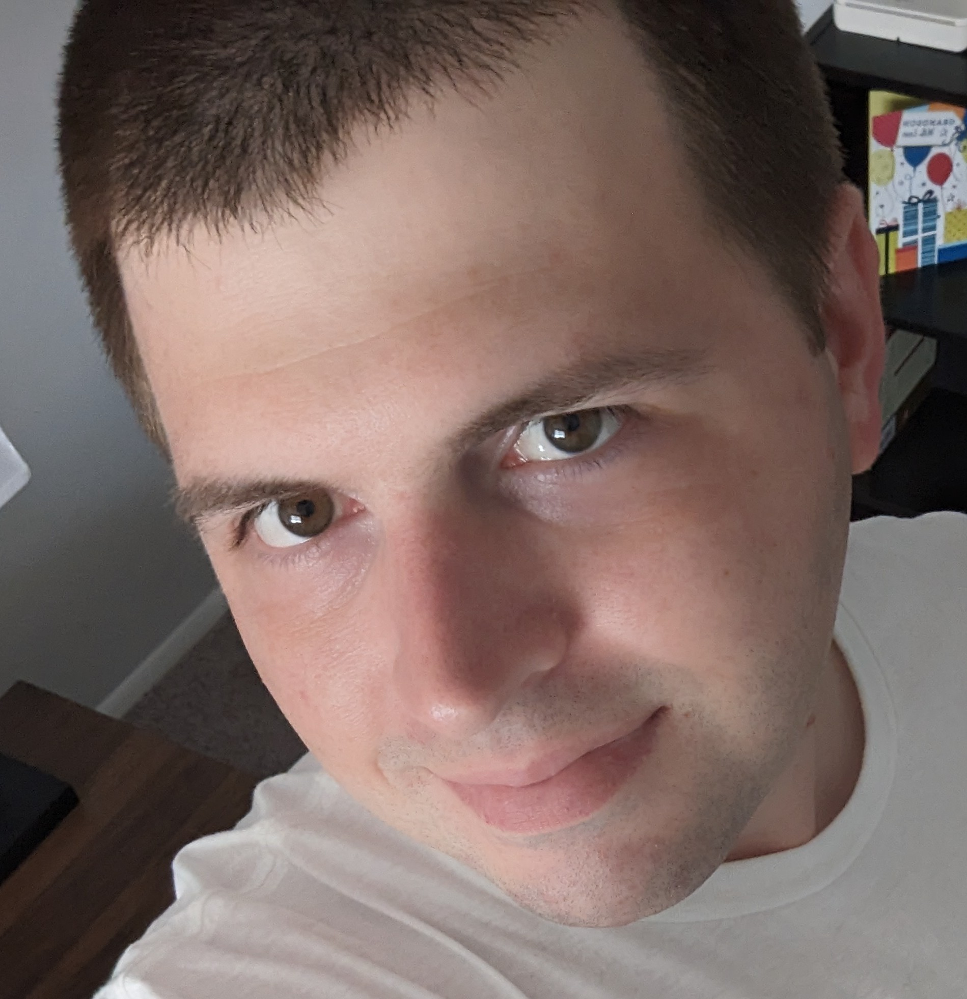

{ width=300 }

# About Me & Professional Philosophy
[My Resume :material-briefcase:](assets/Resume_2026.pdf){ .md-button .md-button--primary }&emsp;[Contact Me :material-send-variant:](mailto:ben@haube-pereira.com){ .md-button }

---
## :material-engine: :material-arrow-right-thin: :material-lan: From Engines to Infrastructure

With thirteen years of experience as an Automotive Technician and Maryland State Inspector, I spent over a decade diagnosing complex mechanical and electrical systems. In 2022, I pivoted that diagnostic mindset toward **Information Technology and Cybersecurity**.

I’ve found that whether it’s a fuel injection system or a network stack, the core principles remain the same: **precision, security, and relentless troubleshooting.**

## :material-star-four-points: My Technical North Star

I am a firm believer in the **Self-Hosted and Open-Source** movement. My home lab isn’t just a hobby; it’s a sandbox for testing the "Defense in Depth" strategies I’m studying for my IT / Cybersecurity career. 

**I prioritize:**

+ **Privacy-First Networking:** Using tools like [Technitium DNS](03_Services/Technitium.md) and [Network Attached Storage](02_Hardware/ZimaBoard_2_NAS.md) servers to take back control of my data.
+ **Immutable Documentation:** Maintaining a "Single Source of Truth" using **Markdown** with [Obsidian](https://obsidian.md/) and [Material for MkDocs](https://squidfunk.github.io/mkdocs-material/) to ensure the infrastructure is reproducible and transparent.
+ **Continuous Learning:** From earning my [**CompTIA^&copy;^**](https://www.comptia.org/en-us/) *(A+ & Linux+)* to mastering Docker orchestration, I am always looking for the next "bottleneck" to solve.
    
## :material-racing-helmet: Beyond the Terminal

When I’m not hardening my network or managing services, you can usually find me:

+ **3D Printing:** Tinkering with my Creality^&copy;^ K1C *(and likely troubleshooting a new filament)*.
+ **At the Track:** Following Formula 1 and other motorsports—old habits from the automotive days die hard.
+ **In the Sim:** Competing in competitive online sim-racing league races. 
+ **Unplugging:** Spending time outdoors and / or hanging out with my husband and our dog, Max.

I’m currently looking for opportunities where I can apply my unique blend of hands-on mechanical diagnostic experience and modern IT security principles to solve real-world infrastructure challenges.