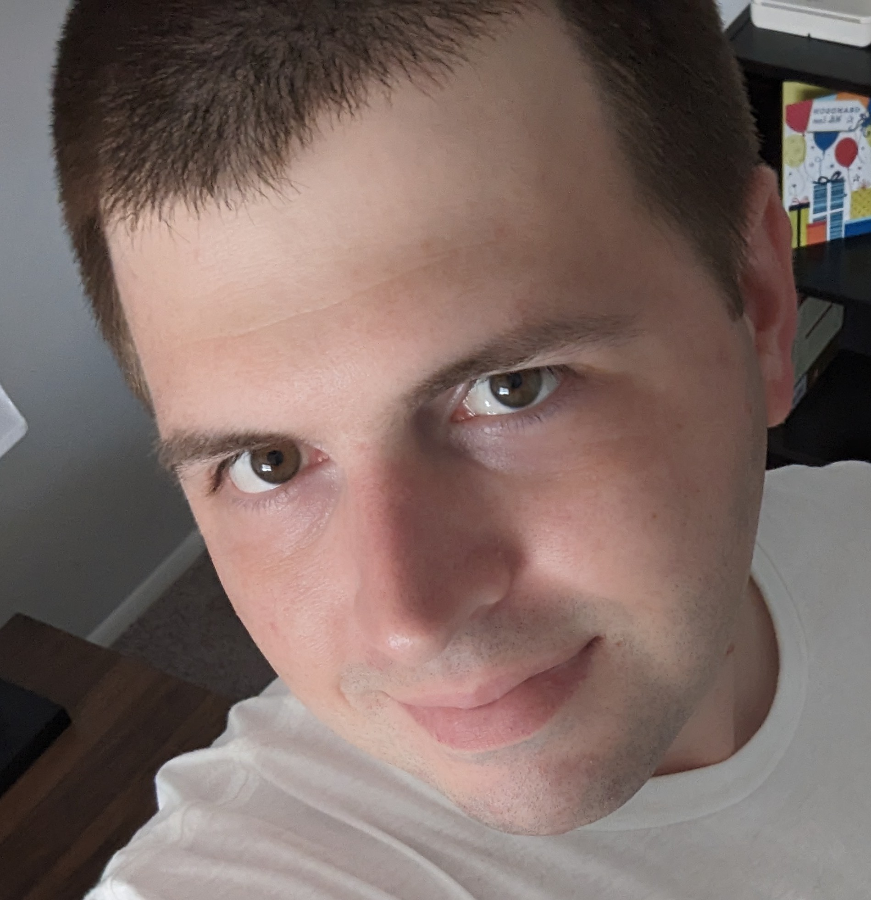

{ width=200 }

# About Me & Professional Philosophy

[My Resume&ensp;:symbols-briefcase:](assets/Resume_2026.pdf){ .md-button .md-button--primary }&emsp;[Contact Me&ensp;:symbols-send:](mailto:ben@haube-pereira.com){ .md-button .md-button--primary }

---

{ width=300 align="right" }

## :symbols-engine: :symbols-move-right: :symbols-network:&ensp;From Engines to Infrastructure

With thirteen years of experience as an Automotive Technician and Maryland State Inspector, I spent over a decade diagnosing complex mechanical and electrical systems. In 2022, I pivoted that diagnostic mindset toward **Information Technology** and **Cybersecurity**.

I’ve found that whether it’s a fuel injection system or a network stack, the core principles remain the same: **precision, security, and relentless troubleshooting.**

## :symbols-astroid:&ensp;My Technical North Star

I am a firm believer in and staunch advocate for the **Self-Hosted** and **Open-Source** movements. My "homelab" isn’t just a hobby; it is a sandbox for testing the "Defense in Depth" strategies I’m studying for my IT / Cybersecurity career, and it is an ecosystem of tools and services I use to take back ownership of my data from the "Big-Tech" monopolies that put profit above people.

### My priorities are...

##### Privacy-First Networking

:    Using tools like [Technitium](03_services/technitium.md) DNS and [Network Attached Storage](02_hardware/zimaos_nas.md) servers to take back control of my data.

##### Immutable Documentation 

:    Maintaining a "Single Source of Truth" using **Markdown** with [VSCodium](https://vscodium.com/){ external-link } and [Material for MkDocs](https://squidfunk.github.io/mkdocs-material/){ external-link } to ensure the infrastructure is reproducible and transparent.

##### Continuous Learning

:    From earning my [CompTIA](https://www.comptia.org/en-us/){ external-link } _(A+ & Linux+)_ to mastering Docker orchestration, I am always looking for the next problem and "bottleneck" to solve.

## :symbols-motor-racing-helmet:&ensp;Beyond the Terminal

When I’m not hardening my network or managing services, you can usually find me...

##### 3D Printing

:    Tinkering with my [Creality K1C](02_hardware/kacey_3d-printer.md), and likely troubleshooting a new filament or hardware modification.

##### At the Track 

:    Following Formula 1 and other motorsports—old habits from the automotive days die hard.

##### In the Sim

:    Competing in competitive online sim-racing league races.

##### Unplugging

:    Spending time outdoors and / or hanging out with my husband and our dog, Max.

I’m currently looking for opportunities where I can apply my unique blend of hands-on mechanical diagnostic experience and modern IT security principles to solve real-world infrastructure challenges.