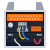{ width=400 }

> [!info] Mini-Rack Build: Dec, 2025 :material-arrow-right-thin: Jan, 2026
> **3D-Printed Parts:**
> 
> + RackMate bottom horizontal frame 
> + ZimaBoard 2 w/SSD mounting bracket 
> + Vented blank plates *(hexagon pattern)* 
> + Ugreen CM753 mounting bracket *(No longer available to download. Included a similar model in collection linked below.)*
>
> [3D-Models :simple-printables:](https://www.printables.com/@rac3r4life/collections/3360495){ .md-button }
>
> **Purchased Parts:**
> 
> + [[ZimaBoard_2_NAS|ZimaBoard 2 1664]]
> + [[Ugreen_Switch|Ugreen CM753 switch]]
> + [[Hitron_Modem|Hitron Modem]]
> + GeeekPi: DeskPi Rack-Mate T0 *(4U - 10" Rack)*
> + One SFP+ :material-arrow-right-thin: 10GbE transciever
> + Two Cat6a Keystone jacks
> + Three GeeekPi 6" Cat6a patch cables
> + Three Monoprice 3' Cat6a patch cables
> + One PCIe 4.0 :material-arrow-right-thin: NVMe add-in card
> + One SK-Hynix 500GB NVMe SSD *(for Docker / VM storage, pulled from [[Ben's_Laptop|ThinkPad]] after storage upgrade)*
> + Two Crucial BX500 4TB SATA SSDs in RAID1 *(for mass network attached storage)*
> + One 30 cm SATA extension cable
> + One PWM Fan controller
> + Two server-grade 5000 RPM, 80 mm Arctic PWM fans
> + Black rack screws
>
> [Amazon List :fontawesome-brands-amazon:](https://www.amazon.com/hz/wishlist/ls/4BBKVMBF22TH?ref_=wl_share){ .md-button }

---

## Printing the Parts

{ width=1018 }

{ width=1018 }

{ width=1018 }

{ width=1018 }

{ width=1018 }

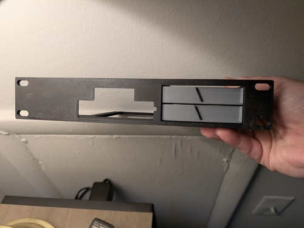{ width=500 }&emsp;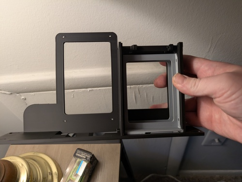{ width=500 }

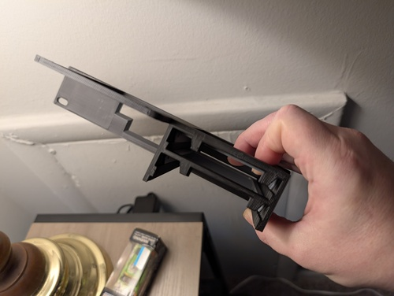{ width=500 }

## Building the Rack

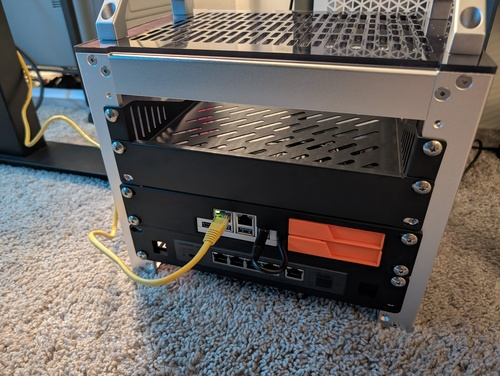{ width=500 }&emsp;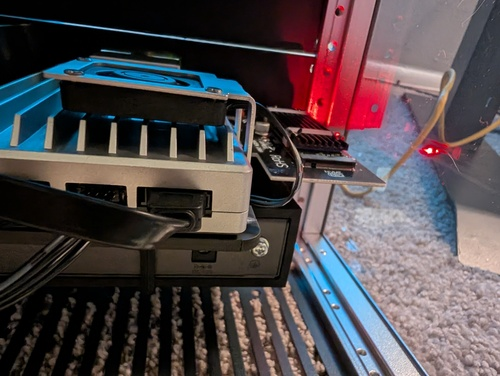{ width=500 }

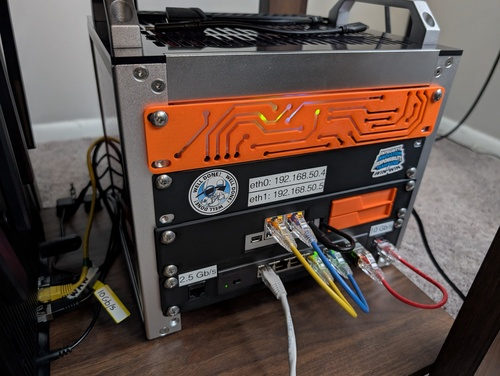{ width=500 }&emsp;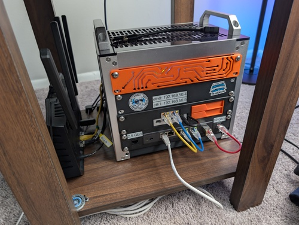{ width=500 }

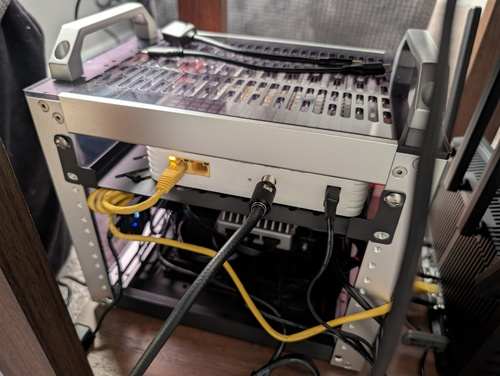{ width=500 }&emsp;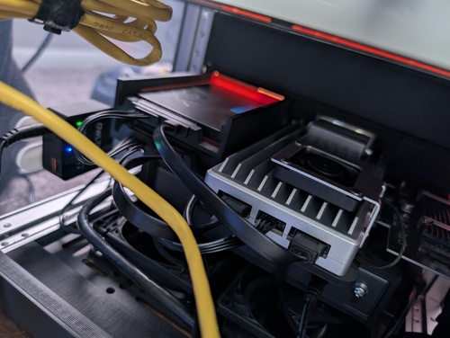{ width=500 }

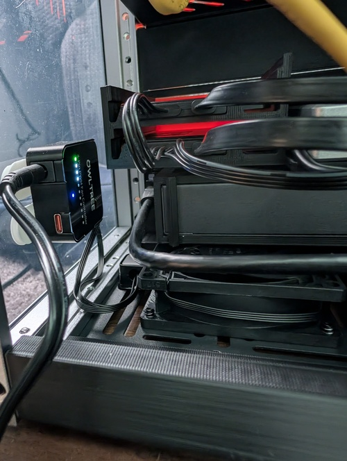{ width=500 }&emsp;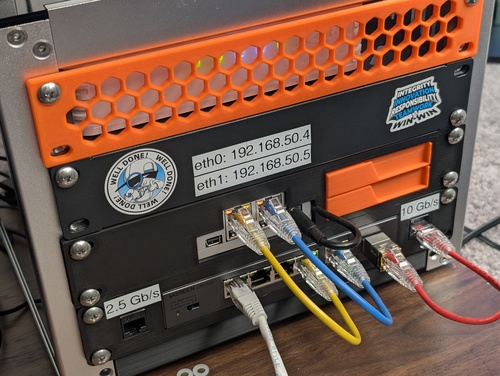{ width=500 }

## Final Rack Configuration

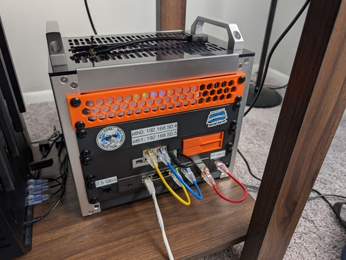{ width=500 }&emsp;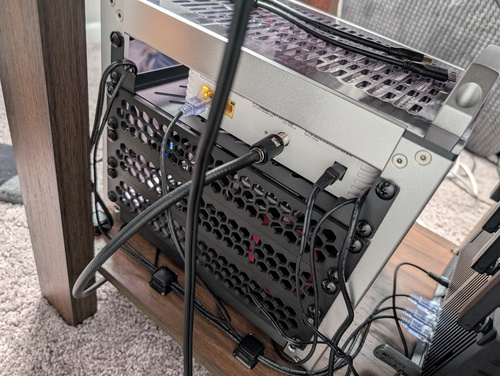{ width=500 }
