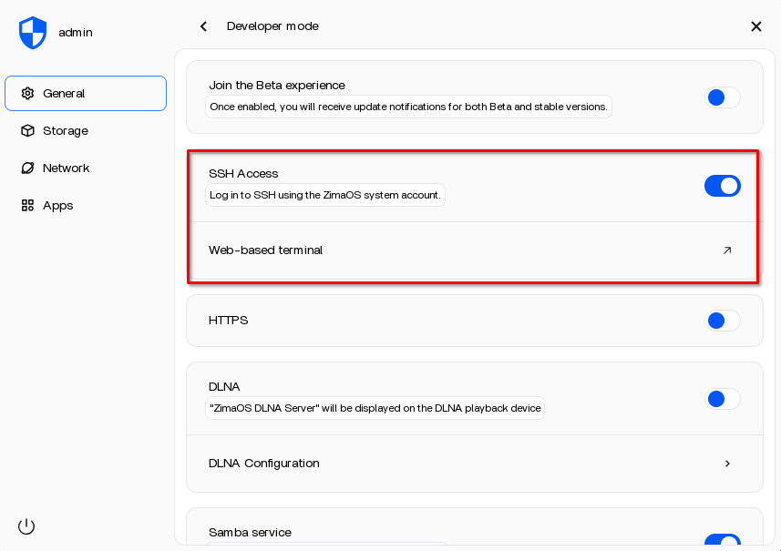

!!! zima "Don't Forget!"

    **ZimaOS** does not have SSH enabled after a fresh install. For the [ZimaOS NAS](../02_Hardware/ZimaBoard_2_NAS.md) the SSH service needs to be enabled first through the [ZimaOS Web UI](http://storage-server.internal/) in the developer options.

    + Settings&ensp;:material-arrow-right-thin:&ensp;General&ensp;:material-arrow-right-thin:&ensp;Developer Mode&ensp;:material-arrow-right-thin:&ensp;SSH Access 
     
        { width=600 }
     
    + After enabling SSH in the developer options the [ttydBridge](../03_Services/ttydBridge.md) application is automatically installed. The SSH service can be configured from there.
    + Once the SSH server is configured the **ttydBridge** application is no longer needed, but remains installed. This is a good backup to get shell access in case of an SSH configuration issue.