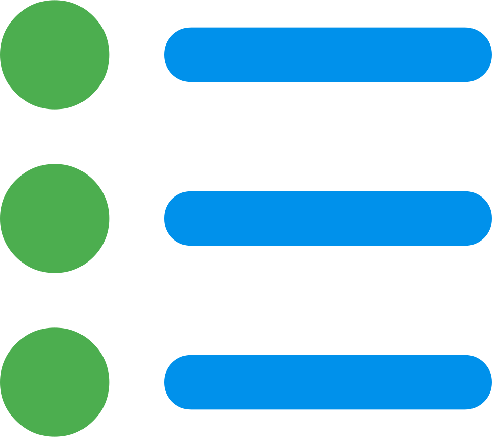

{ width=200 }&emsp;{ width=50 } 

# Network Documentation & Portfolio
[About Me&ensp;:symbols-user-search:](about.md){ .md-button .md-button--primary }&emsp;[Contact Me&ensp;:symbols-send:](mailto:ben@haube-pereira.com){ .md-button .md-button--primary }

---
## :symbols-lan:&ensp;Infrastructure

[:symbols-restore:&ensp;Disaster Recovery Plan](./01_Infrastructure/Disaster_Recovery_Plan.md)
:    Ensuring **HA** for critical network services and providing a clear path to data restoration for stateful services in the event of hardware failure or data corruption.

[:symbols-ip-outline:&ensp;IP Address Management](./01_Infrastructure/IP_Address_Management.md)
:    This page contains information about IPAM, VPNs, and VLANs encompassed by the local network.

[:symbols-ethernet-port-outline:&ensp;MAC Address Tables](./01_Infrastructure/MAC_Address_Tables.md)
:    This page contains tables organizing devices on the LAN and their hardware MAC addresses.

[:symbols-policy:&ensp;Network Security Policy](./01_Infrastructure/Network_Security_Policy.md) 
:    This infrastructure operates on the *Principle of Least Privilege*. No device or service is granted more network access than is strictly required for its primary function. Security is maintained through physical isolation, logical segmentation, and encrypted transit.

[:symbols-graph-2:&ensp;Logical Network Map](./01_Infrastructure/Logical_Map.md)
:    A *Mermaid.js* flowchart focusing on servers, services, and their connections. 

[:symbols-graph-2:&ensp;Physical Network Map](./01_Infrastructure/Physical_Map.md)
:    A *Mermaid.js* flowchart focusing on physical devices and their connections.

---
## :symbols-devices:&ensp;Hardware

!!! links inline end "Extra Links"

    [More Kacey Info&ensp;:brands-creality-v2:](02_Hardware/Kacey_Info.md){ .md-button }

    [Hardware Tags&ensp;:symbols-tag-outline:](02_Hardware/tags.md){ .md-button }

### Core Infrastructure

[:symbols-router-outline:&ensp;ASUS RT-BE92U](./02_Hardware/ASUS_RT-BE92U.md)
:    The main wireless router and firewall for the local network. Located next to the 10-inch mini-rack in the living room on the main floor. The standard firmware has been replaced with [Asuswrt-Merlin](https://www.asuswrt-merlin.net/), a more powerful option that retains the standard ASUS features / UI and adds a lot of great features and capabilities.

[:symbols-router-outline:&ensp;ASUS RT-AX55](./02_Hardware/ASUS_RT-AX55.md)
:    A secondary router located on the stationary printer cart in the office upstairs, acting as an "*AiMesh*" node to expand Wi-Fi coverage to the upper levels. All settings and firmware updates are managed through the main router's Web-UI.

[:symbols-server-outline:&ensp;Debian Server](./02_Hardware/Debian_Server_VM.md)
:    The primary DNS server in the [Technitium](03_Services/Technitium.md) cluster. It is a VM hosted on the rack-mounted [ZimaOS NAS](./02_Hardware/ZimaBoard_2_NAS.md). 

[:symbols-web:&ensp;Hitron Modem](./02_Hardware/Hitron_Modem.md)
:    The DOCSIS 3.1 cable modem that communicates with the ISP *([Xfinity](https://www.xfinity.com/overview))*. Located in the 10-inch mini-rack.

[:symbols-server-outline:&ensp;Raspberry Pi 4B Server](./02_Hardware/Raspberry_Pi_4B_Server.md)
:    The secondary DNS server in the [Technitium](03_Services/Technitium.md) cluster, a CUPS print server, a Home Assistant server, and host for other [Docker](https://www.docker.com/) containers. Located next to the Ai-Mesh node on the stationary printer cart in the office upstairs, and connected to the local network through the [TP-Link Switch](./02_Hardware/TP-Link_Switch.md).

[:symbols-server-outline:&ensp;Raspberry Pi Zero Server](./02_Hardware/Raspberry_Pi_Zero_2_W.md) 
:    A tiny, low-power server acting as a dedicated as Caddy reverse-proxy, giving unique `.internal` FQDNs to services hosted on the local network. Located on the stationary printer cart in the office upstairs, and connected to the local network via 2.4 GHz Wi-Fi (SSID: `Home`). 

[:symbols-ethernet-port-outline:&ensp;TP-Link LiteWave Switch](./02_Hardware/TP-Link_LiteWave_Switch.md)
:    A gigabit desktop switch *(5-port)* distributing Ethernet connections to devices in the TV stand in the living room. Located on the back of the TV stand, attached with Velcro.

[:symbols-ethernet-port-outline:&ensp;TP-Link Switch](./02_Hardware/TP-Link_Switch.md)
:    A gigabit desktop switch *(5-port)* distributing Ethernet connections to devices in the office. It is located on the floor underneath the stationary printer cart.

[:symbols-ethernet-port-outline:&ensp;Ugreen Switch](./02_Hardware/Ugreen_Switch.md)
:    A rack-mounted 2.5 gigabit switch in the living room with a 10 Gb/s SFP+ uplink to the router, distributing Ethernet connections to the devices in the 10-inch mini-rack with extra ports available for future network expansion.

[:symbols-nas-outline:&ensp;ZimaOS NAS](./02_Hardware/ZimaBoard_2_NAS.md) 
:    The primary rack-mounted NAS server & VM host for the local network. With a [ZimaBoard 2 1664](https://www.zimaspace.com/products/single-board2-server?utm_source=head&utm_medium=menu) as the "beating heart," it is the most powerful server on the local network. With an *x86-64* Intel N150 CPU and 16 GB of LPDDR5 *(6400 MHz)* RAM. Located in the 10-inch mini-rack in the living room on the main floor. It has two 2.5 Gb/s Ethernet NICs connected through the Ugreen Switch.

### Key Clients

[:symbols-desktop-pc-outline:&ensp;Ben's Workstation](./02_Hardware/Ben's_Desktop.md) 
:    Ben's main workstation PC located at his desk in the office upstairs. Connected to the local network through the [TP-Link Switch](./02_Hardware/TP-Link_Switch.md).

[:symbols-laptop-minimal:&ensp;Ben's Laptop](./02_Hardware/Ben's_Laptop.md)
:    Ben's main laptop PC, a ThinkPad X1 Carbon, used primarily for getting work done on-the-go. A mobile device connected to the Trusted Wi-Fi network (SSID: `Home`).

[:symbols-mobile:&ensp;Ben's Smartphone](./02_Hardware/Ben's_Smartphone.md)
:    Ben's main mobile device. A Google Pixel 9 Pro connected to the Trusted Wi-Fi network (SSID: `Home`).

[:symbols-printer-3d-nozzle-outline:&ensp;Kacey 3D-Printer](./02_Hardware/Kacey_3D-printer.md) 
:    The Creality K1C 3D-printer located in the office upstairs, and connected to the local network through 2.4 GHz Wi-Fi (SSID: `Home`). Affectionately, named 'Kacey' as a play on the model name, K1C. 

[:symbols-desktop-pc-outline:&ensp;Rob's Workstation](./02_Hardware/Rob's_Desktop.md) 
:    Rob's main workstation PC located at his desk in the office upstairs. Connected to the local network through the [TP-Link Switch](./02_Hardware/TP-Link_Switch.md).

[:symbols-laptop-minimal:&ensp;Rob's Laptop](02_Hardware/Rob's_Laptop.md) 
:    Rob's laptop PC, an ASUS TUF Gaming laptop, used for work and gaming. A mobile device primarily connected to the Trusted Wi-Fi network (SSID: `Home`). However, sometimes it has a 2.5 Gb/s Ethernet connection through the rack-mounted [Ugreen Switch](./02_Hardware/Ugreen_Switch.md).

---
## :symbols-web:&ensp;Services

!!! links inline end "Extra Links"

    [Services Tags&ensp;:symbols-tag-outline:](03_Services/tags.md){ .md-button }

[:services-beszel:&ensp;Beszel](./03_Services/Beszel_Hub.md)
:    A lightweight server monitoring hub with historical data, docker stats, and alerts.

[:services-caddy:&ensp;Caddy](./03_Services/Caddy.md)
:    Lightweight, open-source Web server written in Go. Used as a *reverse-proxy* for creating unique domains for locally hosted services.

[:symbols-web-clock:&nbsp;Chrony](./03_Services/Chrony.md)
:    Advanced, lightweight NTP client and server.

[:services-cloudflare:&ensp;Cloudflared](./03_Services/Cloudflared.md)
:    A secure reverse-proxy tunnel for hosting private services on the public Internet.

[:symbols-print-outline:&ensp;CUPS](./03_Services/CUPS_Print_Server.md)
:    A standards-based, open-source printing system for Linux and other Unix-like operating systems.

[:symbols-web-ip:&ensp;DDNS](./03_Services/DDNS.md)
:    A networking service that automatically maps a static domain name *(hostname)* to a dynamic public IP address. On this local network, the DDNS service is provided by [addr.tools](https://addr.tools).

[:services-dockge:&ensp;Dockge](./03_Services/Dockge.md) 
:    A fancy, easy-to-use and reactive self-hosted Docker `compose.yaml` stack-oriented manager.

[:services-f1-replay-timing:&ensp;F1 Replay Timing](./03_Services/F1_Replay_Timing.md) 
:    Visualization of real-time track data and telemetry synced to F1 live and replays.

[:services-fluidd:&ensp;Fluidd](./03_Services/Fluidd.md)
:    A free and open-source Klipper web interface for managing your 3D-printer.

[:services-gitea:&ensp;Gitea](./03_Services/Gitea.md) 
:    Painless, self-hosted, all-in-one software development service, including Git hosting, code review, team collaboration, package registry and CI/CD.

[:services-glance:&ensp;Glance](./03_Services/Glance.md)
:    A self-hosted dashboard that puts all your feeds in one place. 

[:services-glances:&ensp;Glances](./03_Services/Glances.md)
:    Glances an Eye on your system. A `top` / `htop` alternative for GNU / Linux, BSD, Mac OS and Windows operating systems. 

[:services-gotify-notification:&ensp;Gotify](./03_Services/Gotify.md)
:    A simple server for sending and receiving messages in real-time per WebSocket. 

[:services-home-assistant:&ensp;Home Assistant](./03_Services/Home_Assistant.md)
:    Open-source home automation that puts local control and privacy first.

[:services-homebox:&ensp;Homebox](./03_Services/Homebox.md) 
:    An inventory and organization system built for the home user.

[:services-immich:&ensp;Immich](./03_Services/Immich.md)
:    High performance self-hosted photo and video management solution.

[:services-it-tools:&ensp;IT-Tools](./03_Services/IT-Tools.md)
:    Handy tools for network administrators and developers.

[:services-klipper:&ensp;Moonraker](./03_Services/Moonraker.md)
:    Web API server for [Klipper](https://www.klipper3d.org/).

[:symbols-settings-sync:&ensp;Nebula-Sync](./03_Services/Nebula-Sync.md)
:    Synchronize configuration between multiple [Pi-hole](https://pi-hole.net) instances.

[:services-nextcloud:&ensp;Nextcloud](./03_Services/Nextcloud.md)
:    Self-hosted cloud storage and collaboration platform.

[:symbols-smb-share-outline:&ensp;NFS](./03_Services/NFS.md) 
:    Remote file system access.

[:simple-nginx:&ensp;Nginx](./03_Services/Nginx.md)
:    The world's most popular Web Server, high performance Load Balancer, Reverse Proxy, API Gateway and Content Cache.

[:services-ntop:&ensp;ntopng](./03_Services/ntopng.md)
:    Web-based traffic and security network traffic monitoring. 

[:simple-obsidian:&ensp;Obsidian LiveSync](./03_Services/Obsidian_LiveSync.md)
:    Seamless multi-primary syncing database with an intuitive HTTP / JSON API, designed for reliability.

[:services-openspeedtest:&ensp;OpenSpeedTest](./03_Services/OpenSpeedTest.md)
:    A free & open-source HTML5 network performance estimation tool.

[:simple-pihole:&ensp;Pi-hole](./03_Services/Pi-hole.md)
:    A DNS sinkhole that protects your devices from unwanted content without installing any client-side software.

[:services-portainer:&ensp;Portainer-EE](./03_Services/Portainer.md)
:    A lightweight service delivery platform for containerized applications. 

[:services-portracker:&ensp;Portracker](./03_Services/Portracker.md)
:    A self-hosted, real-time port monitoring and discovery tool.

[:symbols-remote-desktop:&ensp;RDP](./03_Services/RDP.md)
:    Remote desktop access over the local network. *(not exposed to the internet)*

[:symbols-smb-share-outline:&ensp;SMB](./03_Services/SMB.md)
:    Remote file system access.

[:services-spoolman:&ensp;Spoolman](./03_Services/Spoolman.md)
:    Keep track of your inventory of 3D-printer filament spools. 

[:symbols-terminal:&ensp;SSH](./03_Services/SSH.md)
:    Provides secure encrypted communications between two untrusted hosts over an insecure network.

[:simple-syncthing:&ensp;Syncthing](./03_Services/Syncthing.md)
:    Open decentralized file synchronization.

[:services-technitium:&ensp;Technitium](./03_Services/Technitium.md)
:    An open-source authoritative as well as recursive DNS server that can be used for self hosting a DNS server for privacy & security.

[:symbols-terminal:&ensp;ttydBridge](./03_Services/ttydBridge.md)
:    A DockerApp makes it easy to use the host terminal in the Web.

[:services-uptime-kuma:&ensp;Uptime Kuma](./03_Services/Uptime_Kuma.md)
:    A fancy self-hosted monitoring tool.

[:simple-wireguard:&ensp;WireGuard Server](./03_Services/Wireguard_Server.md)
:    An extremely simple yet fast and modern VPN that utilizes state-of-the-art cryptography.

[:services-youtube-dl:&ensp;yt-dlp Web-UI](./03_Services/yt-dlp_WebUI.md)
:    High performance extendable Web-UI and RPC server for `yt-dlp` with low impact on resources.

---
## :symbols-swap-horizontal:&ensp;Change Management

[:brands-raspberry-pi:&nbsp;:symbols-arrow-right-thin:&nbsp;:services-caddy:&ensp;Reverse Proxy & DNS Routing](./04_Change_Management/Reverse-Proxy.md)
:    Preparing the [Raspberry Pi Zero Server](./02_Hardware/Raspberry_Pi_Zero_2_W.md) to be a [Caddy](./03_Services/Caddy.md) reverse proxy server to give unique FQDNs to services hosted on the local network.

[:simple-pihole:&nbsp;:symbols-arrow-right-thin:&nbsp;:services-technitium:&ensp;DNS Migration](./04_Change_Management/DNS_Migration.md) 
:    Preparing to migrate from [Pi-hole](./03_Services/Pi-hole.md) to [Technitium](./03_Services/Technitium.md) for DNS queries on the local network. 

---
## :symbols-printer-3d-nozzle-outline:&ensp;3D Printing

!!! links inline end "Check out my 3D Models!"
    All of my 3D models are published to Printables, and shared with the GPLv3 open-source license. Every model has STEP and FreeCAD files included for easy editing.

    [Printables&ensp;:brands-printables:](https://www.printables.com/@rac3r4life){ .md-button }

[:symbols-settings:&ensp;Manual Bed Leveling Mod](./3D_Printing/K1_Bed_Level_Knobs_Tutorial.md) 
:    Installing a bed leveling modification on the [Creality K1C](./02_Hardware/Kacey_3D-printer.md). 

[:symbols-toothbrush-nozzle:&ensp;Nozzle Cleaning Macro](./3D_Printing/Manual_Nozzle_Cleaning_Gcode_Macro.md) 
:    Enabling a custom g-code macro I wrote for manually cleaning the nozzle with a silicone brush.

[:symbols-prowiper:&ensp;PROWIPER^&copy;^ Mod](./3D_Printing/PROWIPER_Mod.md) 
:    Installing the PROWIPER^&copy;^ Mod, and editing the required g-code on the [Creality K1C](./02_Hardware/Kacey_3D-printer.md).

---
## :symbols-linux:&ensp;Linux Tutorials

!!! links inline end "Extra Links"
    **My Favorite Bash Aliases:**
    :    Here is an aggregated list of Bash terminal aliases that I find useful in my daily workflow.

        [My Bash Aliases&ensp;:symbols-terminal:](Linux_Tutorials/My_Terminal_Aliases.md){ .md-button }

    **Update PCRs Script:**
    :    In this GitHub repository I have written a Bash script, `update-pcrs`, that automates the process of clearing and registering new PCRs and regenerating the initramfs after a firmware or kernel upgrade. The script is full-featured with flags for using custom PCRs *(defaults to 0+4+7+11)*, usage help, checking the version, and defining the device path. 

        [Update PCRs&ensp;:simple-github:](https://github.com/benhaube/Update-LUKS-PCRs-script){ .md-button }

[:symbols-update:&ensp;Automatic Updates for Debian Servers](./Linux_Tutorials/Configure_Unattended-Upgrades.md)
:    How to install and configure the `unattended-upgrades` package on your Debian server to enable automatic updates. This tutorial will help you configure Systemd timers, custom origin settings, email notifications, automatic reboot scheduling, and dedicated logging to monitor all upgrade activity.

[:material-svg:&ensp;Convert an SVG to Data URI](Linux_Tutorials/SVG_to_URI.md) 
:    How to convert an SVG into a data URI for use in HTML pages and CSS stylesheets. 

[:symbols-lock-open-outline:&ensp;Decrypt LUKS with TPM2](./Linux_Tutorials/Unlock_LUKS_TPM2.md) 
:    How to unlock your encrypted LUKS2 volumes with the TPM2 when the system boots. 

[:symbols-terminal:&ensp;Defining Bash Aliases](./Linux_Tutorials/Defining_Terminal_Aliases.md) 
:    How to define Bash terminal aliases in their own file to avoid a cluttered `.bashrc` file. The methodology is different on  Debian and RHEL / Fedora based Linux distributions.

[:symbols-image:&ensp;Immich Slideshow for Nest Hub](./Linux_Tutorials/Immich_Slideshow_for_Nest_Hub.md)
:    How to replace the Google Photos slideshow on the Nest Hub with an Immich slideshow utilizing an `immich-frame` container and [Home Assistant](./03_Services/Home_Assistant.md) with Google Cast.

[:symbols-file-badge:&ensp;Self-Signed Certificates](./Linux_Tutorials/Self-Signed_Certs.md)
:    How to generate self-signed SSL certificates for use in testing, development, and internal web servers.

[:symbols-feedback-outline:&ensp;Setup SSH Login Notification](./Linux_Tutorials/Setup_SSH_Login_Email_Notification.md) 
:    How to set up an email and push notification delivered to your inbox every time a new SSH session is established; utilizing a Bash script, `msmtp` and `pam_exec.so`, and a Gotify server. 